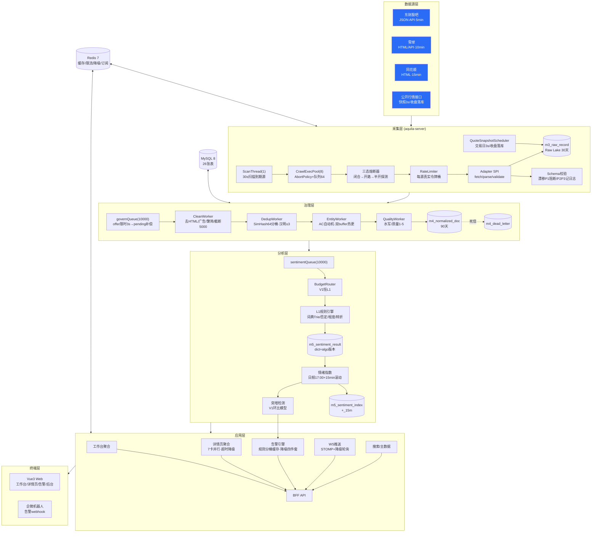
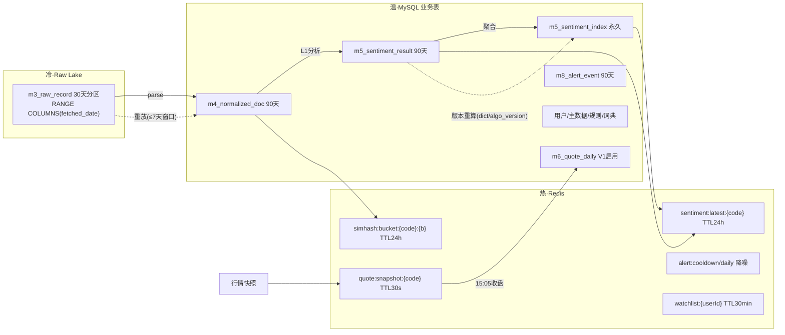
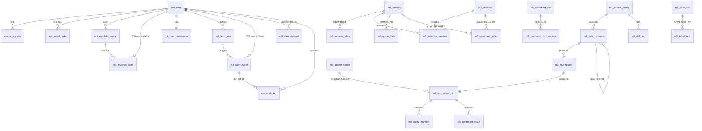

# 01 Aquila 完整设计方案（终稿 V1.4）

> **合并基线**：Trae V1.3（体） + codebuddy 技术补丁 + Copilot 治理框架 + 本方案三处再平衡（§九）
> **内容**：定位与范围 → 架构图 → 数据拓扑 → ER 图 → 调用链 → 调用方式 → 实现方案 → 对 V1.3 的取舍对照
> **部署形态**：V1 单机单实例（docker-compose）；规模假设：注册 ≤100 / DAU ≤30 / 设计并发 50

---

## 一、定位与范围

**一句话**：面向个人投资者/小团队的 A 股投研工具，以「采集→治理→情感→投研」四条流水线为骨架，核心差异化为**舆情情绪指数（二级参考信号）+ 突增告警 + 一屏式个股研报**。

**V1 范围（14 项交付，6 周）**：登录（手机+邮箱双通道）/ 工作台五卡片 / 自选股 / 证券主数据+搜索 / 舆情三源采集（东财股吧+雪球+同花顺）/ 治理四 Worker / L1 情感引擎 / 情绪指数（日频+15min）/ 行情快照（自选股+指数，V1.3 新增）/ 详情页（速览+舆情真实，五卡占位）/ WebSocket 推送 / 基础告警（价格+声量环比）/ 数据质量（漂移+幂等+重放）/ 运营后台骨架（数据源看板+词典）。

**V1 禁做**：L2 模型、Z-Score/情绪反转（攒基线）、技术/资金/基本面卡片、选股器、评分卡、DSL 编辑器、RSS/公告/研报采集、移动端、多实例。

---

## 二、系统架构图



**层间铁律**：采集层是唯一外部交互层；行情直通应用层、不进治理流水线；文本类才走治理→情感。

---

## 三、数据拓扑（热-温-冷 + 血缘）



**血缘链（traceId 全程贯通）**：
`task_id(m3_task_instance)` → `raw_record.id` → `doc_id(m4)` → `sentiment_result(doc_id+dict_version+algo_version)` → `index(uk: scope+date)` → `alert_event(rule_id+dedup_key)`；审计侧 `biz_id` 串联一次操作的全部事件。

---

## 四、ER 图（V1.4 全量 26 张表）



**表清单（V1.4 = V1.1 的 22 张 + V1.3 新增 4 张）**：
用户域 5（+sys_email_code）、主数据域 5、采集域 4、治理域 3、情感域 5（+m5_author_profile、+m5_sentiment_dict_version、+m5_label_set/item 计 2）、告警域 3、行情 1（m6_quote_daily 提前启用）、审计 1（sys_audit_log）。
关键 DDL 修订全部继承 V1.3：`m3_raw_record` 按 `fetched_date` 按天幂等分区；`m8_alert_event` 加 `user_id`；`m3_task_instance` 6 态状态机 + `replay_of`；`crawl_params` 敏感字段 AES-256-GCM。

---

## 五、调用链（四条核心链路）

### 链路 1：舆情端到端（核心链路）

```
ScanThread(30s) ─到期源─> execPool.submit [锁:sourceLock]
  → circuitBreaker.allow? ──开路──> skip + 指标
  → RateLimiter.acquire()
  → Adapter.fetch(cursor=DB.last_cursor)
  → raw upsert m3_raw_record (幂等: source+outer+fetched_date)
  → Adapter.parse → SchemaValidator [P1→阻断+告警 / P2P3→m3_drift_log]
  → governQueue.offer(3s) ─超时─> parse_status=0 留待 BacklogReplayer(60s)
  → 提交游标(DB) → 记账(status: 1成功/3部分成功)
Clean → Dedup(分桶SimHash) → Entity(AC) → Quality → persist[单条事务]
  → 合格(quality≥2 且非重复) → sentimentQueue
  → BudgetRouter → L1分析 → m5_sentiment_result(engine_level=actual, dict/algo version)
  → 15min滚动聚合(交易日盘中) → m5_sentiment_index_15m + Redis latest
  → 环比突增检测(对比上一交易日同期) → m8_alert_event → 降噪四件套 → 推送
日频: 交易日17:00 → 全量聚合(收盘基准w_time) → m5_sentiment_index → 刷缓存
```

### 链路 2：行情快照（V1.3 新增）

```
QuoteSnapshotScheduler(交易日 09:25-15:05 每3s)
  → 标的集 = 自选股 ∪ 告警scope展开 ∪ 三大指数
  → 批量拉取(50-100代码/次, QPS≤1)
  → Redis quote:snapshot:{code}(TTL30s) + market:summary:{date}(5min)
  → 15:05 收盘落 m6_quote_daily
  → 失败降级: marketSnapshot=null + X-Degraded: quote + 最近收盘价 stale=true
```

### 链路 3：用户请求链（详情页）

```
GET /api/securities/{code}/detail?cards=overview,sentiment
  → 鉴权Filter(JWT) → 限流Filter(60/min) → traceId注入
  → Redis卡片缓存(5min±10%抖动) ──miss──> BFF聚合
      ├ CompletableFuture×7 (每卡超时500ms, 超时→{available:false})
      └ 总预算700ms
  → 统一Result{code,message,data,traceId}
WS: CONNECT(Bearer) → 订阅 /user/queue/quote|alert|watchlist
  → msgId递增/跳号重连/队列溢出通知/断线降级10s轮询
```

### 链路 4：重放与治理修复链

```
POST /api/crawl/tasks/replay {source,窗口≤7d,target=parse|govern}
  → 新任务(replay_of=原任务) → 加载raw(parse_status过滤)
  → 重新parse→治理→情感→受影响(code,tradeDate)清单
  → 指数重算(同dict_version可复现验证) → 刷缓存 → sys_audit_log留痕
词典回滚: POST /api/admin/dict/versions/{v}/rollback → 同上触发重算链
```

---

## 六、调用方式（内外部接口汇总）

| 调用方 → 被调方 | 方式 | 协议/要点 |
|---|---|---|
| 前端 → 后端业务 API | HTTPS REST | `{code,message,data,traceId}` 包装；JWT AT2h/RT7d 旋转；Idempotency-Key 写幂等；429 为传输层限流例外 |
| 前端 → 后端实时 | WSS + STOMP | Bearer 认证、10s 心跳、msgId 续传检测、auth_expired 60s 续期 |
| 后端 → 东财/雪球/同花顺 | HTTPS 出站 | Adapter SPI 插件；RateLimiter ≤5QPS/源；UA 真实标注；敏感参数 AES 加密存 DB |
| 后端 → 行情接口 | HTTPS 出站 | 批量快照 3s 周期；独立熔断与记账（复用 m3_source_config, source_type=5） |
| 后端 → 企微/钉钉 | HTTPS webhook | markdown 卡片；失败重试 3 次；webhook URL 加密存储；夜间勿扰补发 |
| 内部流水线各环节 | 进程内队列/直接调用 | 队列限时 offer 3s + pending 补偿；单条事务；traceId MDC 透传 |
| 定时任务 | 内部调度 | 全部过交易日历；cron：15min 滚动 / 17:00 日频 / 02:00 对账 / 03:30 分区淘汰 |
| 运营 → 后台 | `/api/admin/**` | ADMIN 角色；全部写操作进 sys_audit_log（biz_id） |
| 演进接缝（V2 换实现不改调用方） | 6 个接口抽象 | TaskDispatcher / PushChannel / ConfigProvider / RuleEvaluator / ReplayOrchestrator / DomainEventPublisher |

---

## 七、核心实现方案（算法与关键机制定稿）

### 7.1 情绪指数（V1.4 最终公式，直接可实现）

```
Si = 50 + 50 × Σ(wk_eff × score_k) / Σ(wk_eff)          # [0,100]，中性 50

wk_eff = w_account × w_time × w_source × w_quality × w_interaction × conf_factor
w_account     = max(0.1, kol_score/100)                  # V1 恒 0.1（画像表默认10，加权平均中约去）
w_time        = clamp(0.5^(Δt/24h), 0.05, 1.0)           # Δt 以收盘为基准；盘后帖 Δt=0 不放大
w_source      = 东财1.0 / 雪球0.9 / 同花顺0.9             # m3_source_config 可配
w_quality     = quality_score / 5
w_interaction = clamp(ln(1+互动数), 0.5, 3.0)             # 防单帖绑架
conf_factor   = 0.3(零命中) | 0.6(低置信) | 1.0           # 防水帖拉平

空值三态：无帖→NULL("—")；有帖无有效样本→NULL("暂无有效情绪信号")；正常→数值
板块聚合：先 DISTINCT doc_id 去重再聚合（防一帖多股重复计）
信号分级：NO_DATA / LOW_SAMPLE(<10) / HIGH_VOLATILE / NORMAL → 决定展示样式与告警门槛
失真治理：dict_version+algo_version 落库；回滚→自动重算→验证→复盘（责任人流程见运行手册）
```

### 7.2 L1 规则引擎

词典 100% 来自 `m5_sentiment_dict`（六类：正/负/否定/程度/转折/广告），Trie 最长匹配分词；否定与程度窗口 = 前 3 个已切 token；转折词后加权 ×1.5、遇句读复位；`score=tanh(Σ/3)`，label 阈值 ±0.15；标题:正文 = 0.6:0.4 分权；`detail` 记录逐词 `{word, baseScore, negation, degree, finalScore}` 供标注回归。词典热加载双 buffer 原子切换，版本单调递增可回滚。

### 7.3 治理关键参数

SimHash64 分桶（高 16 位）+ 汉明 ≤3 + 24h 滑窗，桶按时间淘汰；实体 AC 词典 = 证券名称+别名；Quality 扣分制 [1,5]；背压 = 队列 offer 3s 超时→pending→BacklogReplayer 60s 补投 + 队列水位四级（50/80/100%）。

### 7.4 采集弹性

三态熔断（5 连败开路→半开探测→失败指数退避 30s/2m/10m/30m；403 立即开路+P0）；限流 RateLimiter 每源实例（配置变更走重建不走 computeIfAbsent 缓存）；游标 DB 为准、批成功提交；部分成功记 status=3。

### 7.5 告警引擎

规则按 scope 分桶缓存（SECURITY:code → 规则集），评估 O(命中规则数)；指标白名单 + op 白名单；降噪四件套（SETNX 冷却 / 日上限 / dedup_key 合并 / 夜间勿扰 08:00 补发且再过降噪）；priority 显式字段；全事件落 user_id。

---

## 八、质量与 SLA

| 指标 | V1 目标 |
|---|---|
| 热帖发布→可见 | P95 ≤3min（核心源 ≤90s） |
| 详情页首屏 / 工作台 | P95 ≤800ms / ≤1.5s |
| 日频指数 | 交易日 18:00 前（17:00 触发） |
| 采集成功率 | ≥99% 单源月度 |
| 告警触达 | ≤30s |
| 可用性 | 99.0%（V1） |
| L1 情感准确率 | 标注集 ≥75%（词典更新回归门槛：下降 ≤3pp） |
| 工程质量看板（V1 五卡） | 采集成功率 / 热帖延迟 / 指数 NULL 占比 / 告警触达率 / 死信积压；双周门禁 |

---

## 九、对 V1.3 的取舍对照（V1.4 独立修订）

| # | V1.3 方案 | V1.4 处置 | 理由 |
|---|---|---|---|
| 1 | 52 项缺陷全部 V1 落地 | 采纳 47，裁剪/推迟 5 | 保护 6 周关键路径 |
| 2 | 告警倒排索引（A-02） | **简化为 scope 分桶缓存** | V1 规则 ≤50×100 用户规模下全量扫也就 5000 次求值/30s，倒排索引的复杂度不划算；V2 再升级 |
| 3 | 审计/标注集版本/词典回滚 API 全家桶进 V1 | **V1 最小集**：sys_audit_log 表+写埋点（无查询页）、词典 version 字段（无回滚 API，回滚走人工 SQL+重算）；完整治理 V2 | 治理方向正确但 V1 排期容不下完整闭环 |
| 4 | W0 扩至 11 项 | **按阻塞性重排**：DDL 补丁/行情源决策/线程背压策略 W0 必做；标注规范、看板埋点移 W1-W2 并行支线 | W0 只留"不做就返工"的项 |
| 5 | 工程质量看板 9 项 | V1 先做 5 项核心指标卡，双周门禁保留 | 先可观测性原则不变，但看板本身也要 MVP |

> 除上表 5 项外，V1.3 的全部修订（7 项 P0、ALG-01~05 公式、缓存防护四件套、演进接口六接缝、追踪标识约定、双通道登录、历史冷启动回补）**原样采纳**。

---

## 十、版本谱系与文档地图

```
V1.0 原始五稿（完善文档/原始设计稿/）
 → V1.1/V1.2 第一轮定稿（完善文档/00-10，claude 产出 + codebuddy 部分合入）
 → V1.3 Trae 合并版（完善文档/Trae/，52 缺陷全落地）
 → V1.4 本方案（完善文档/claude code/，终稿：V1.3 + 五处再平衡）

开发执行时阅读顺序：本文件夹 00→01→02，细节回查 Trae/ 对应分册（DDL→Trae/03，契约→Trae/04，实现→Trae/05）。
```
