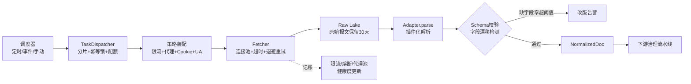
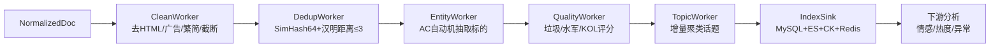
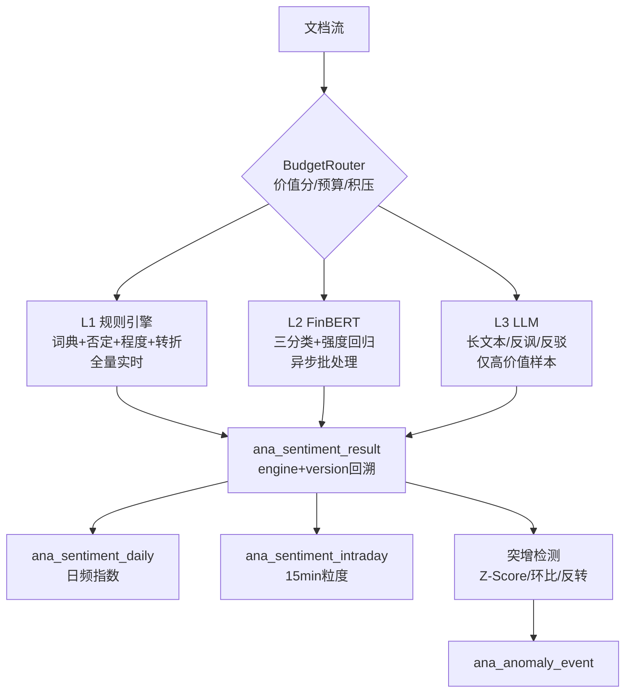

# Aquila 功能模块详细设计（整理版）

> **来源**：整理自 `v2-design/` 6 份文档（01 需求边界 + 02 技术选型 + 03 数据库设计 + 04 多端适配 + 05 拓扑图）
> **性质**：功能模块的详细设计整理，每模块附**可行性标注**（基于单机个人/小团队场景）
> **标注图例**：✅ 直接可用 ｜ ⚠️ 需轻量化 ｜ ⏸️ 暂缓（目标态）

---

## 一、功能模块总览

| 模块 | 名称 | 子功能数 | 核心 | 可行性 |
|---|---|---|---|---|
| M1 | 账户与工作台 | 4 | 登录/工作台/自选/偏好 | ✅ |
| M2 | 标的主数据 | 4 | 证券/行业概念/日历/搜索 | ✅ |
| M3 | 信息采集中心 ★ | 6 | 源插件/任务编排/反爬/Raw Lake/质量/配额 | ⚠️ |
| M4 | 内容治理流水线 ★ | 6 | 清洗/去重/实体/话题/质量/合规 | ⚠️ |
| M5 | 舆情与情绪分析 ★ | 6 | 三级情感/情绪指数/突增/词云/板块/观点 | ⚠️ |
| M6 | 多维投研分析 ★ | 8 | 技术/资金/基本/估值/研报/题材/评分卡/自定义 | ✅ |
| M7 | AI 投研助手 | 5 | 日报/复盘/RAG/NL2Filter/事件抽取 | ⏸️ |
| M8 | 告警与触达 | 4 | 规则引擎/降噪/多渠道/订阅 | ✅ |
| M9 | 开放能力 | 3 | OpenAPI/导出/Webhook | ⏸️ |
| M10 | 运营后台 | 5 | 运维/词典/权限/审计/成本 | ✅ |

**★ 核心域**：M3 采集 + M4 治理 + M5 情感 + M6 投研，构成四条流水线主轴。

---

## 二、各模块详细设计

### M1 账户与工作台 ✅

**职责**：用户身份、个性化工作台、自选股管理、偏好设置。

| 编号 | 功能点 | 设计要点 |
|---|---|---|
| M1.1 | 登录认证 | 账密+验证码 → 可扩展短信/OAuth；**JWT**(AT 2h / RT 7d) + 设备级会话；同账号多端并发策略可配 |
| M1.2 | 今日必看 | 工作台聚合卡片：自选股情绪红黑榜、今日热帖 Top10、持仓关注异动、大盘速览、待办告警 |
| M1.3 | 自选股 | 多分组（最多 20 组 × 100 只）；拖拽排序、备注标签、代码/拼音搜索；**跨端实时同步**（写扩散 Redis + 异步落库） |
| M1.4 | 偏好设置 | A 股红涨绿跌 / 国际色反转；推送时段免打扰；列表密度（紧凑/舒适）；暗色主题 |

**核心实体**：`sys_user` / `sys_role` / `user_watchlist` / `user_watch_item` / `user_preference`

**可行性**：✅ 全部可直接落地。JWT + 自选股 + 偏好 KV，现有技术栈完全覆盖。

---

### M2 标的主数据 ✅

**职责**：证券主数据、行业概念图谱、交易日历、全站搜索。

| 编号 | 功能点 | 设计要点 |
|---|---|---|
| M2.1 | 证券主数据 | 起步沪深 A 股 + 主要指数 + 可转债；结构预留港股/美股/基金 |
| M2.2 | 行业-概念-地域 | 三级标签：`行业(申万三级)` → `概念(题材)` → `地域`；一股票多概念，支持**题材热度反算** |
| M2.3 | 交易日历/停复牌/ST | 准确计算「交易日」而非自然日，避免非交易日误判"零舆情"；ST/退市/停牌影响是否参与排行 |
| M2.4 | 全站搜索 | ES 完成时走 ES，降级走 MySQL `LIKE + 前缀索引`；代码联想 |

**核心实体**：`dim_security` / `dim_industry` / `dim_concept` / `dim_sec_tag` / `trade_calendar`

**可行性**：✅ 主数据 + 日历直接做。搜索 ES 可选，降级 MySQL LIKE 够用。

---

### M3 信息采集中心 ★ ⚠️

**职责**：插件化接入多源公开信息，统一调度、反爬治理、原始报文保留、质量监控。

#### 3.1 数据源矩阵

| 源类型 | 具体来源 | 采集方式 | 频率 |
|---|---|---|---|
| 散户舆情 | 东财股吧、雪球、同花顺 | HTTP JSON / HTML 解析 | 5-15 min 增量 |
| 新闻资讯 | 财经媒体 RSS、新闻站、快讯 | RSS + HTML | 1-5 min |
| 公告 | 交易所公告（巨潮/上交所/深交所） | 官方接口 + PDF | 15-30 min |
| 研报 | 券商研报摘要、一致预期 | HTML/接口 | 日/周频 |
| 行情 | 日K/分时/实时快照 | 行情 API | 交易日实时 + 收盘落地 |
| 资金情报 | 龙虎榜、大宗、融资融券、北向 | 官方/数据站 | 日频 |
| 财报 | 三大报表、财务指标 | 数据接口 | 季度 + 修正重采 |

> **原则**：所有外部源通过**插件化 Adapter** 接入，主链路不出现任何"某个网站"硬编码。

#### 3.2 采集架构

```
调度器(PowerJob)
  └─ 触发 TaskInstance(sourceCode, params)
      ├─ 1. 取策略：RateLimit / ProxyPool / CookiePool / UA指纹
      ├─ 2. 取页：HTTP Client（连接池 + 超时 + 重试 + 指数退避）
      ├─ 3. 落原始：RawRecord → 对象存储/DB（永不被覆盖）
      ├─ 4. 解析：Adapter.parse(raw) → List<NormalizedDoc>
      ├─ 5. 校验：Schema Validate + 字段漂移检测（缺字段率 > 阈值告警）
      ├─ 6. 投递：Kafka topic ingest.doc.<type>
      └─ 7. 记账：采集成功/失败/新函数/耗时 → 采集指标表
```

#### 3.3 关键治理能力

| 能力 | 设计要点 |
|---|---|
| 限流 | 令牌桶（源级 + 全局两级）；滑动窗口 QPS；QPS 按时间带调整（盘中高/夜间低） |
| 熔断 | 三态熔断器（Closed/Open/Half-Open），连续失败 5 次开路，30s 后半开放行 1 探测 |
| 代理池 | IP 池（自建/三方），成功率与延迟评分，自动淘汰；每源可配是否走代理 |
| Cookie/会话池 | TTL 过期自动刷新（Headless 浏览器或登录接口）；无效自动下线并告警 |
| 全量 vs 增量 | 首次全量回溯 N 页，之后按 `last_cursor` 增量；每日一次浅全量防历史帖被编辑 |
| 幂等去重 | 源全局唯一 ID `source + outer_id` 唯一索引；`INSERT ... ON DUPLICATE KEY UPDATE` |
| 重放能力 | 原始报文保留 30 天，解析器升级后可无网重放补数据 |
| 成本控制 | LLM/商用 API 按源设月度预算，超预算自动降级到规则引擎 |

#### 3.4 采集健康度指标

- 源级成功率、P95 耗时、平均新增/小时、连续零新增告警
- 字段缺失率漂移（title 缺失率 0% → 12% ⇒ 页面改版告警）
- 代理池可用率、Cookie 池有效数、被限流(403/429)计数

**核心实体**：`crawl_source` / `crawl_task` / `crawl_task_run` / `crawl_raw_record` / `crawl_source_health`

**可行性**：⚠️ 核心思路对，但需砍掉：**代理池/Cookie池/Headless 浏览器**（东股 API 直连即可）、**PowerJob**（用 ThreadPoolTaskScheduler）、**Kafka 投递**（改本地队列或直接落库）、**Raw Lake 到 MinIO**（改 MySQL 表）。保留：限流、熔断、增量游标、字段漂移检测、幂等去重。

---

### M4 内容治理流水线 ★ ⚠️

**职责**：把原始报文清洗成结构化文档，去重、抽实体、聚类话题、质量打分、合规过滤。

```
NormalizedDoc (Kafka)
  → CleanWorker    : 去HTML/去广告/去水印/折算繁体/长度截断/空值丢弃
  → DedupWorker    : simhash64 计算 → Redis 滑窗 + Hamming距离≤3 判重 → Clusters
  → EntityWorker   : 词典 AC 自动机 + 规则 → 抽取股票代码/简称/机构/人名
  → QualityWorker  : 垃圾/水军/重复搬运打分；账号影响力评分(KOL)
  → TopicWorker    : 在线聚类(KMeans/增量) → 话题簇 + 话题词
  → IndexWorker    : 落 MySQL(主) + ES(检索) + CK(统计) + 更新 Redis 热榜
```

| 能力 | 设计要点 |
|---|---|
| 近似去重 | SimHash 64 位指纹 + 汉明距离 ≤3 判转载；同内容多次转载仅计一次主帖，累加 `duplicate_count` 作热点权重 |
| 实体抽取 | AC 自动机词典匹配（股票代码/简称/机构/人名）+ 规则补充 |
| 质量打分 | 垃圾/水军/重复搬运识别；账号影响力(KOL)评分 |
| 话题聚类 | 在线增量 KMeans → 话题簇 + 话题词 |

**核心实体**：`doc_post` / `doc_comment` / `doc_news` / `doc_announcement` / `doc_research` / `doc_entity_mention` / `doc_topic` / `doc_quality_score`

**可行性**：⚠️ 保留：清洗、SimHash 去重、实体抽取（AC 自动机，Java 30 行可实现）、质量打分。砍掉/暂缓：Kafka 流水线（改同步 Service 调用）、KMeans 话题聚类（复杂度高，V2 再说）、ES+CK 双写（MySQL 主存够）。

---

### M5 舆情与情绪分析 ★ ⚠️

**职责**：三级情感引擎、个股情绪指数、突增检测、词云、板块情绪、观点聚合。

#### 5.1 三级情感引擎（可插拔 + 自动降级）

| 级别 | 实现 | 用途 | 成本 |
|---|---|---|---|
| L1 规则 | 金融情感词典 + 否定词 + 程度副词 + 转折句 | 全量实时标注，兜底层 | ~0 |
| L2 模型 | **FinBERT 微调**（三分类 + 强度回归） | 主力口径，异步批处理 | 低 |
| L3 LLM | 小模型/API，处理长文本、反讽、反驳 | 仅高价值样本（KOL/热帖/长文） | 高 |

**路由策略**：`BudgetRouter` 按 (文档价值分, 当日预算, 队列积压) 决定走哪级；三级结果统一写入同一结果表，保留 `engine` + `version` 支持口径回溯。

#### 5.2 情绪指数口径（必须可解释）

```
个股日情绪指数 Si = 100 × Σ(wk × score_k) / Σ(wk)
权重 wk = w_account(账号影响力) × w_time(半衰期, 24h 衰减 0.5)
       × w_source(源可信度) × w_quality(质量分) × log(1+互动数)
```

派生表：`ana_sentiment_daily(stock_code, trade_date, post_cnt, pos_ratio, neg_ratio, sent_index, ...)`、`ana_sentiment_intraday` 15 分钟粒度。

#### 5.3 突增检测（三种模型并行，命中任一即产生事件）

1. **Z-Score**：当前 15min 声量 vs 过去 20 日同时段均值，Z > 3
2. **环比突增**：当日累计声量 > 昨日同期 × 3 且绝对值 > 30
3. **情绪反转**：情绪指数 1h 内跌幅 > 40（如 +30 → -15）

#### 5.4 观点聚合

对 Top-N 热帖调 LLM 抽结构化三元组：`{立场, 论据要点, 涉及标的, 证据引用}`，前端渲染"多方理由 / 空方理由"双栏，每条结论可点击溯源原文。

**核心实体**：`ana_sentiment_result` / `ana_sentiment_daily` / `ana_sentiment_intraday` / `ana_hot_stat` / `ana_keyword` / `ana_anomaly_event`

**可行性**：⚠️ **L1 规则引擎直接可用**（现有项目已有，需补：权重值生效、标题情感启用、转折句处理）。L2 FinBERT 需训练数据 + GPU，**暂缓**。L3 LLM 可选（云端 API，按预算）。情绪指数公式直接可用。突增检测三种模型直接可用。观点聚合 ⏸️ 暂缓。

---

### M6 多维投研分析 ★ ✅

**职责**：行情技术、资金面、基本面、估值、研报、题材图谱、综合评分卡、自定义看板。

#### 6.1 个股详情页（一屏式研报视图，核心界面）

七大卡片区：

1. **速览**：价格、涨跌幅、情绪温度(+/-/o)、热度分位、综合评分雷达
2. **舆情**：情绪走势叠加 K 线双轴图、词云、Top 热帖
3. **技术面**：多周期 K 线、主要指标、关键价位
4. **资金面**：主力资金流向、龙虎榜、北向持股变化
5. **基本面**：近 8 期营收/净利/ROE/毛利趋势、杜邦拆解、行业排名
6. **机构观点**：评级分布饼图、目标价区间、预测修正方向
7. **风险提示**：商誉、质押、减持、问询函、诉讼、ST 风险

#### 6.2 综合评分卡（可解释）

```
CompositeScore = 0.25×基本面 + 0.20×估值 + 0.20×资金面 + 0.20×技术面 + 0.15×舆情情绪
每项由若干因子 z-score 标准化后加权，输出 0~100 + 归因条形图（哪些因子拉高/拉低）
```

- 因子定义表化存 DB（`ana_factor_def`），后台调权重无需发版
- 所有得分**持久化快照**，支持"当时的评分 vs 现在"对比，避免幸存者偏差

#### 6.3 题材图谱

概念/产业链 → 成分股 → 情绪与热度加权 → **题材温度计**；支持"某利好事件沿产业链传导"路径高亮（事件节点 + 边权重），回答"这条新闻利好谁"。

**核心实体**：`quote_daily` / `mf_moneyflow` / `fin_indicator` / `fin_balance` / `fin_income` / `fin_cashflow` / `ana_factor_def` / `ana_factor_value` / `ana_stock_score` / `dim_concept` / `dim_industry_chain`

**可行性**：✅ 全部可落地。评分卡公式 + 因子表化 + 快照持久化，现有技术栈完整覆盖。题材图谱可先做静态映射，传导高亮 V2 再做。

---

### M7 AI 投研助手 ⏸️

**职责**：LLM 驱动的个股日报、大盘复盘、文档问答、自然语言选股、事件抽取。

| 能力 | 技术实现 | 风险控制 |
|---|---|---|
| 个股日报 | 取当日结构化数据拼 Template → LLM 成文 | 输出仅描述事实，禁"建议买入"措辞（Prompt 约束 + 后置审核词表） |
| 大盘复盘 | 指数 + 涨跌家数 + 板块轮动 + 情绪指标 → LLM | 同上 |
| 文档问答 | 研报/公告切片向量化 → **Milvus** 检索 → RAG 回答 | 每段回答附原文引用锚点 |
| NL2Filter | LLM 输出结构化 JSON Filter → 转查询条件 | 白名单字段 + Schema 校验后才可执行 |
| 事件抽取 | 公告正文 → 事件类型 + 涉及标的 + 影响方向 | 仅作线索，标注"AI 生成，需人工核实" |

**可行性**：⏸️ **暂缓**。依赖 LLM API + Milvus 向量库 + Python FastAPI/Celery，整个 AI 计算层。短期可做：用云端 LLM API（Qwen/DeepSeek）+ Java 模板拼装做"个股日报"先跑通，RAG/NL2Filter 等有量了再做。

---

### M8 告警与触达 ✅

**职责**：规则引擎、降噪、多渠道推送、订阅管理。

#### 规则引擎（DSL 化）

```json
{
  "name": "情绪突降",
  "scope": "watchlist",
  "condition": {
    "and": [
      {"metric": "sentiment_index_1h", "op": "drop", "value": 40},
      {"metric": "volume_ratio", "op": ">", "value": 1.5}
    ]
  },
  "cooldown": "4h",
  "maxPerDay": 3,
  "channels": ["webpush", "email"]
}
```

**降噪机制**：同类事件 15 分钟窗口合并、同一标的日上限、夜间勿扰、优先级队列（P0 异动 > P1 舆情 > P2 日报）。

**核心实体**：`alt_rule` / `alt_rule_condition` / `alt_event` / `alt_notify_log` / `alt_channel`

**可行性**：✅ 规则 DSL + 降噪 + 企微/钉钉推送，现有技术栈直接做。WebPush 可选（PWA）。

---

### M9 开放能力 ⏸️

**职责**：OpenAPI、数据集导出、Webhook 事件流。

| 能力 | 设计 |
|---|---|
| OpenAPI | Key 鉴权 + 限流配额 |
| 数据导出 | CSV/Parquet |
| Webhook | 事件流订阅 |

**可行性**：⏸️ 多租户/对外开放场景才需要，个人投研暂缓。

---

### M10 运营后台 ✅

**职责**：数据源/任务运维、词典管理、权限 RBAC、审计、成本看板。

| 编号 | 功能点 |
|---|---|
| M10.1 | 数据源/任务/调度运维 |
| M10.2 | 词典管理（情感词、否定词、行业词） |
| M10.3 | 用户与权限（RBAC） |
| M10.4 | 审计日志与操作留痕 |
| M10.5 | 成本看板（LLM Token / 代理 IP 消耗） |

**核心实体**：`sys_audit_log` / `sys_dict_word` / `crawl_source` / `collect_task_run`

**可行性**：✅ RBAC + 审计 + 词典管理 + 任务运维看板，直接做。成本看板 ⏸️（有 LLM 后再做）。

---

## 三、四大流水线设计

### 流水线 1：采集流水线



### 流水线 2：内容治理流水线



### 流水线 3：情感分析流水线



### 流水线 4：投研分析流水线

```mermaid
flowchart TB
    DOC["文档流"] --> SENT["情感结果"]
    Q["行情/资金/财报"] --> FAC["因子计算<br/>技术/估值/资金/基本"]
    MD["主数据/题材映射"] --> TOP["题材温度聚合"]
    SENT & FAC --> SCR["综合评分卡+归因"]
    SENT --> SUM["AI 摘要<br/>个股日报/大盘复盘"]
    SCR --> ALT["告警规则引擎"]
    EVT2["异常事件"] --> ALT
    ALT --> PUSH["多渠道触达<br/>站内/邮件/WebPush/企微/钉钉"]
```



---

## 四、核心业务流程

### 采集 → 分析 → 触达全景

```
            ┌──────────── 采集层 ────────────┐
外部源 ─Adapter─► HTTP Fetch ─► Raw Lake ─► Parse ─► Kafka(ingest.doc.*)
            └────────────────────────────────┘
                                │
            ┌──────────── 治理层 ─────────────┐
            Clean→Dedup→Entity→Quality→Topic │
            └────────────────────────────────┘
                          │            │
           ┌──────────────┘            └──────────────┐
           ▼                                          ▼
  ┌── 分析层（批/流）──┐                      ┌── 检索/存储 ──┐
  │ 情感引擎 L1/L2/L3 │                      │ MySQL + ES   │
  │ 因子计算/评分卡    │                      │ ClickHouse   │
  │ 异常检测/热度榜    │                      │ Redis cache  │
  └──────────┬────────┘                      └──────┬───────┘
             │                                      │
             ▼                                      ▼
    ┌── 应用层 ─────────────────────────────────────────┐
    │ REST/gRPC BFF → 工作台/个股/题材/助手/告警/OpenAPI │
    └──────────────────────┬────────────────────────────┘
                           ▼
              Web(PC) / Mobile H5 / 小程序 / 第三方
```

---

## 五、SLA 承诺

| 指标 | 目标 |
|---|---|
| 热帖从发布到可见 | P95 ≤ 3 min（核心源 ≤ 90 s） |
| 个股详情页首屏 | P95 ≤ 800 ms（含图表数据） |
| 日频因子与评分 | 每交易日 18:00 前完成全部计算 |
| 采集任务成功率 | ≥ 99%（单源月度） |
| 系统可用性 | 99.5%（检索与登录不可用不可接受） |

---

## 六、版本演进节奏

| 阶段 | 周期 | 交付模块 |
|---|---|---|
| V1 MVP | 6 周 | M1 + M2 + M3(3源) + M4(轻) + M5(L1规则) + 个股详情页 |
| V2 增强 | +6 周 | M5(L2模型) + M6(技术/资金/基本) + M8 告警 + 移动适配完善 |
| V3 智能 | +8 周 | M7 全部 + M9 OpenAPI + 题材图谱 + 评分卡 |
| V4 规模化 | 持续 | 数据分层存储、ClickHouse 全面接管分析查询、多租户隔离 |

---

## 七、务实化落地映射

基于单机个人/小团队场景，把 v2-design 映射到可落地方案：

| v2-design 设计 | 务实化方案 | 阶段 |
|---|---|---|
| PowerJob 调度 | ThreadPoolTaskScheduler(8) + AtomicBoolean | V1 |
| Kafka 流水线 | 同步 Service 调用 / 本地阻塞队列 | V1 |
| Raw Lake → MinIO | `crawl_raw_record` 表（保留 30 天，按月分区） | V1 |
| 代理池/Cookie池/Headless | 砍（东财 API 直连） | 砍 |
| SimHash + AC 自动机 | ✅ 保留（Java 30 行可实现） | V1 |
| 三级情感引擎 | **仅 L1 规则起步**，L2/L3 暂缓 | V1 |
| 情绪指数 + 突增检测 | ✅ 保留 | V1-V2 |
| MySQL + ES + CK + Redis | **MySQL + Redis 起步**，ES 可选，CK 暂缓 | V1 |
| Milvus 向量库 | 砍（V3 有 RAG 需求再引入） | V3 |
| BFF 5 个编排 | AppService 编排（单体） | V1 |
| Java + Python 双语言 | **Java 单体起步**，Python AI 层 V3 | V1 / V3 |
| Spring Cloud Gateway | Nginx 反代 | V1 |
| FinBERT 微调 | 砍（需 GPU + 训练数据） | 砍 |
| 评分卡 + 因子表化 + 快照 | ✅ 保留 | V2 |
| 告警 DSL + 降噪 + 企微/钉钉 | ✅ 保留 | V2 |
| 多端适配（一套代码+响应式） | ✅ 保留 | V2 |
| NL2Filter / RAG / LLM 摘要 | 云端 LLM API + Java 模板先跑通 | V3 |

---

## 八、与现有 Stock-BBS 的关系

| 现有 Stock-BBS | 对应 v2-design 模块 | 差距 |
|---|---|---|
| 股吧采集（PostController/GubaCrawler） | M3 采集中心 | 缺：插件化、Raw Lake、字段漂移检测；有：限流、熔断、增量 |
| 情感分析（LocalSentimentService） | M5 L1 规则引擎 | 缺：权重生效、标题情感、转折句；有：词典+否定+程度 |
| 行情采集（MarketServiceImpl） | M3 行情源 + M6 技术面 | 缺：多源健康度路由；有：三源降级、退避 |
| 因子评分（FactorServiceImpl） | M6 综合评分卡 | 缺：五维评分、因子表化、快照；有：三维评分 |
| 选股（ScreenerServiceImpl） | M6 评分卡衍生 | 缺：策略 DSL；有：条件匹配 |
| 投研（ResearchPlatformServiceImpl） | M6 个股详情页 | 缺：七卡片一屏式；有：多维聚合 |
| 告警（PlatformAnalyticsServiceImpl） | M8 告警与触达 | 缺：DSL、降噪、优先级；有：规则扫描、当日去重 |
| 自选股（WatchlistServiceImpl） | M1.3 自选股 | 缺：跨端同步、分组；有：基础 CRUD |
| 平台治理（SecurityServiceImpl 等） | M10 运营后台 | 缺：审计 AOP、词典管理；有：RBAC、审计落表 |

**结论**：现有 Stock-BBS 已覆盖 v2-design 约 **40% 功能点**，剩余 60% 可在健壮化基础上渐进补齐，无需从零重写。

---

> **文档维护**：本文为 v2-design 功能模块的整理+务实化标注，落地时优先参考「健壮版方案」+ 本文档的可行性标注，v2-design 原文作为目标态蓝图保留。
