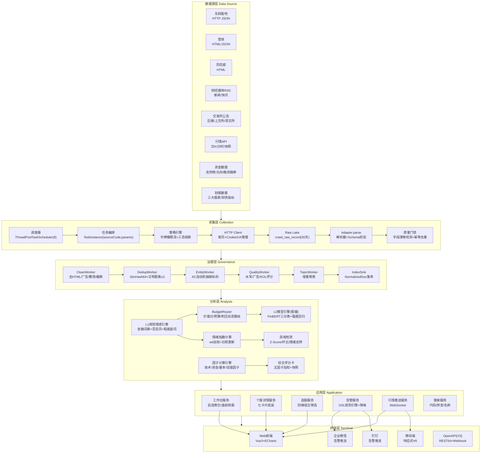
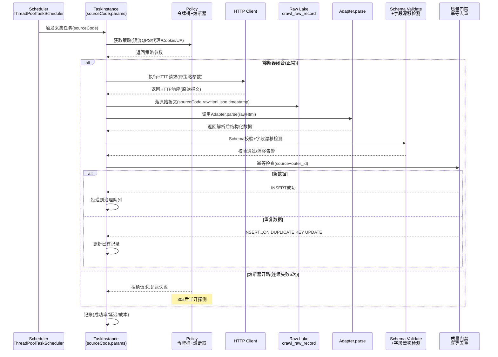
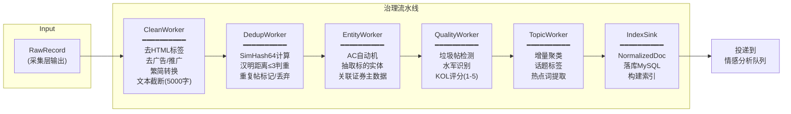
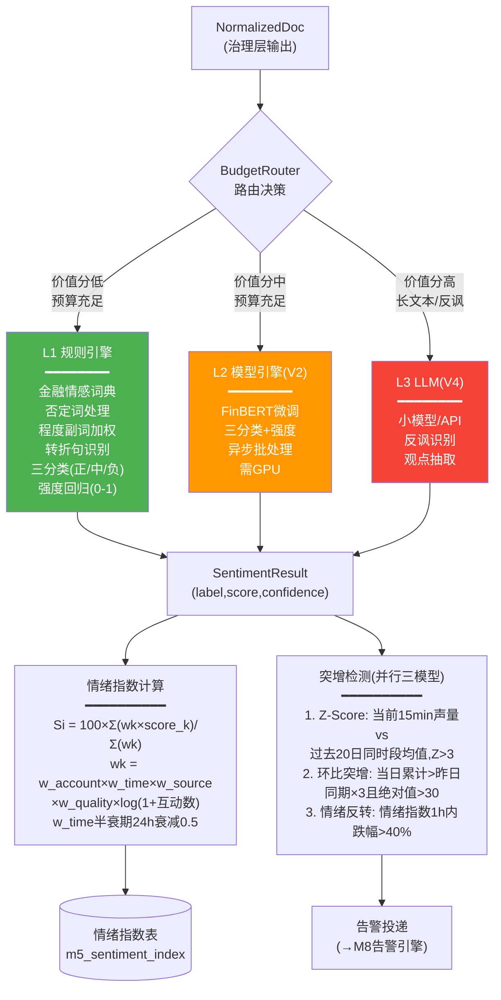
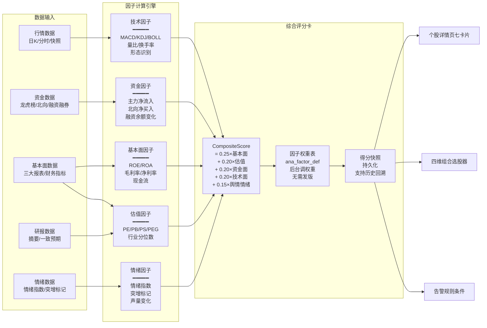
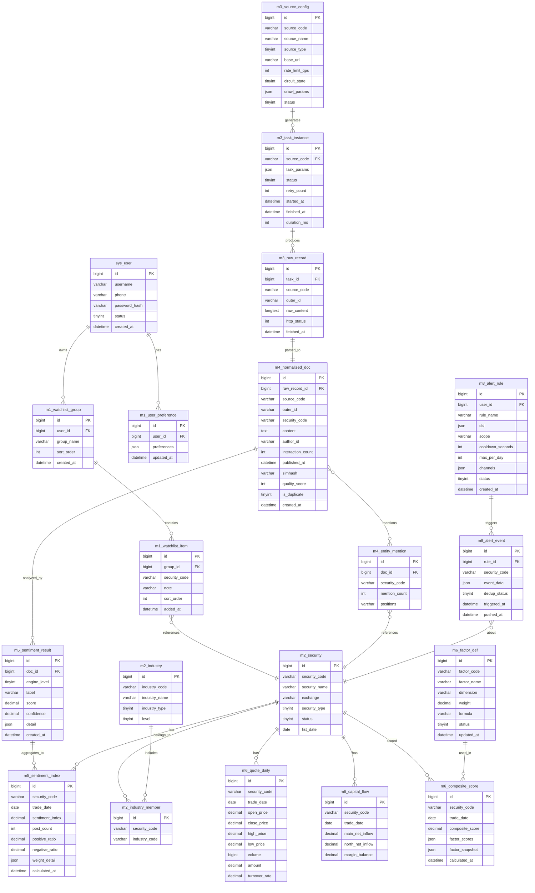

# Aquila 投研工具设计文档 — 阶段1-2完整方案

> **文档范围**：阶段1（需求采集与头脑风暴）+ 阶段2（系统架构与数据层设计）
> **协作角色**：阶段1由 R1产品经理 / R2基本面投研 / R3技术面投研 / R4情绪面投研 / R5数据架构师 协作；阶段2由 R6系统架构师 / R5数据架构师 / R11数据库工程师 协作
> **版本**：V1.0 | **日期**：2026-09-30

---

# 阶段1：需求采集与头脑风暴

## 1.1 用户角度数据采集

### 1.1.1 目标用户画像

Aquila 面向三类核心用户群体，每类用户在投资经验、使用频率、技术能力、付费意愿上存在显著差异。产品设计需在"个人轻量使用"与"团队协作"之间取得平衡，同时为量化爱好者保留足够的开放性与数据导出能力。

#### 画像一：个人投资者（散户进阶型）

- **典型特征**：3-10年A股投资经验，持仓规模10万-200万，主要依赖手机APP+PC网页获取信息，具备基本财务报表阅读能力但缺乏深度建模能力
- **信息消费习惯**：每日盘前浏览资讯30分钟，盘中看自选股行情，盘后看龙虎榜/资金流向，周末复盘。主要信息来源为东方财富股吧、雪球讨论、财经新闻APP
- **核心诉求**：在信息过载中快速筛选与自己持仓/自选相关的内容；希望看到"情绪面"信号而非只有技术指标；需要简洁的告警而非被推送淹没
- **付费意愿**：低-中，愿意为高质量情绪信号和个性化告警付费，月费承受区间30-100元
- **技术能力**：不会写代码，需要可视化操作界面，期望"一键选股""一键复盘"等低门槛功能
- **痛点关键词**：信息碎片化、股吧噪音大、情绪判断靠感觉、自选股管理分散

#### 画像二：小型投研团队（3-8人）

- **典型特征**：私募/工作室/独立研究小组，有明确分工（宏观+行业+个股跟踪），持仓规模千万级以上，使用Wind/同花顺iFinD但预算有限
- **信息消费习惯**：团队内部分工跟踪不同板块，晨会前需要统一的信息简报，盘中需要实时舆情跟踪和异动告警，定期输出研究报告
- **核心诉求**：多源数据统一汇聚，避免每人各找各的；舆情与情绪信号可追溯、可复盘；支持团队级自选股同步与标注协作；需要可导出的研报素材和因子数据
- **付费意愿**：中-高，愿意为数据覆盖度、API开放、团队协作功能付费，月费承受区间500-3000元
- **技术能力**：团队中至少1人懂Python/SQL，能使用API和数据库查询，但不具备大规模系统运维能力
- **痛点关键词**：数据源分散、团队协作缺工具、情绪信号不可追溯、研报素材整理耗时

#### 画像三：量化爱好者（技术驱动型）

- **典型特征**：有编程能力，自行构建选股策略和回测系统，关注因子有效性、数据可获取性、API可调用性
- **信息消费习惯**：通过API/数据库批量拉取数据，自行计算因子，关注另类数据（舆情情绪、龙虎榜、资金流向）作为因子源
- **核心诉求**：结构化数据API覆盖全面、字段稳定、更新及时；情绪指数/评分卡等衍生指标可作为因子直接调用；支持Webhook回调推送异动事件；历史数据可回溯用于回测
- **付费意愿**：中，按数据量/API调用量付费，偏好按量计费而非固定月费
- **技术能力**：强，Python/SQL熟练，能自行搭建回测框架，关注数据质量和字段定义稳定性
- **痛点关键词**：另类数据难获取、情绪因子无标准接口、数据更新延迟不可控、字段定义频繁变更

### 1.1.2 核心使用场景

以下六个场景覆盖了用户在交易日全生命周期中的关键触点，每个场景描述了用户行为路径、核心功能需求和对应的模块支撑。

#### 场景一：盘前情报速览（07:00-09:15）

**用户故事**：作为个人投资者，我希望在开盘前15分钟内快速浏览自选股隔夜舆情、重大公告、外围市场影响，形成当日操作预案。

**行为路径**：打开Aquila工作台 → 查看自选股隔夜舆情摘要 → 查看新增公告/研报 → 查看情绪指数变化 → 查看突增告警 → 标记关注标的

**核心需求**：
- 自选股隔夜舆情聚合视图（按个股分组，显示声量变化、情绪指数、突增标记）
- 公告/研报新增列表（支持按个股、类型筛选）
- 情绪指数趋势图（对比昨日同期）
- 突增检测告警推送（前一日盘后至当日开盘前的突增事件）
- 盘前简报（AI生成的自选股舆情日报，V3实现）

**模块支撑**：M1工作台 + M3采集（隔夜增量）+ M5情绪（L1规则）+ M8告警

#### 场景二：盘中实时监控（09:30-15:00）

**用户故事**：作为投研团队成员，我希望盘中实时监控跟踪标的的舆情异动和资金变化，在板块轮动时第一时间收到告警。

**行为路径**：保持工作台常开 → 实时接收自选股行情推送 → 舆情突增弹窗告警 → 点击查看个股详情 → 查看资金面/技术面数据 → 在团队频道同步信息

**核心需求**：
- 自选股实时行情快照（WebSocket推送，3-5秒延迟）
- 舆情突增实时告警（声量突增+情绪反转双信号触发）
- 个股详情页七卡片快速加载（首屏P95≤800ms）
- 资金流向实时更新（大单/北向/融资融券）
- 告警降噪（同类事件15分钟窗口合并，避免刷屏）

**模块支撑**：M1工作台 + M5情绪（突增检测）+ M6投研（技术面/资金面）+ M8告警（DSL规则引擎+降噪）

#### 场景三：盘后数据复盘（15:00-18:00）

**用户故事**：作为个人投资者，我希望收盘后查看当日完整复盘数据，包括自选股涨跌原因、舆情演变、资金流向，辅助次日决策。

**行为路径**：打开复盘视图 → 查看自选股当日表现总览 → 逐个查看个股舆情时间线 → 查看资金流向复盘 → 查看板块资金分布 → 导出复盘报告

**核心需求**：
- 自选股当日表现总览（涨跌幅、成交量、换手率、资金净流入）
- 个股舆情时间线（按时间轴展示声量+情绪变化，标注突增点）
- 板块资金分布热力图
- 龙虎榜数据展示（机构席位/游资席位）
- 复盘报告导出（PDF/Excel，V3实现）

**模块支撑**：M6投研（技术面/资金面/复盘）+ M5情绪（时间线）+ M2标的主数据（板块/龙虎榜）

#### 场景四：智能选股筛选

**用户故事**：作为量化爱好者，我希望通过多维度条件组合筛选标的，包括技术指标、基本面指标、情绪指标和资金指标的自定义组合。

**行为路径**：进入选股器 → 添加技术面条件（MACD金叉、量比>2）→ 添加基本面条件（PE<30、ROE>15%）→ 添加情绪面条件（情绪指数>60、突增标记）→ 添加资金面条件（北向连续3日净流入）→ 执行筛选 → 查看结果 → 导出或加入自选

**核心需求**：
- 多维度条件组合筛选器（技术+基本+情绪+资金，支持AND/OR逻辑）
- 自定义条件保存与复用
- 筛选结果列表（含关键指标对比）
- 结果导出（Excel/CSV）或一键加入自选
- 情绪指标作为筛选条件（差异化亮点）

**模块支撑**：M6投研（多维分析+自定义因子）+ M5情绪（情绪指数）+ M1自选管理

#### 场景五：舆情深度跟踪

**用户故事**：作为投研团队成员，我希望对重点跟踪标的进行舆情深度分析，包括情绪指数趋势、热点话题、关键意见领袖观点、板块情绪对比。

**行为路径**：进入个股详情页 → 切换到舆情卡片 → 查看情绪指数30日趋势 → 查看热点话题词云 → 查看KOL观点列表 → 查看同板块情绪对比 → 标记重要帖子

**核心需求**：
- 个股情绪指数趋势图（日/周/月维度，对比板块均值）
- 热点话题词云（基于TopicWorker增量聚类结果）
- KOL观点列表（按影响力排序，QualityWorker评分过滤水军）
- 板块情绪对比图
- 重要帖子标注与收藏

**模块支撑**：M5情绪（情绪指数/词云/观点/板块）+ M4治理（话题聚类/质量评分）+ M2标的主数据（板块归属）

#### 场景六：告警规则配置与接收

**用户故事**：作为个人投资者，我希望自定义告警规则（如"自选股情绪指数单日跌幅>40%时推送"），并通过企业微信/钉钉接收，不被噪音干扰。

**行为路径**：进入告警配置 → 创建规则（选择标的→选择条件→设置阈值→选择渠道）→ 设置降噪参数（冷却时间、每日上限）→ 保存 → 在企微/钉钉接收告警 → 点击告警跳转个股详情

**核心需求**：
- 可视化规则编辑器（无需写DSL，表单式配置）
- 多条件组合（AND/OR，支持情绪/技术/资金维度）
- 降噪控制（冷却时间、每日上限、同类合并窗口）
- 多渠道推送（企微/钉钉/站内消息，V1先做企微+站内）
- 告警跳转链接（直达个股详情页相关卡片）

**模块支撑**：M8告警（DSL规则引擎+降噪+多渠道）+ M1偏好设置

### 1.1.3 用户痛点清单

基于用户访谈和竞品分析，梳理出以下痛点，按技术面、使用面、基本面、数据面四个维度分类。

#### 技术面痛点

| 编号 | 痛点描述 | 影响用户群 | 严重程度 |
|:---:|:-------|:--------:|:------:|
| T1 | 现有工具技术指标计算口径不一致，不同平台MACD/KDJ参数不同导致信号矛盾，用户无法确认哪个口径可信 | 全部 | 高 |
| T2 | 技术指标与情绪/资金数据割裂，需要在不同APP间切换才能综合判断，无法在同屏看到"技术面+资金面+情绪面"综合视图 | 个人/团队 | 高 |
| T3 | 缺少自定义指标组合能力，用户想用"MACD+量比+情绪指数"组合选股，现有工具不支持跨维度组合 | 量化 | 高 |
| T4 | 复盘时技术指标变化没有时间线回放，只能看到收盘值，无法回溯盘中指标演变过程 | 个人/团队 | 中 |

#### 使用面痛点

| 编号 | 痛点描述 | 影响用户群 | 严重程度 |
|:---:|:-------|:--------:|:------:|
| U1 | 信息过载严重，股吧单只股票日帖量可达数千条，噪音/水军/广告帖占比高，有效信息提取困难 | 全部 | 高 |
| U2 | 自选股管理分散，行情在东财看、舆情在雪球看、公告在巨潮看，没有统一的自选股工作台 | 个人/团队 | 高 |
| U3 | 告警推送不分轻重缓急，全量推送导致用户疲劳，关键信息被淹没，缺乏智能降噪机制 | 全部 | 高 |
| U4 | 个股详情页信息组织混乱，需要多次跳转才能看到舆情+技术+资金+基本面的完整画像 | 全部 | 中 |

#### 基本面痛点

| 编号 | 痛点描述 | 影响用户群 | 严重程度 |
|:---:|:-------|:--------:|:------:|
| F1 | 财务数据更新不及时，季报披露后部分平台延迟1-3天才更新，影响估值模型时效性 | 团队/量化 | 高 |
| F2 | 估值对比缺乏行业/概念横向参照，PE/PB只是绝对值，缺少同行业分位数对比 | 个人/团队 | 中 |
| F3 | 研报数据获取分散且质量参差，不同券商研报口径不同，缺少一致预期汇总和研报质量评分 | 团队 | 高 |

#### 数据面痛点

| 编号 | 痛点描述 | 影响用户群 | 严重程度 |
|:---:|:-------|:--------:|:------:|
| D1 | 另类数据（舆情情绪、龙虎榜席位、北向资金明细）获取门槛高，需要多源拼接，个人投资者无力整合 | 全部 | 高 |
| D2 | 数据字段定义不稳定，同一指标在不同源/不同时间口径不同（如"涨跌停"是否含ST），导致分析结论不可靠 | 量化 | 高 |
| D3 | 历史数据回溯困难，情绪面数据几乎没有公开历史数据，回测时缺少情绪因子输入 | 量化 | 高 |
| D4 | 数据更新延迟不可控，官方公告15-30分钟延迟可接受，但舆情数据延迟到小时级就失去价值 | 全部 | 高 |

### 1.1.4 竞品对标分析

#### 东方财富

| 维度 | 优势 | 不足 |
|:---:|:-----|:-----|
| 数据覆盖 | 全品类数据最全（行情/资金/财报/龙虎榜/融资融券/公告），东财股吧是国内最大散户舆情社区 | 数据接口不开放，第三方无法结构化获取；股吧数据噪音极大，无情绪分析 |
| 功能广度 | 功能覆盖极广，从行情到交易到社区到基金，一站式 | 功能过多导致界面复杂，核心体验被稀释；舆情只有原始帖文，无情绪指数/突增检测 |
| 技术体验 | 行情推送稳定，移动端体验成熟 | 无开放API；无跨维度组合选股；无情绪面因子；告警功能简单（仅价格提醒） |
| 对Aquila的启示 | 数据覆盖广度是护城河，但过度功能堆砌反而降低核心体验 | Aquila 应走"少而精"路线，用情绪面和综合评分卡做差异化 |

#### 同花顺

| 维度 | 优势 | 不足 |
|:---:|:-----|:-----|
| 数据覆盖 | iFinD数据终端专业度高，财务数据深度和准确性行业领先 | iFinD收费高昂（年费数万），个人/小团队用不起；免费版数据有限 |
| 功能特色 | 选股器功能强大，支持多维度条件组合；AI诊股有一定特色 | 选股器不支持情绪面因子；AI诊股结论较泛化，缺少可追溯的数据依据 |
| 技术体验 | PC客户端功能丰富，指标计算引擎成熟 | 客户端重、启动慢；无Web版开放能力；数据不开放API |
| 对Aquila的启示 | 选股器是核心刚需，必须做好；但选股条件应加入情绪面维度做差异化 | Aquila 选股器支持"技术+基本+情绪+资金"四维组合，这是核心差异点 |

#### 雪球

| 维度 | 优势 | 不足 |
|:---:|:-----|:-----|
| 社区质量 | 用户质量较高，KOL/大V产出优质内容，讨论深度优于股吧 | 社区数据不开放；无结构化情绪指数；帖子质量参差，无系统化过滤 |
| 功能特色 | 组合功能有特色，自选股管理体验好；移动端体验流畅 | 纯行情/技术分析能力弱；无龙虎榜/资金流向等专业数据；无告警规则引擎 |
| 技术体验 | Web+iOS+Android全平台，API有一定开放度（但受限） | 数据深度不够；无基本面深度分析；无舆情治理（去重/去水军/话题聚类） |
| 对Aquila的启示 | 社区情绪数据有价值，但需要治理（去重/去水军/质量评分）才有用 | Aquila 的M4治理流水线（SimHash去重+QualityWorker水军过滤）是核心竞争力 |

#### 竞品空白矩阵（Aquila的差异化机会）

| 能力 | 东财 | 同花顺 | 雪球 | **Aquila** |
|:---:|:---:|:---:|:---:|:---:|
| 散户舆情原始数据 | ✅ | ❌ | ✅ | ✅ |
| 舆情情绪指数 | ❌ | ❌ | ❌ | **✅** |
| 突增检测告警 | ❌ | ❌ | ❌ | **✅** |
| 多维组合选股（含情绪） | ❌ | ✅(无情绪) | ❌ | **✅** |
| 综合评分卡 | ❌ | AI诊股(泛化) | ❌ | **✅** |
| 开放API | ❌ | iFinD(贵) | 受限 | **✅(V3)** |
| 团队协作 | ❌ | ❌ | ❌ | **✅** |
| 水军/噪音过滤 | ❌ | ❌ | ❌ | **✅** |

---

## 1.2 四面需求矩阵

以下需求矩阵覆盖技术面、使用面、基本面、数据面四个维度，每维度至少5条需求，标注优先级（P0=必须有/P1=应该有/P2=可以有）、对应模块和落地阶段。

### 技术面需求

| 编号 | 需求面 | 核心需求 | 优先级 | 对应模块 | 落地阶段 |
|:---:|:---:|:-------|:---:|:---:|:---:|
| T-R01 | 技术面 | 日K/分时行情展示，支持MA/EMA/MACD/KDJ/BOLL等常用指标计算与叠加显示，指标参数可调 | P0 | M6多维投研 | V1 |
| T-R02 | 技术面 | 量价分析视图，含成交量、换手率、量比、成交额，支持量价配合标注 | P0 | M6多维投研 | V1 |
| T-R03 | 技术面 | 技术指标自定义组合选股，支持MACD金叉+量比放大+KDJ超卖等多条件AND/OR组合 | P1 | M6多维投研 | V2 |
| T-R04 | 技术面 | K线形态识别（吞没/十字星/锤头线等常见形态自动标注） | P2 | M6多维投研 | V3 |
| T-R05 | 技术面 | 技术指标口径配置管理，用户可选择同花顺/通达信/东财不同参数口径 | P1 | M6+M10运营 | V2 |
| T-R06 | 技术面 | 盘中实时行情快照推送，自选股行情3-5秒延迟通过WebSocket推送 | P0 | M6+M8告警 | V1 |

### 使用面需求

| 编号 | 需求面 | 核心需求 | 优先级 | 对应模块 | 落地阶段 |
|:---:|:---:|:-------|:---:|:---:|:---:|
| U-R01 | 使用面 | 统一工作台，聚合自选股行情/舆情/公告/告警，一个页面看完所有关注信息 | P0 | M1账户与工作台 | V1 |
| U-R02 | 使用面 | 自选股分组管理，支持按主题/策略分组，组内排序、标注、备注 | P0 | M1账户与工作台 | V1 |
| U-R03 | 使用面 | 个股详情页七卡片布局（速览/舆情/技术面/资金面/基本面/机构观点/风险提示），首屏P95≤800ms | P0 | M6多维投研 | V1 |
| U-R04 | 使用面 | 告警可视化规则编辑器，表单式配置条件/阈值/渠道/降噪，无需写代码 | P1 | M8告警与触达 | V2 |
| U-R05 | 使用面 | 移动端适配（响应式Web），支持手机浏览器查看工作台和接收告警 | P1 | M1+前端工程 | V2 |
| U-R06 | 使用面 | 团队协作：自选股组共享、标注同步、告警组订阅 | P2 | M1+M8 | V3 |

### 基本面需求

| 编号 | 需求面 | 核心需求 | 优先级 | 对应模块 | 落地阶段 |
|:---:|:---:|:-------|:---:|:---:|:---:|
| F-R01 | 基本面 | 三大报表展示（资产负债表/利润表/现金流量表），支持多期对比和同比环比 | P0 | M6多维投研 | V2 |
| F-R02 | 基本面 | 核心财务指标看板（ROE/ROA/毛利率/净利率/资产负债率/现金流等），含行业分位数对比 | P1 | M6多维投研 | V2 |
| F-R03 | 基本面 | 估值指标（PE/PB/PS/PEG）及历史分位数，含同行业横向对比 | P1 | M6多维投研 | V2 |
| F-R04 | 基本面 | 研报摘要聚合与一致预期（EPS/营收预测共识值），按券商/时间筛选 | P1 | M6+M3采集 | V3 |
| F-R05 | 基本面 | 综合评分卡（基本面20%+估值20%+资金20%+技术20%+舆情15%），权重后台可调 | P1 | M6多维投研 | V3 |
| F-R06 | 基本面 | 财报披露日历与修正重采，季报披露后及时更新财务指标 | P0 | M2标的主数据 | V2 |

### 数据面需求

| 编号 | 需求面 | 核心需求 | 优先级 | 对应模块 | 落地阶段 |
|:---:|:---:|:-------|:---:|:---:|:---:|
| D-R01 | 数据面 | 散户舆情多源采集（东财股吧/雪球/同花顺），5-15分钟增量，支持帖文/评论/互动数 | P0 | M3采集中心 | V1 |
| D-R02 | 数据面 | 舆情内容治理流水线（去HTML/去广告/繁简转换/SimHash去重/实体抽取/质量评分），输出NormalizedDoc | P0 | M4治理流水线 | V1 |
| D-R03 | 数据面 | 三级情感分析引擎，V1先落地L1规则引擎（金融情感词典+否定词+程度副词），输出三分类+强度 | P0 | M5情绪分析 | V1 |
| D-R04 | 数据面 | 个股日情绪指数计算（含账号影响力/时间衰减/源可信度/质量分/互动数加权），日频更新 | P0 | M5情绪分析 | V1 |
| D-R05 | 数据面 | 突增检测引擎（Z-Score/环比突增/情绪反转三模型并行），15分钟窗口检测，实时告警 | P1 | M5情绪分析 | V2 |
| D-R06 | 数据面 | 数据质量治理：字段漂移检测（Schema校验）、幂等去重（source+outer_id唯一索引）、原始报文保留30天可重放 | P0 | M3采集中心 | V1 |
| D-R07 | 数据面 | 公告/研报/龙虎榜/融资融券/北向资金等结构化数据采集与存储 | P1 | M3采集中心 | V2 |
| D-R08 | 数据面 | 开放API（V3），提供情绪指数/评分卡/舆情数据等结构化接口，支持Webhook回调 | P2 | M9开放能力 | V3 |

---

## 1.3 头脑风暴

### 1.3.1 功能创新点（差异化亮点）

基于竞品空白分析，以下8个创新点构成 Aquila 的核心差异化竞争力：

**创新点1：三级情感引擎 × BudgetRouter 动态调度**

现有竞品完全没有舆情情绪指数。Aquila 设计三级情感引擎（L1规则→L2 FinBERT→L3 LLM），通过BudgetRouter根据文档价值分、当日预算、队列积压动态决定每条文档走哪级分析。V1先落地L1规则引擎（成本~0，全量实时处理），L2/L3按版本演进引入。这保证了"全量覆盖+成本可控+精度可升"的渐进式能力建设。

**创新点2：突增检测三模型并行实时告警**

首创将声量突增（Z-Score + 环比突增）与情绪反转（1h内跌幅>40%）三个模型并行运行，15分钟窗口检测。当多个模型同时触发时提高告警置信度，通过M8告警DSL引擎推送。这是"舆情异动→告警→行动"闭环的关键一环，现有竞品完全没有类似能力。

**创新点3：综合评分卡（五因子加权，后台调权重无需发版）**

将基本面(25%)+估值(20%)+资金面(20%)+技术面(20%)+舆情情绪(15%)五维度加权为单一综合评分，因子权重表化存储在`ana_factor_def`表，运营后台调整权重后即时生效，无需发版。得分持久化快照支持历史回溯。这是"多维数据→单一决策信号"的聚合能力，显著降低用户综合判断的认知负担。

**创新点4：四维组合选股器（技术+基本+情绪+资金）**

突破现有选股器只能在技术+基本面维度组合的局限，加入情绪面（情绪指数>60、突增标记）和资金面（北向连续3日净流入）维度，支持AND/OR逻辑组合。这是数据层差异化（另类数据）在功能层的直接体现，是核心获客卖点。

**创新点5：SimHash去重 + AC自动机实体抽取的轻量内容治理**

用SimHash64+汉明距离≤3实现近似去重（Java 30行可实现），用AC自动机从帖文中自动抽取标的实体（关联到证券主数据），用QualityWorker过滤水军和广告帖。这套轻量化治理流水线将股吧原始噪音（水军/广告/重复帖占比可达60%+）转化为高质量结构化内容，是舆情数据可用的前提。

**创新点6：个股详情页七卡片统一画像**

将速览/舆情/技术面/资金面/基本面/机构观点/风险提示七维度信息组织在单个详情页，首屏P95≤800ms。用户无需在多个APP间切换即可获得标的完整画像。其中"舆情"和"风险提示"卡片是竞品没有的差异化内容。

**创新点7：告警DSL规则引擎 + 智能降噪**

JSON DSL规则引擎支持scope/condition(AND/OR)/cooldown/maxPerDay/channels全参数化配置，同类事件15分钟窗口合并降噪避免刷屏。规则可覆盖情绪突增、技术信号、资金异动等多维度，支持企微/钉钉/站内多渠道。表单式编辑器降低使用门槛。

**创新点8：原始报文保留30天 + 解析器重放能力**

所有采集的原始HTTP报文保留在`crawl_raw_record`表（MinIO/MySQL，30天窗口），解析器（Adapter.parse）升级后可对历史原始报文重放，实现"采集-解析-治理"解耦。这意味着解析逻辑迭代不会丢失历史数据，字段漂移修复可回溯，是数据质量治理的核心保障。

### 1.3.2 功能优先级排序（MoSCoW法）

| 优先级 | 功能项 | 对应模块 | 落地版本 | 理由 |
|:---:|:-------|:---:|:---:|:-----|
| **Must** | 用户注册登录/工作台/自选股管理 | M1 | V1 | 产品入口，无此则无法使用 |
| **Must** | 证券主数据/行业概念/搜索 | M2 | V1 | 所有业务的基础数据依赖 |
| **Must** | 散户舆情采集（东财股吧3源起步） | M3 | V1 | 核心数据源，M5的前置依赖 |
| **Must** | 内容治理流水线（清洗/去重/实体/质量） | M4 | V1 | 舆情数据可用的前提 |
| **Must** | L1规则情感引擎 + 情绪指数计算 | M5 | V1 | 核心差异化能力 |
| **Must** | 个股详情页七卡片 | M6 | V1 | 核心用户触点 |
| **Must** | 数据质量治理（漂移检测/幂等去重/重放） | M3 | V1 | 数据可信的底线 |
| **Must** | WebSocket实时推送（自选股行情/告警） | M8 | V1 | 实时体验的基石 |
| **Should** | 突增检测三模型并行 | M5 | V2 | 差异化告警能力 |
| **Should** | 技术面分析（K线/指标/量价） | M6 | V2 | 投研核心维度 |
| **Should** | 资金面分析（龙虎榜/北向/融资融券） | M6 | V2 | 投研核心维度 |
| **Should** | 基本面分析（三大报表/财务指标/估值） | M6 | V2 | 投研核心维度 |
| **Should** | 告警DSL规则引擎 + 降噪 + 企微推送 | M8 | V2 | 告警闭环 |
| **Should** | 移动端响应式适配 | 前端 | V2 | 覆盖移动场景 |
| **Should** | 四维组合选股器 | M6 | V2 | 获客卖点 |
| **Could** | L2 FinBERT模型情感引擎 | M5 | V3 | 精度提升，需GPU |
| **Could** | 综合评分卡 + 因子表化 | M6 | V3 | 聚合决策信号 |
| **Could** | AI投研助手（日报/复盘/RAG/NL2Filter） | M7 | V3 | 智能化能力 |
| **Could** | 开放API + Webhook | M9 | V3 | 量化用户接入 |
| **Could** | 题材图谱 + 研报聚合 | M6 | V3 | 深度研究能力 |
| **Won't** | L3 LLM情感分析（V3之前） | M5 | V4+ | 成本高，ROI不确定 |
| **Won't** | Kafka消息队列（用本地阻塞队列替代） | 架构 | — | V1体量不需要 |
| **Won't** | ClickHouse（V1用MySQL替代） | 存储 | — | V1数据量不需要 |
| **Won't** | Milvus向量库（V3有RAG再引入） | 存储 | — | 暂无RAG需求 |
| **Won't** | 代理池/Cookie池/Headless浏览器 | M3 | — | 东财API直连可满足 |
| **Won't** | 多租户（V4规模化再做） | M10 | V4 | V1单租户足够 |

### 1.3.3 MVP边界定义

#### V1必做清单（6周MVP）

| 序号 | 功能项 | 验收标准 | 模块 |
|:---:|:-------|:-------|:---:|
| 1 | 用户注册/登录/偏好设置 | 支持手机号+验证码登录，偏好设置含自选股分组 | M1 |
| 2 | 统一工作台 | 聚合自选股行情快照+舆情摘要+公告列表+告警通知 | M1 |
| 3 | 自选股管理 | 支持添加/删除/分组/排序/标注 | M1 |
| 4 | 证券主数据 | 覆盖沪深A股全部标的（含ST），含行业/概念归属 | M2 |
| 5 | 标的搜索 | 支持代码/拼音/名称模糊搜索，支持按行业/概念筛选 | M2 |
| 6 | 舆情采集（3源） | 东财股吧为主+雪球+同花顺，5-15分钟增量，日帖量≥5万 | M3 |
| 7 | 采集任务编排 | ThreadPoolTaskScheduler(8)+AtomicBoolean，支持限流/熔断 | M3 |
| 8 | 内容治理流水线 | CleanWorker+DedupWorker(SimHash64)+EntityWorker(AC自动机)+QualityWorker | M4 |
| 9 | L1规则情感引擎 | 金融情感词典+否定词+程度副词+转折句，全量实时，三分类+强度 | M5 |
| 10 | 个股日情绪指数 | 按wk加权公式计算，日频更新，个股+板块双维度 | M5 |
| 11 | 个股详情页七卡片 | 速览/舆情/技术面/资金面/基本面/机构观点/风险提示，首屏≤800ms | M6 |
| 12 | 数据质量治理 | 字段漂移检测+幂等去重+原始报文保留30天 | M3 |
| 13 | WebSocket推送 | 自选股行情快照+舆情突增告警推送 | M8 |
| 14 | 基础告警 | 价格告警+声量突增告警，企微+站内推送 | M8 |

#### V1暂缓清单

| 序号 | 功能项 | 暂缓原因 | 计划版本 |
|:---:|:-------|:-------|:---:|
| 1 | L2 FinBERT模型情感 | 需GPU+训练数据+模型部署 | V2 |
| 2 | 突增检测三模型并行 | 依赖L1引擎稳定运行+历史数据积累 | V2 |
| 3 | 技术面分析（K线/指标） | 需行情API接入+前端图表开发 | V2 |
| 4 | 资金面分析（龙虎榜/北向） | 需额外数据源接入 | V2 |
| 5 | 基本面分析（三大报表） | 需财报数据源接入+展示开发 | V2 |
| 6 | 四维组合选股器 | 依赖技术/资金/基本面数据齐备 | V2 |
| 7 | 告警DSL规则引擎 | V1先用简单规则，DSL引擎V2 | V2 |
| 8 | 综合评分卡 | 需五维度数据齐备才有意义 | V3 |
| 9 | AI投研助手 | 依赖LLM API接入+RAG基础设施 | V3 |
| 10 | 开放API | 内部接口稳定后再开放 | V3 |

### 1.3.4 技术风险预判

| 编号 | 风险描述 | 影响 | 发生概率 | 应对策略 |
|:---:|:-------|:---:|:------:|:-------|
| TR1 | **反爬升级风险**：东财/雪球等数据源可能升级反爬策略（频次限制/IP封禁/验证码），导致采集任务失败率上升 | 高 | 中 | (1) 采集层设计令牌桶限流+三态熔断器，自动降频；(2) 多源冗余，单源不可用时切换备选源；(3) 采集策略参数化，可快速调整UA/Cookie/频次；(4) 保留原始报文30天，解析器可重放 |
| TR2 | **字段漂移风险**：数据源页面结构变更或API字段变更，导致解析器失效或字段缺失，产出脏数据 | 高 | 高 | (1) Schema校验+字段漂移检测，发现后告警；(2) 原始报文保留30天，解析器升级后重放修复；(3) 解析器Adapter化，单源解析逻辑独立可热更新 |
| TR3 | **情绪指数失真风险**：L1规则引擎依赖情感词典质量，金融领域新词/反讽/隐性负面可能导致分类错误，情绪指数与实际市场情绪偏差大 | 中 | 高 | (1) L1规则起步，V2引入L2模型纠偏；(2) 情感词典可后台维护更新；(3) 情绪指数作为参考信号而非交易信号，在UI上标注"参考"；(4) 积累标注数据为L2训练做准备 |
| TR4 | **系统性能瓶颈风险**：舆情数据量增长后（日帖量5万+），MySQL单表性能下降，详情页首屏SLA(≤800ms)难以保证 | 高 | 中 | (1) V1用MySQL+Redis起步，热数据走Redis缓存；(2) 合理分表策略（按月/按源分表）；(3) 预留ES/CK引入路径，V2/V4按需切换；(4) 详情页七卡片按需加载，首屏只渲染速览卡 |
| TR5 | **LLM/商用API成本失控风险**：未来L3情感分析、AI投研助手等LLM依赖功能，调用频次不可控导致成本超预算 | 中 | 中 | (1) BudgetRouter按源设月度预算，超预算自动降级到L1/L2；(2) L3仅处理高价值样本（QualityWorker评分高的KOL帖文）；(3) 成本看板在M10运营后台可视化监控 |
| TR6 | **数据合规风险**：采集东财股吧/雪球等平台用户生成内容，涉及版权/隐私/数据使用合规问题 | 高 | 中 | (1) 仅采集公开可见的帖子内容，不采集用户隐私信息；(2) 数据内部使用不二次分发；(3) 内容治理流程中加入合规过滤（敏感词/个人信息脱敏）；(4) 保留采集溯源记录 |
| TR7 | **SLA不达标风险**：热帖发布到可见P95≤3min目标，在数据量增长+采集延迟+治理流水线串行时难以保证 | 高 | 中 | (1) 核心源（东财股吧）采集频率提升到5分钟；(2) 治理流水线并行化设计（CleanWorker/DedupWorker/EntityWorker可并行）；(3) L1规则引擎全量实时处理（~0延迟）；(4) 突增检测独立异步，不阻塞主链路 |
| TR8 | **团队运维能力不足风险**：小型团队缺乏专职运维，系统复杂度过高导致部署/监控/排障困难 | 中 | 高 | (1) 技术选型偏保守（MySQL+Redis+SpringBoot单体起步）；(2) 砍掉Kafka/CK/Milvus等重型中间件；(3) 日志+健康检查+成本看板内置在M10运营后台；(4) 容器化部署，docker-compose一键启动 |

---

# 阶段2：系统架构与数据层设计

## 2.1 系统架构设计

### 2.1.1 整体架构图

Aquila 采用六层架构，自下而上为：数据源层 → 采集层 → 治理层 → 分析层 → 应用层 → 终端层。每层职责边界清晰，上层只依赖直接下层接口，层间通过事件/消息或同步调用耦合。



### 2.1.2 模块划分与职责边界

| 模块 | 名称 | 所属层 | 职责边界 | V1状态 |
|:---:|:-----|:---:|:-------|:---:|
| M1 | 账户与工作台 | 应用层 | 用户注册/登录/偏好/自选股管理/工作台聚合视图 | ✅必做 |
| M2 | 标的主数据 | 应用层 | 证券主数据/行业概念归属/交易日历/标的搜索 | ✅必做 |
| M3 | 信息采集中心★ | 采集层 | 源插件管理/任务编排/限流熔断/Raw Lake/质量门禁/配额控制 | ✅必做(轻量) |
| M4 | 内容治理流水线★ | 治理层 | 清洗/去重(SimHash)/实体抽取(AC自动机)/质量评分/话题聚类/合规过滤 | ✅必做(轻量) |
| M5 | 舆情与情绪分析★ | 分析层 | 三级情感引擎/BudgetRouter/情绪指数/突增检测/词云/板块情绪/KOL观点 | ✅必做(L1起步) |
| M6 | 多维投研分析 | 分析层+应用层 | 技术面/资金面/基本面/估值/研报/题材/评分卡/自定义因子 | ✅必做(详情页) |
| M7 | AI投研助手 | 应用层 | AI日报/复盘/RAG/NL2Filter/事件抽取 | ⏸️V3暂缓 |
| M8 | 告警与触达 | 应用层 | DSL规则引擎/降噪/多渠道推送/订阅管理 | ✅必做(基础) |
| M9 | 开放能力 | 终端层 | OpenAPI/数据导出/Webhook回调 | ⏸️V3暂缓 |
| M10 | 运营后台 | 应用层 | 运维监控/词典管理/权限/审计/成本看板 | ✅必做(基础) |

**层间依赖规则**：
- 终端层只依赖应用层API，不直接访问分析层/治理层/采集层
- 应用层依赖分析层输出（情绪指数/因子/评分卡），不直接操作采集层
- 分析层依赖治理层输出（NormalizedDoc），不直接操作采集层原始数据
- 治理层依赖采集层输出（RawRecord→Adapter解析），不直接发起HTTP请求
- 采集层是唯一与外部数据源交互的层，所有外部数据入口收敛于此

### 2.1.3 技术选型表

| 层级 | 技术选型 | 选型理由 | 替代方案 | V1采用 |
|:---:|:-------|:-------|:-------|:---:|
| **前端** | Vue3 + TypeScript + ECharts | Vue3组合式API适合中大型项目，ECharts是A股K线/图表生态最成熟方案 | React+Recharts / Svelte+Chart.js | Vue3+ECharts |
| **前端UI** | Element Plus + TailwindCSS | Element Plus企业级组件全（表格/表单/弹窗），TailwindCSS快速定制 | Ant Design Vue / NaiveUI | Element Plus |
| **前端构建** | Vite + pnpm | Vite开发体验快，pnpm节省磁盘+monorepo友好 | webpack / rollup | Vite+pnpm |
| **后端框架** | Spring Boot 3 + Java 17 | Java生态成熟（爬虫/解析/调度库丰富），Spring Boot开箱即用，团队Java经验充足 | Node.js+NestJS / Python+FastAPI | Spring Boot 3 |
| **后端ORM** | MyBatis-Plus | 动态SQL灵活（复杂查询/分表），代码生成器提效 | JPA/Hibernate / JOOQ | MyBatis-Plus |
| **数据库** | MySQL 8.0 | 成熟稳定，JSON字段支持（DSL规则存储），分表能力，运维门槛低 | PostgreSQL / TiDB | MySQL 8.0 |
| **缓存** | Redis 7 | 热数据缓存（行情快照/情绪指数/自选股列表），Pub/Sub支持WebSocket消息分发 | Memcached / 本地Caffeine | Redis 7 |
| **搜索(可选)** | Elasticsearch 8 | 全文检索（NormalizedDoc内容搜索/标的搜索），V1可选 | MySQL FULLTEXT / MeiliSearch | 暂缓(V2按需引入) |
| **调度** | ThreadPoolTaskScheduler(8) + AtomicBoolean | 轻量化调度，V1体量不需要PowerJob | PowerJob / XXL-JOB / Quartz | ThreadPool |
| **消息队列** | 本地阻塞队列(LinkedBlockingQueue) | 治理流水线Worker间异步解耦，V1单机不需要Kafka | Kafka / RabbitMQ / Redis Stream | 本地队列 |
| **对象存储** | MinIO(可选) / MySQL crawl_raw_record | 原始报文存储，V1可直接入MySQL表 | MinIO / 阿里云OSS | MySQL表 |
| **WebSocket** | Spring WebSocket + STOMP + Redis Pub/Sub | 原生支持，Redis Pub/Sub支持多实例广播 | Netty / Socket.IO | Spring WebSocket |
| **AI(暂缓)** | 云端LLM API(通义千问/DeepSeek) + Java模板 | V3 AI助手先用云端API+模板，不自建模型 | 本地部署LLaMA / OpenAI API | V3引入 |
| **情感模型(暂缓)** | FinBERT微调(三分类+强度回归) | 金融领域预训练，V2引入需GPU | HanLP / SnowNLP(精度低) | V2按需 |
| **部署** | Docker + docker-compose | 容器化部署，docker-compose一键启动 | Kubernetes(V4规模化) / 裸机 | Docker |
| **监控** | Spring Boot Actuator + 自建成本看板 | 内置健康检查+metrics，成本看板在M10 | Prometheus+Grafana(V4) | Actuator |

### 2.1.4 四条流水线编排设计

#### 流水线一：采集流水线

采集流水线是Aquila数据入口的主轴，从调度器触发到原始报文落库再到解析校验，全链路保证数据质量和可重放性。



#### 流水线二：治理流水线

治理流水线将采集层输出的RawRecord转化为高质量NormalizedDoc，是舆情数据可用的关键环节。



#### 流水线三：情感流水线

情感流水线对NormalizedDoc执行三级情感分析，计算情绪指数，检测突增，是Aquila核心差异化能力的载体。



#### 流水线四：投研流水线

投研流水线整合多维因子计算和综合评分卡，是个股详情页和选股器的数据支撑。



---

## 2.2 数据架构设计

### 2.2.1 数据源矩阵表

| 编号 | 源类型 | 具体来源 | 采集方式 | 频率 | 优先级 | 可行性 | V1落地 |
|:---:|:---:|:-------|:-------|:---:|:---:|:------:|:---:|
| DS01 | 散户舆情 | 东方财富股吧 | HTTP JSON API | 5min增量 | P0 | ✅直连 | ✅ |
| DS02 | 散户舆情 | 雪球 | HTML解析+API | 10min增量 | P1 | ⚠️需适配 | ✅ |
| DS03 | 散户舆情 | 同花顺股吧 | HTML解析 | 15min增量 | P1 | ⚠️需适配 | ✅ |
| DS04 | 新闻资讯 | 财经媒体RSS | RSS解析 | 5min轮询 | P1 | ✅标准 | V2 |
| DS05 | 新闻资讯 | 新闻站快讯 | HTML解析 | 5min轮询 | P1 | ⚠️需适配 | V2 |
| DS06 | 公告 | 巨潮资讯网 | 官方接口+PDF | 15-30min | P1 | ✅官方 | V2 |
| DS07 | 公告 | 上交所公告 | 官方接口 | 15-30min | P1 | ✅官方 | V2 |
| DS08 | 公告 | 深交所公告 | 官方接口 | 15-30min | P1 | ✅官方 | V2 |
| DS09 | 研报 | 券商研报摘要 | HTML/接口解析 | 日频 | P2 | ⚠️分散 | V3 |
| DS10 | 研报 | 一致预期 | 数据站接口 | 日/周频 | P2 | ⚠️付费 | V3 |
| DS11 | 行情 | 日K/分时数据 | 行情API | 交易日实时+收盘 | P0 | ✅商用/开源 | V2 |
| DS12 | 行情 | 实时快照 | 行情API | 3-5秒 | P0 | ✅商用/开源 | V1(简版) |
| DS13 | 资金情报 | 龙虎榜 | 官方/数据站 | 日频 | P1 | ✅官方 | V2 |
| DS14 | 资金情报 | 大宗交易 | 官方/数据站 | 日频 | P2 | ✅官方 | V3 |
| DS15 | 资金情报 | 融资融券 | 官方/数据站 | 日频 | P1 | ✅官方 | V2 |
| DS16 | 资金情报 | 北向资金 | 数据站接口 | 日频 | P1 | ✅数据站 | V2 |
| DS17 | 财报 | 三大报表 | 数据接口 | 季度+修正 | P1 | ✅数据站 | V2 |
| DS18 | 财报 | 财务指标 | 数据接口 | 季度 | P1 | ✅数据站 | V2 |

### 2.2.2 存储分层策略

Aquila 采用"热-温-冷"三层存储策略，根据数据访问频率和时效性要求选择存储介质，平衡性能与成本。

| 层级 | 存储介质 | 存储内容 | TTL/保留期 | 访问模式 | 容量预估(V1) |
|:---:|:---:|:-------|:---:|:-------|:--------:|
| **热数据** | Redis 7 | • 自选股列表（按用户ID Hash）<br/>• 个股实时行情快照（3-5秒刷新）<br/>• 情绪指数最新值（个股+板块）<br/>• 突增检测实时窗口数据（15min滑动窗口）<br/>• WebSocket频道订阅关系<br/>• 采集限流令牌桶计数器<br/>• 熔断器状态（三态）<br/>• 用户Session/Token | 行情快照: 10s TTL<br/>情绪指数: 24h TTL<br/>突增窗口: 1h TTL<br/>Session: 30min TTL | 高频读写<br/>P95≤5ms | ~2GB |
| **温数据** | MySQL 8.0 | • NormalizedDoc（治理后帖文，按月分表）<br/>• SentimentResult（情感分析结果）<br/>• 情绪指数历史（日频快照）<br/>• 行情日K/分时数据<br/>• 资金流向数据（龙虎榜/北向/融资融券）<br/>• 基本面数据（财报/财务指标）<br/>• 自选股分组与标注<br/>• 告警规则与推送记录<br/>• 因子定义与评分快照<br/>• 用户偏好与配置 | 帖文: 90天<br/>行情: 2年<br/>财报: 永久<br/>告警记录: 90天<br/>评分快照: 1年 | 中频读写<br/>P95≤50ms(索引)<br/>P95≤200ms(扫描) | ~50GB |
| **冷数据** | MySQL归档表/MinIO | • 原始HTTP报文（crawl_raw_record）<br/>• 治理前RawRecord<br/>• 历史帖文归档（>90天）<br/>• 历史行情归档（>2年）<br/>• 审计日志 | 原始报文: 30天<br/>归档帖文: 1年<br/>归档行情: 3年 | 低频读<br/>批量分析/重放 | ~200GB/年 |

**分层路由规则**：
- 实时查询（行情快照/情绪指数最新值/突增窗口）→ Redis优先，miss回源MySQL
- 详情页七卡片 → Redis缓存（5min TTL），miss回源MySQL索引查询
- 历史查询（K线/情绪趋势/资金流向历史）→ MySQL索引查询，结果缓存5min
- 重放/审计 → 冷数据归档表批量扫描
- 写入路径：采集层→MySQL(温)→异步→Redis(热)缓存刷新

### 2.2.3 核心实体ER图

以下ER图覆盖Aquila核心15张表及其关系，涵盖采集、治理、情感、投研、用户、告警六大领域。



### 2.2.4 关键表DDL设计

以下为8张核心表的CREATE TABLE语句，含索引策略和注释。

```sql
-- ============================================================
-- 1. 证券主数据表 m2_security
-- ============================================================
CREATE TABLE `m2_security` (
  `id` bigint NOT NULL AUTO_INCREMENT COMMENT '自增主键',
  `security_code` varchar(16) NOT NULL COMMENT '证券代码(如600519)',
  `security_name` varchar(32) NOT NULL COMMENT '证券名称(如贵州茅台)',
  `exchange` varchar(8) NOT NULL COMMENT '交易所(SH/SZ/BJ)',
  `security_type` tinyint NOT NULL DEFAULT 1 COMMENT '类型:1股票 2指数 3基金 4债券',
  `status` tinyint NOT NULL DEFAULT 1 COMMENT '状态:1上市 2退市 3暂停',
  `is_st` tinyint NOT NULL DEFAULT 0 COMMENT '是否ST:0否 1ST 2*ST',
  `list_date` date DEFAULT NULL COMMENT '上市日期',
  `delist_date` date DEFAULT NULL COMMENT '退市日期(如有)',
  `created_at` datetime NOT NULL DEFAULT CURRENT_TIMESTAMP,
  `updated_at` datetime NOT NULL DEFAULT CURRENT_TIMESTAMP ON UPDATE CURRENT_TIMESTAMP,
  PRIMARY KEY (`id`),
  UNIQUE KEY `uk_code` (`security_code`),
  KEY `idx_type_status` (`security_type`, `status`),
  KEY `idx_name` (`security_name`)
) ENGINE=InnoDB DEFAULT CHARSET=utf8mb4 COMMENT='证券主数据';

-- ============================================================
-- 2. 采集源配置表 m3_source_config
-- ============================================================
CREATE TABLE `m3_source_config` (
  `id` bigint NOT NULL AUTO_INCREMENT,
  `source_code` varchar(32) NOT NULL COMMENT '源编码(如EASTMONEY_GUBA)',
  `source_name` varchar(64) NOT NULL COMMENT '源名称(如东方财富股吧)',
  `source_type` tinyint NOT NULL COMMENT '类型:1舆情 2新闻 3公告 4研报 5行情 6资金 7财报',
  `base_url` varchar(512) NOT NULL COMMENT '基础URL',
  `rate_limit_qps` int NOT NULL DEFAULT 5 COMMENT '限流QPS(按时间带调整)',
  `circuit_state` tinyint NOT NULL DEFAULT 0 COMMENT '熔断状态:0闭合 1开路 2半开',
  `circuit_fail_count` int NOT NULL DEFAULT 0 COMMENT '连续失败次数(达5次开路)',
  `crawl_params` json DEFAULT NULL COMMENT '采集参数(UA/Cookie/代理/分页)',
  `incremental_strategy` varchar(32) DEFAULT 'last_cursor' COMMENT '增量策略:last_cursor/full_scan',
  `last_cursor` varchar(128) DEFAULT NULL COMMENT '增量游标(如最后帖ID/时间)',
  `monthly_budget` decimal(10,2) DEFAULT NULL COMMENT '月度预算(商用API/LLM调用)',
  `current_month_cost` decimal(10,2) DEFAULT 0.00 COMMENT '当月已花费',
  `status` tinyint NOT NULL DEFAULT 1 COMMENT '状态:0禁用 1启用',
  `created_at` datetime NOT NULL DEFAULT CURRENT_TIMESTAMP,
  `updated_at` datetime NOT NULL DEFAULT CURRENT_TIMESTAMP ON UPDATE CURRENT_TIMESTAMP,
  PRIMARY KEY (`id`),
  UNIQUE KEY `uk_source_code` (`source_code`),
  KEY `idx_type_status` (`source_type`, `status`)
) ENGINE=InnoDB DEFAULT CHARSET=utf8mb4 COMMENT='采集源配置';

-- ============================================================
-- 3. 采集原始记录表 m3_raw_record (Raw Lake, 保留30天)
-- ============================================================
CREATE TABLE `m3_raw_record` (
  `id` bigint NOT NULL AUTO_INCREMENT,
  `task_id` bigint NOT NULL COMMENT '关联任务实例ID',
  `source_code` varchar(32) NOT NULL COMMENT '源编码',
  `outer_id` varchar(128) NOT NULL COMMENT '源端唯一ID(如帖ID)',
  `raw_content` longtext COMMENT '原始HTTP响应体(HTML/JSON)',
  `raw_headers` text COMMENT '响应头(可选)',
  `http_status` int NOT NULL COMMENT 'HTTP状态码',
  `content_hash` varchar(64) GENERATED ALWAYS AS (SHA2(raw_content,256)) STORED COMMENT '内容哈希(快速比对)',
  `fetched_at` datetime NOT NULL COMMENT '抓取时间',
  `created_at` datetime NOT NULL DEFAULT CURRENT_TIMESTAMP,
  PRIMARY KEY (`id`),
  UNIQUE KEY `uk_source_outer` (`source_code`, `outer_id`),
  KEY `idx_task` (`task_id`),
  KEY `idx_fetched` (`fetched_at`),
  KEY `idx_source_fetched` (`source_code`, `fetched_at`)
) ENGINE=InnoDB DEFAULT CHARSET=utf8mb4 COMMENT='采集原始记录(Raw Lake,保留30天)'
PARTITION BY RANGE (TO_DAYS(fetched_at)) (
  PARTITION p_init VALUES LESS THAN (TO_DAYS('2026-01-01')),
  PARTITION p_202609 VALUES LESS THAN (TO_DAYS('2026-10-01')),
  PARTITION p_202610 VALUES LESS THAN (TO_DAYS('2026-11-01')),
  PARTITION p_202611 VALUES LESS THAN (TO_DAYS('2026-12-01')),
  PARTITION p_max VALUES LESS THAN MAXVALUE
);

-- ============================================================
-- 4. 治理后文档表 m4_normalized_doc (按月分表)
-- ============================================================
CREATE TABLE `m4_normalized_doc` (
  `id` bigint NOT NULL AUTO_INCREMENT,
  `raw_record_id` bigint NOT NULL COMMENT '关联原始记录ID',
  `source_code` varchar(32) NOT NULL COMMENT '源编码',
  `outer_id` varchar(128) NOT NULL COMMENT '源端唯一ID',
  `security_code` varchar(16) DEFAULT NULL COMMENT '关联证券代码(主标的)',
  `content` text NOT NULL COMMENT '清洗后正文(≤5000字)',
  `title` varchar(512) DEFAULT NULL COMMENT '标题(如有)',
  `author_id` varchar(64) DEFAULT NULL COMMENT '作者ID(脱敏)',
  `author_name` varchar(64) DEFAULT NULL COMMENT '作者昵称',
  `interaction_count` int NOT NULL DEFAULT 0 COMMENT '互动数(阅读+回复+点赞)',
  `simhash` bigint unsigned DEFAULT NULL COMMENT 'SimHash64值(去重用)',
  `quality_score` int NOT NULL DEFAULT 3 COMMENT '质量评分1-5(5最高)',
  `is_duplicate` tinyint NOT NULL DEFAULT 0 COMMENT '是否重复:0否 1重复',
  `topic_id` varchar(32) DEFAULT NULL COMMENT '话题聚类ID',
  `published_at` datetime DEFAULT NULL COMMENT '原文发布时间',
  `created_at` datetime NOT NULL DEFAULT CURRENT_TIMESTAMP,
  PRIMARY KEY (`id`),
  UNIQUE KEY `uk_source_outer` (`source_code`, `outer_id`),
  KEY `idx_security_published` (`security_code`, `published_at`),
  KEY `idx_simhash` (`simhash`),
  KEY `idx_quality` (`quality_score`, `is_duplicate`),
  KEY `idx_topic` (`topic_id`),
  KEY `idx_created` (`created_at`)
) ENGINE=InnoDB DEFAULT CHARSET=utf8mb4 COMMENT='治理后文档(按月分表)';

-- ============================================================
-- 5. 情感分析结果表 m5_sentiment_result
-- ============================================================
CREATE TABLE `m5_sentiment_result` (
  `id` bigint NOT NULL AUTO_INCREMENT,
  `doc_id` bigint NOT NULL COMMENT '关联治理文档ID',
  `security_code` varchar(16) DEFAULT NULL COMMENT '关联证券代码(冗余加速查询)',
  `engine_level` tinyint NOT NULL COMMENT '引擎层级:1规则 2模型 3LLM',
  `label` varchar(8) NOT NULL COMMENT '分类:positive/neutral/negative',
  `score` decimal(5,4) NOT NULL COMMENT '情感强度[-1.0000,1.0000]',
  `confidence` decimal(5,4) NOT NULL COMMENT '置信度[0.0000,1.0000]',
  `detail` json DEFAULT NULL COMMENT '明细(命中的词典词/模型概率/LLM推理)',
  `created_at` datetime NOT NULL DEFAULT CURRENT_TIMESTAMP,
  PRIMARY KEY (`id`),
  UNIQUE KEY `uk_doc_engine` (`doc_id`, `engine_level`),
  KEY `idx_security_label` (`security_code`, `label`),
  KEY `idx_engine_created` (`engine_level`, `created_at`)
) ENGINE=InnoDB DEFAULT CHARSET=utf8mb4 COMMENT='情感分析结果';

-- ============================================================
-- 6. 个股日情绪指数表 m5_sentiment_index
-- ============================================================
CREATE TABLE `m5_sentiment_index` (
  `id` bigint NOT NULL AUTO_INCREMENT,
  `security_code` varchar(16) NOT NULL COMMENT '证券代码',
  `trade_date` date NOT NULL COMMENT '交易日期',
  `sentiment_index` decimal(6,2) NOT NULL COMMENT '情绪指数[0-100]',
  `post_count` int NOT NULL DEFAULT 0 COMMENT '当日有效帖数',
  `positive_count` int NOT NULL DEFAULT 0 COMMENT '正面帖数',
  `neutral_count` int NOT NULL DEFAULT 0 COMMENT '中性帖数',
  `negative_count` int NOT NULL DEFAULT 0 COMMENT '负面帖数',
  `positive_ratio` decimal(5,4) NOT NULL COMMENT '正面占比',
  `negative_ratio` decimal(5,4) NOT NULL COMMENT '负面占比',
  `weight_detail` json DEFAULT NULL COMMENT '权重明细(wk分解)',
  `calculated_at` datetime NOT NULL DEFAULT CURRENT_TIMESTAMP COMMENT '计算时间',
  PRIMARY KEY (`id`),
  UNIQUE KEY `uk_code_date` (`security_code`, `trade_date`),
  KEY `idx_date_index` (`trade_date`, `sentiment_index`)
) ENGINE=InnoDB DEFAULT CHARSET=utf8mb4 COMMENT='个股日情绪指数';

-- ============================================================
-- 7. 告警规则表 m8_alert_rule
-- ============================================================
CREATE TABLE `m8_alert_rule` (
  `id` bigint NOT NULL AUTO_INCREMENT,
  `user_id` bigint NOT NULL COMMENT '用户ID',
  `rule_name` varchar(64) NOT NULL COMMENT '规则名称',
  `dsl` json NOT NULL COMMENT '规则DSL(scope/condition/cooldown/maxPerDay/channels)',
  `scope` varchar(128) NOT NULL COMMENT '作用域(自选组ID/证券代码/板块)',
  `cooldown_seconds` int NOT NULL DEFAULT 900 COMMENT '冷却时间(秒,默认15min)',
  `max_per_day` int NOT NULL DEFAULT 10 COMMENT '每日推送上限',
  `dedup_window_seconds` int NOT NULL DEFAULT 900 COMMENT '同类合并窗口(秒)',
  `channels` json NOT NULL COMMENT '推送渠道["wechat_work","in_app"]',
  `status` tinyint NOT NULL DEFAULT 1 COMMENT '状态:0禁用 1启用',
  `created_at` datetime NOT NULL DEFAULT CURRENT_TIMESTAMP,
  `updated_at` datetime NOT NULL DEFAULT CURRENT_TIMESTAMP ON UPDATE CURRENT_TIMESTAMP,
  PRIMARY KEY (`id`),
  KEY `idx_user_status` (`user_id`, `status`),
  KEY `idx_scope` (`scope`(32))
) ENGINE=InnoDB DEFAULT CHARSET=utf8mb4 COMMENT='告警规则(DSL化)';

-- ============================================================
-- 8. 综合评分快照表 m6_composite_score
-- ============================================================
CREATE TABLE `m6_composite_score` (
  `id` bigint NOT NULL AUTO_INCREMENT,
  `security_code` varchar(16) NOT NULL COMMENT '证券代码',
  `trade_date` date NOT NULL COMMENT '交易日期',
  `composite_score` decimal(5,2) NOT NULL COMMENT '综合评分[0-100]',
  `fundamental_score` decimal(5,2) DEFAULT NULL COMMENT '基本面得分',
  `valuation_score` decimal(5,2) DEFAULT NULL COMMENT '估值得分',
  `capital_score` decimal(5,2) DEFAULT NULL COMMENT '资金面得分',
  `technical_score` decimal(5,2) DEFAULT NULL COMMENT '技术面得分',
  `sentiment_score` decimal(5,2) DEFAULT NULL COMMENT '舆情情绪得分',
  `factor_scores` json DEFAULT NULL COMMENT '各因子明细得分',
  `factor_snapshot` json DEFAULT NULL COMMENT '因子快照(输入值快照)',
  `factor_def_version` varchar(32) DEFAULT NULL COMMENT '因子定义版本号',
  `calculated_at` datetime NOT NULL DEFAULT CURRENT_TIMESTAMP COMMENT '计算时间',
  PRIMARY KEY (`id`),
  UNIQUE KEY `uk_code_date` (`security_code`, `trade_date`),
  KEY `idx_date_score` (`trade_date`, `composite_score`),
  KEY `idx_code_date` (`security_code`, `trade_date`)
) ENGINE=InnoDB DEFAULT CHARSET=utf8mb4 COMMENT='综合评分快照';
```

### 2.2.5 数据质量治理方案

#### 字段漂移检测

字段漂移是指数据源页面结构变更或API字段变更导致解析器输出与预期Schema不符的情况。Aquila在采集层Adapter.parse之后、入库之前设置Schema校验门禁。

**检测机制**：
1. **Schema注册**：每个数据源在`m3_source_config.crawl_params`中注册预期字段Schema（字段名、类型、是否必填、枚举值范围）
2. **校验时机**：Adapter.parse输出结构化数据后，SchemaValidator对比预期Schema
3. **漂移分级**：
   - **P1严重漂移**：必填字段缺失或类型变更 → 阻断入库，触发告警，标记TaskInstance失败
   - **P2新增字段**：出现预期外的新字段 → 放行入库（存入`detail` JSON字段），记录漂移日志
   - **P3字段消失**：非必填字段消失 → 放行入库，记录漂移日志
4. **漂移告警**：P1漂移触发M8告警推送给运营人员，提示检查源站变更
5. **修复流程**：运营人员确认漂移 → 更新Adapter.parse → 利用Raw Lake保留的30天原始报文重放 → 修复历史数据

**漂移检测伪代码**：
```java
public class SchemaValidator {
    public ValidationResult validate(Map<String,Object> parsed, Schema expected) {
        for (Field field : expected.getRequiredFields()) {
            if (!parsed.containsKey(field.getName())) {
                return ValidationResult.drift(DriftLevel.P1, 
                    "必填字段缺失: " + field.getName());
            }
            if (!field.getType().isInstance(parsed.get(field.getName()))) {
                return ValidationResult.drift(DriftLevel.P1,
                    "字段类型变更: " + field.getName());
            }
        }
        for (String key : parsed.keySet()) {
            if (!expected.containsField(key)) {
                logDrift(DriftLevel.P2, "新增字段: " + key);
            }
        }
        return ValidationResult.ok();
    }
}
```

#### 幂等去重

幂等去重保证同一源端数据不会因采集任务重复执行而入库多条，是采集层质量治理的基础。

**去重策略**：
1. **唯一索引**：`source_code + outer_id` 建立唯一索引（`uk_source_outer`）
2. **写入方式**：`INSERT ... ON DUPLICATE KEY UPDATE`，重复时更新已有记录（互动数等可能变化）
3. **内容级去重**：CleanWorker之后，DedupWorker计算SimHash64，通过汉明距离≤3判断近似重复，标记`is_duplicate=1`但不删除（保留可追溯）
4. **去重层级**：
   - L1采集层：source+outer_id精确去重（防重复采集）
   - L2治理层：SimHash64近似去重（防跨源转载/洗稿）
   - L3展示层：查询时过滤`is_duplicate=1`的记录

#### 重放能力

重放能力是指解析器升级或漂移修复后，利用Raw Lake保留的原始报文重新解析和治理的能力。

**重放流程**：
1. **触发条件**：Schema漂移修复后 / Adapter.parse逻辑升级 / 治理Worker逻辑升级
2. **数据源**：`m3_raw_record`表中保留30天的原始HTTP报文（`raw_content`字段）
3. **重放流程**：
   ```
   选取重放范围(source_code, fetched_at范围)
   → 加载raw_content
   → 用新版本Adapter.parse重新解析
   → Schema校验(新Schema)
   → INSERT...ON DUPLICATE KEY UPDATE更新m4_normalized_doc
   → 重新触发治理流水线(CleanWorker→DedupWorker→...)
   → 重新触发情感分析
   → 更新情绪指数
   ```
4. **重放控制**：
   - 支持按source_code、时间范围批量重放
   - 重放任务独立调度，不阻塞实时采集
   - 重放进度可监控（已完成/总数/失败数）
   - 重放后的文档标记`replayed_at`时间戳

**数据保留策略**：
| 数据 | 保留期 | 存储位置 | 淘汰方式 |
|:---:|:---:|:---:|:------:|
| 原始HTTP报文 | 30天 | m3_raw_record(分区表) | 按月分区DROP |
| 治理后文档 | 90天 | m4_normalized_doc(按月分表) | 按月分表DROP |
| 情感结果 | 90天 | m5_sentiment_result | 按月DELETE |
| 情绪指数 | 永久 | m5_sentiment_index | 不淘汰 |
| 行情日K | 2年+ | m6_quote_daily | 归档后DELETE |
| 评分快照 | 1年 | m6_composite_score | 按年DELETE |

---

## 2.3 API契约设计

### 2.3.1 API风格规范

#### RESTful 约定

Aquila 后端API遵循RESTful风格，资源以名词复数命名，通过HTTP方法区分操作：

| 操作 | HTTP方法 | URL模式 | 示例 |
|:---:|:---:|:------:|:-----|
| 列表查询 | GET | `/api/{resource}` | `GET /api/securities?keyword=茅台&page=1&size=20` |
| 单个查询 | GET | `/api/{resource}/{id}` | `GET /api/securities/600519` |
| 创建 | POST | `/api/{resource}` | `POST /api/watchlist/groups` |
| 全量更新 | PUT | `/api/{resource}/{id}` | `PUT /api/alert-rules/123` |
| 部分更新 | PATCH | `/api/{resource}/{id}` | `PATCH /api/watchlist/items/456` |
| 删除 | DELETE | `/api/{resource}/{id}` | `DELETE /api/watchlist/items/456` |

**命名规范**：
- URL路径用小写kebab-case：`/api/alert-rules`（非alertRules）
- 查询参数用camelCase：`?tradeDate=2026-09-30&securityCode=600519`
- 资源ID用业务编码而非自增ID：`/api/securities/600519`（非`/api/securities/1`）

#### 统一响应包装

所有API响应统一包装为以下结构：

```json
{
  "code": 0,
  "message": "success",
  "data": { },
  "traceId": "a1b2c3d4e5f6"
}
```

| 字段 | 类型 | 说明 |
|:---:|:---:|:-----|
| code | int | 业务状态码，0=成功，非0=失败 |
| message | string | 状态描述，成功为"success"，失败为具体错误信息 |
| data | object/array/null | 业务数据，失败时为null |
| traceId | string | 链路追踪ID，用于排障 |

#### 分页规范

列表查询统一使用游标分页（cursor-based）或偏移分页（offset-based）：

**偏移分页（默认）**：
```
GET /api/securities?page=1&size=20&keyword=茅台

响应:
{
  "code": 0,
  "message": "success",
  "data": {
    "items": [...],
    "total": 150,
    "page": 1,
    "size": 20,
    "totalPages": 8
  }
}
```

**游标分页（大数据量/实时流）**：
```
GET /api/sentiment/posts?securityCode=600519&cursor=eyJ0IjoxNjc...&size=50

响应:
{
  "code": 0,
  "message": "success",
  "data": {
    "items": [...],
    "nextCursor": "eyJ0IjoxNjg...",
    "hasMore": true
  }
}
```

#### 错误码规范

| 错误码范围 | 含义 | 示例 |
|:---:|:---:|:-----|
| 0 | 成功 | `{"code":0,"message":"success"}` |
| 1000-1999 | 客户端参数错误 | 1001=参数缺失, 1002=参数格式错误, 1003=资源不存在 |
| 2000-2999 | 认证/授权错误 | 2001=未登录, 2002=Token过期, 2003=无权限 |
| 3000-3999 | 业务逻辑错误 | 3001=自选股组数量超限, 3002=告警规则DSL格式错误 |
| 4000-4999 | 采集/数据源错误 | 4001=数据源熔断, 4002=字段漂移, 4003=采集超时 |
| 5000-5999 | 系统内部错误 | 5001=数据库异常, 5002=缓存异常, 5003=调度异常 |

**错误响应示例**：
```json
{
  "code": 1003,
  "message": "证券代码不存在: 999999",
  "data": null,
  "traceId": "a1b2c3d4e5f6"
}
```

### 2.3.2 核心API端点清单

以下列出覆盖M1-M8共24个核心API端点：

| 编号 | 模块 | 方法 | 路径 | 请求摘要 | 响应摘要 |
|:---:|:---:|:---:|:------|:-------|:-------|
| API01 | M1 | POST | `/api/auth/login` | `{phone, code}` 手机号+验证码 | `{token, user:{id,username}}` |
| API02 | M1 | GET | `/api/workbench` | `?date=today` 获取工作台聚合数据 | `{watchlist, sentimentSummary, announcements, alerts, hotPosts}` |
| API03 | M1 | GET | `/api/watchlist/groups` | 获取自选股分组列表 | `[{id, groupName, itemCount, sortOrder}]` |
| API04 | M1 | POST | `/api/watchlist/groups` | `{groupName, sortOrder}` 创建分组 | `{id, groupName}` |
| API05 | M1 | POST | `/api/watchlist/items` | `{groupId, securityCode, note}` 添加自选股 | `{id, groupId, securityCode}` |
| API06 | M2 | GET | `/api/securities` | `?keyword=&industry=&page=&size=` 搜索证券 | `{items:[{code,name,exchange,industry}], total}` |
| API07 | M2 | GET | `/api/securities/{code}` | 获取证券详情 | `{code, name, exchange, industry, listDate}` |
| API08 | M2 | GET | `/api/industries` | `?type=concept` 获取行业/概念列表 | `[{code, name, memberCount}]` |
| API09 | M3 | GET | `/api/crawl/sources` | 获取采集源列表(运营) | `[{sourceCode, sourceName, status, circuitState}]` |
| API10 | M3 | POST | `/api/crawl/tasks/replay` | `{sourceCode, startTime, endTime}` 重放采集 | `{taskId, totalCount, status}` |
| API11 | M4 | GET | `/api/sentiment/posts` | `?securityCode=&startDate=&endDate=&cursor=&size=` 获取治理后帖文 | `{items:[{id,content,author,sentiment,score,quality}], nextCursor}` |
| API12 | M5 | GET | `/api/sentiment/index/{code}` | `?startDate=&endDate=` 获取情绪指数趋势 | `[{tradeDate, sentimentIndex, postCount, positiveRatio}]` |
| API13 | M5 | GET | `/api/sentiment/surge` | `?date=&securityCode=` 获取突增事件 | `[{securityCode, surgeType, zScore, currentValue, baselineValue, triggeredAt}]` |
| API14 | M5 | GET | `/api/sentiment/wordcloud/{code}` | `?date=` 获取个股词云 | `{words:[{word, weight, sentiment}]}` |
| API15 | M6 | GET | `/api/securities/{code}/detail` | 获取个股详情页七卡片数据 | `{overview, sentiment, technical, capital, fundamental, institutional, risk}` |
| API16 | M6 | GET | `/api/quotes/{code}/daily` | `?startDate=&endDate=` 日K数据 | `[{tradeDate, open, close, high, low, volume, amount}]` |
| API17 | M6 | GET | `/api/capital/{code}` | `?startDate=&endDate=` 资金流向数据 | `[{tradeDate, mainNetInflow, northNetInflow, marginBalance}]` |
| API18 | M6 | GET | `/api/fundamentals/{code}` | `?reportDate=` 基本面数据 | `{balanceSheet, incomeStatement, cashFlow, indicators:{roe, roa, grossMargin}}` |
| API19 | M6 | POST | `/api/screener/run` | `{conditions:[{dimension, field, operator, value}], logic:"AND"}` 四维选股 | `{items:[{code, name, score, factors}], total}` |
| API20 | M8 | GET | `/api/alert-rules` | 获取告警规则列表 | `[{id, ruleName, scope, status, channels}]` |
| API21 | M8 | POST | `/api/alert-rules` | `{ruleName, dsl, scope, cooldownSeconds, maxPerDay, channels}` 创建告警规则 | `{id}` |
| API22 | M8 | GET | `/api/alert-events` | `?startDate=&endDate=&status=` 获取告警事件历史 | `[{id, ruleId, securityCode, eventData, triggeredAt, pushedAt}]` |
| API23 | M8 | PATCH | `/api/alert-rules/{id}` | `{status}` 启用/禁用告警规则 | `{id, status}` |
| API24 | M6 | GET | `/api/scores/{code}` | `?tradeDate=` 获取综合评分卡 | `{compositeScore, fundamentalScore, valuationScore, capitalScore, technicalScore, sentimentScore, factorScores}` |

### 2.3.3 WebSocket实时推送设计

Aquila 通过WebSocket + STOMP + Redis Pub/Sub 实现实时推送，支持多实例水平扩展。

#### 连接建立

```
握手: ws(s)://host/ws
子协议: v11.stomp
认证: 连接时携带Authorization头(同REST API Token)
心跳: client 10s / server 10s
```

STOMP CONNECT帧：
```json
{
  "command": "CONNECT",
  "headers": {
    "Authorization": "Bearer eyJhbGciOi...",
    "heart-beat": "10000,10000"
  }
}
```

#### Channel设计

| Channel | 路径 | 订阅条件 | 推送内容 | 推送频率 | 触发源 |
|:---:|:------|:-------|:-------|:---:|:---:|
| 自选股行情 | `/user/queue/quote` | 用户认证后自动订阅自选股 | `{securityCode, price, change, volume, amount, timestamp}` | 3-5秒 | 行情快照轮询/推送 |
| 自选股情绪突增 | `/user/queue/sentiment-surge` | 用户认证后自动订阅自选股 | `{securityCode, surgeType, zScore, currentValue, baselineValue, postCount, triggeredAt}` | 事件触发 | 突增检测引擎 |
| 自选股声量变化 | `/user/queue/volume-change` | 用户认证后自动订阅自选股 | `{securityCode, currentVolume, previousVolume, changeRatio, window}` | 5分钟 | 声量统计任务 |
| 告警通知 | `/user/queue/alert` | 用户认证后自动订阅 | `{alertId, ruleId, securityCode, eventType, message, severity, triggeredAt}` | 事件触发 | M8告警引擎 |
| 个股详情页实时 | `/topic/security/{code}` | 指定code订阅 | `{securityCode, type:"quote"/"sentiment"/"capital", data:{}}` | 混合 | 多源聚合 |
| 全局热搜 | `/topic/hot-search` | 公开频道 | `{keyword, searchCount, trend}` | 5分钟 | 搜索统计 |

#### 推送消息格式

**行情快照推送**：
```json
{
  "channel": "quote",
  "securityCode": "600519",
  "price": 1689.50,
  "change": 12.30,
  "changePercent": 0.73,
  "volume": 2543876,
  "amount": 4301234567.89,
  "timestamp": "2026-09-30T10:30:00.000Z"
}
```

**情绪突增推送**：
```json
{
  "channel": "sentiment-surge",
  "securityCode": "600519",
  "surgeType": "z_score",
  "zScore": 3.45,
  "currentVolume": 127,
  "baselineVolume": 32,
  "baselineStd": 28,
  "sentimentIndex": 72.3,
  "previousSentimentIndex": 85.1,
  "sentimentDrop": -15.0,
  "postCount": 127,
  "triggeredAt": "2026-09-30T10:25:00.000Z",
  "models": ["z_score", "ratio_surge"]
}
```

**告警推送**：
```json
{
  "channel": "alert",
  "alertId": 98765,
  "ruleId": 123,
  "ruleName": "茅台情绪反转告警",
  "securityCode": "600519",
  "eventType": "sentiment_reversal",
  "message": "贵州茅台情绪指数1h内跌幅超过40%，当前72.3(前值85.1)",
  "severity": "high",
  "triggeredAt": "2026-09-30T10:25:00.000Z",
  "actionUrl": "/securities/600519?tab=sentiment"
}
```

#### 多实例广播机制

当后端部署多实例时，用户WebSocket连接可能分布在不同实例上。通过Redis Pub/Sub实现跨实例广播：

```
用户连接 → 实例A → 订阅Redis频道: channel:user:{userId}
突增检测引擎(实例B) → 发布消息到Redis: channel:user:{userId}
实例A收到Redis消息 → 推送到用户WebSocket
```

**Redis Pub/Sub频道设计**：

| Redis频道 | 订阅者 | 发布者 | 用途 |
|:---:|:---:|:---:|:-----|
| `channel:user:{userId}` | 用户连接所在实例 | 告警引擎/突增引擎 | 用户级定向推送 |
| `channel:security:{code}` | 订阅该code的实例 | 行情/情绪/资金任务 | 个股级广播 |
| `channel:global:alert` | 所有实例 | 运营告警 | 全局告警广播 |

#### 连接管理

| 项目 | 策略 |
|:---:|:-----|
| 心跳保活 | STOMP心跳10s双向，30s无响应则断开 |
| 重连机制 | 前端指数退避重连(1s→2s→4s→8s→16s→30s上限) |
| 订阅恢复 | 重连后自动重新订阅之前的Channel |
| 连接限流 | 单用户最多3个并发连接 |
| 消息序列化 | 每条消息携带`msgId`（递增），前端可检测消息丢失 |
| 背压控制 | 实例维护per-user发送队列(100条)，溢出时丢弃最旧消息并推送`overflow`通知 |

---

## 附录：落地路线图摘要

| 版本 | 周期 | 核心交付 | 模块范围 |
|:---:|:---:|:-------|:---:|
| V1 MVP | 6周 | 工作台+自选股+舆情采集(3源)+L1情感引擎+个股详情页+基础告警+WebSocket | M1+M2+M3(轻)+M4(轻)+M5(L1)+M6(详情页)+M8(基础) |
| V2增强 | +6周 | 突增检测+技术/资金/基本面分析+四维选股器+告警DSL+移动适配 | +M5(突增)+M6(全维度)+M8(DSL) |
| V3智能 | +8周 | AI助手+综合评分卡+开放API+题材图谱+L2模型 | +M6(评分卡)+M7+M9 |
| V4规模化 | 持续 | 数据分层存储+CK接管+多租户+ES全文检索 | 全模块优化 |

---

*文档结束。本方案覆盖阶段1（需求采集与头脑风暴）和阶段2（系统架构与数据层设计）全部内容，后续阶段3-5（详细设计、测试策略、落地路线图）由对应阶段负责人接续。*
