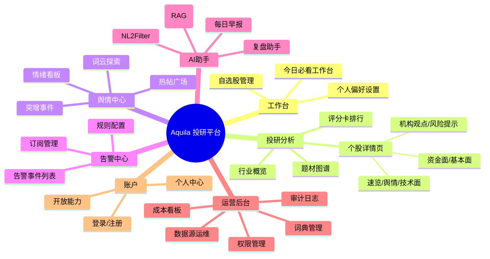
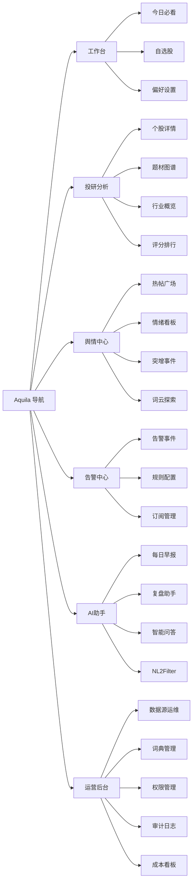
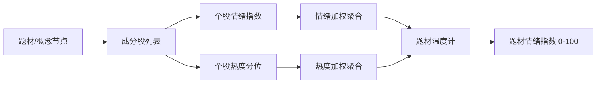
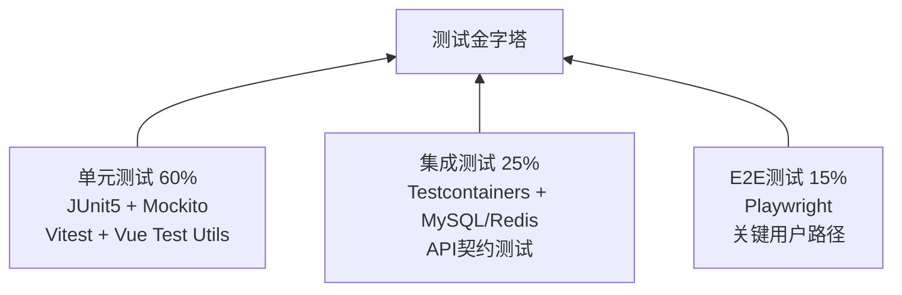
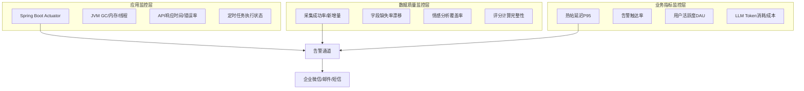
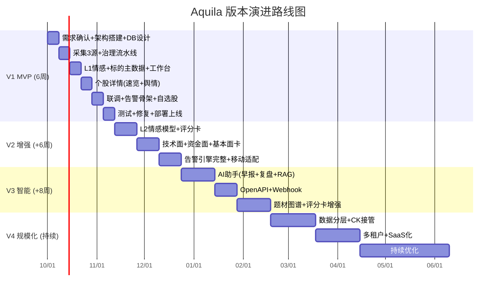

# Aquila 投研工具设计文档 — 阶段4 & 阶段5

> 阶段4：界面设计与用户体验（R7 UX设计师 / R1 产品经理 / R9 前端工程师 协作）
> 阶段5：落地评估与最终方案（R12 测试工程师 / R13 技术写作 / R6 系统架构师 协作）

---

# 阶段4：界面设计与用户体验

## 4.1 整体导航与信息架构

### 4.1.1 全站信息架构图



### 4.1.2 一级/二级导航层级树



### 4.1.3 路由设计表

| # | 路径 | 页面名称 | 权限 | 懒加载策略 | 所属模块 |
|---|---|---|---|---|---|
| 1 | `/login` | 登录页 | 公开 | 预加载（入口页） | M1 |
| 2 | `/register` | 注册页 | 公开 | 懒加载 | M1 |
| 3 | `/dashboard` | 今日必看工作台 | 登录用户 | 预加载（首页） | M1.2 |
| 4 | `/watchlist` | 自选股管理 | 登录用户 | 懒加载 | M1.3 |
| 5 | `/settings/preferences` | 个人偏好设置 | 登录用户 | 懒加载 | M1.4 |
| 6 | `/stock/:code` | 个股详情页（七卡片） | 登录用户 | 预加载路由壳 + 各Tab懒加载 | M6.1 |
| 7 | `/stock/:code?tab=sentiment` | 个股-舆情卡 | 登录用户 | Tab级懒加载 | M6.1 |
| 8 | `/stock/:code?tab=technical` | 个股-技术面卡 | 登录用户 | Tab级懒加载 | M6.1 |
| 9 | `/stock/:code?tab=capital` | 个股-资金面卡 | 登录用户 | Tab级懒加载 | M6.1 |
| 10 | `/theme-graph` | 题材图谱 | 登录用户 | 懒加载（重型页面） | M6.3 |
| 11 | `/industry/:industryCode` | 行业概览 | 登录用户 | 懒加载 | M6 |
| 12 | `/score-ranking` | 评分卡排行 | 登录用户 | 懒加载 | M6.7 |
| 13 | `/sentiment/hot-posts` | 热帖广场 | 登录用户 | 懒加载 + 无限滚动 | M5 |
| 14 | `/sentiment/dashboard` | 情绪看板 | 登录用户 | 懒加载 | M5 |
| 15 | `/sentiment/surge` | 突增事件 | 登录用户 | 懒加载 | M5.3 |
| 16 | `/alert/events` | 告警事件列表 | 登录用户 | 懒加载 | M8 |
| 17 | `/alert/rules` | 告警规则配置 | 登录用户 | 懒加载 | M8.1 |
| 18 | `/alert/subscriptions` | 订阅管理 | 登录用户 | 懒加载 | M8.4 |
| 19 | `/ai/daily-brief` | 每日早报 | 登录用户 | 懒加载 | M7.1 |
| 20 | `/ai/review` | 复盘助手 | 登录用户 | 懒加载 | M7.2 |
| 21 | `/ai/chat` | 智能问答(RAG) | 登录用户 | 懒加载 | M7.3 |
| 22 | `/admin/datasource` | 数据源运维看板 | 管理员 | 懒加载 | M10.1 |
| 23 | `/admin/dictionary` | 词典管理 | 管理员 | 懒加载 | M10.2 |
| 24 | `/admin/audit` | 审计日志 | 管理员 | 懒加载 | M10.4 |
| 25 | `/admin/cost` | 成本看板 | 管理员 | 懒加载 | M10.5 |
| 26 | `/admin/permissions` | 权限管理 | 超级管理员 | 懒加载 | M10.3 |

**懒加载策略说明：**
- **预加载（Preload）**：登录后首屏必达页面（工作台、个股详情页路由壳），通过 Vite 的 `import()` + `webpackPrefetch` 提前拉取 chunk
- **路由级懒加载**：所有其他页面使用 `() => import('@/views/xxx.vue')` 动态导入，按需加载
- **Tab级懒加载**：个股详情页七卡片采用 Tab 切换时按需渲染，首屏只渲染当前激活Tab + 速览卡骨架
- **重型页面**：题材图谱（含 D3 力导向图）、AI问答（含流式SSE）单独打 chunk，避免拖慢主包

### 4.1.4 主题与视觉规范

#### 色板系统

**A股配色（默认主题）：**

| 色彩用途 | 色值 | 说明 |
|---|---|---|
| 涨色-主 | `#F5495B` (Red 500) | A股红涨，用于价格上涨、正向情绪 |
| 涨色-浅 | `#FF6B7A` (Red 400) | 辅助涨色，进度条、弱强调 |
| 涨色-背景 | `rgba(245,73,91,0.08)` | 涨幅卡片背景 |
| 跌色-主 | `#00A870` (Green 500) | A股绿跌，用于价格下跌、负向情绪 |
| 跌色-浅 | `#26C281` (Green 400) | 辅助跌色 |
| 跌色-背景 | `rgba(0,168,112,0.08)` | 跌幅卡片背景 |
| 平色 | `#909399` (Gray 500) | 平盘、中性 |

**国际色反转主题（可切换）：**

| 色彩用途 | 色值 | 说明 |
|---|---|---|
| 涨色 | `#00A870` | 绿涨（国际惯例） |
| 跌色 | `#F5495B` | 红跌 |

**功能色板：**

| 色彩用途 | 色值 | 说明 |
|---|---|---|
| 主品牌色 | `#2B6CF6` (Blue 600) | Aquila品牌主色，导航高亮、按钮 |
| 品牌色-悬停 | `#1E54D7` (Blue 700) | 交互悬停态 |
| 品牌色-浅 | `#E8F0FF` (Blue 50) | 选中态背景 |
| 告警-P0 | `#F5495B` | 严重异动，红色 |
| 告警-P1 | `#FF9F1C` (Orange 500) | 舆情告警，橙色 |
| 告警-P2 | `#4DA3FF` (Blue 400) | 日报提醒，蓝色 |
| 成功 | `#00A870` | 操作成功 |
| 警告 | `#FF9F1C` | 警告提示 |
| 危险 | `#F5495B` | 删除/危险操作 |

**暗色模式色板：**

| 色彩用途 | 亮色值 | 暗色值 |
|---|---|---|
| 背景-主 | `#FFFFFF` | `#1A1D24` |
| 背景-次 | `#F5F7FA` | `#22262E` |
| 背景-卡片 | `#FFFFFF` | `#2A2E36` |
| 文字-主 | `#1F2329` | `#E5EAF0` |
| 文字-次 | `#646A73` | `#A0A6AD` |
| 文字-占位 | `#C0C4CC` | `#5C6166` |
| 边框 | `#E4E7ED` | `#3A3F48` |
| 分割线 | `#EBEEF5` | `#33373F` |
| 涨色 | `#F5495B` | `#FF5A6E`（暗色下提亮） |
| 跌色 | `#00A870` | `#26C281`（暗色下提亮） |

#### 字体规范

| 层级 | 字号 | 行高 | 字重 | 用途 |
|---|---|---|---|---|
| Display | 28px | 36px | 700 | 页面标题、大盘指数 |
| H1 | 22px | 30px | 600 | 卡片标题 |
| H2 | 18px | 26px | 600 | 区块标题 |
| H3 | 16px | 24px | 500 | 小标题、Tab标题 |
| Body | 14px | 22px | 400 | 正文、表格 |
| Body-Strong | 14px | 22px | 600 | 强调正文 |
| Caption | 12px | 18px | 400 | 辅助信息、时间戳 |
| Number-L | 24px | 32px | 700 | 价格、涨跌幅（大号） |
| Number-M | 16px | 24px | 600 | 表格内价格 |
| Number-S | 13px | 20px | 500 | 小数字 |

**字体族：**
```
font-family: 'Inter', 'PingFang SC', 'Microsoft YaHei', 'Helvetica Neue', sans-serif;
数字字体: 'DIN Alternate', 'Roboto Mono', 'SF Mono', monospace;
```

#### 间距系统（4px基准）

| Token | 值 | 用途 |
|---|---|---|
| `--space-1` | 4px | 最小间距，图标内边距 |
| `--space-2` | 8px | 紧凑间距，标签内边距 |
| `--space-3` | 12px | 默认间距，列表行间距 |
| `--space-4` | 16px | 卡片内边距，区块间距 |
| `--space-6` | 24px | 卡片间间距 |
| `--space-8` | 32px | 大区块间距 |
| `--space-12` | 48px | 页面级间距 |

**圆角规范：**
- 卡片圆角：`8px`
- 按钮/标签圆角：`4px`
- 头像/徽章圆角：`50%`（圆形）
- 弹窗圆角：`12px`

**阴影规范：**
- 卡片阴影：`0 2px 8px rgba(0,0,0,0.06)`
- 悬浮卡片：`0 4px 16px rgba(0,0,0,0.10)`
- 弹窗阴影：`0 8px 32px rgba(0,0,0,0.12)`

---

## 4.2 工作台设计（M1.2 今日必看）

### 4.2.1 工作台布局描述

工作台采用 **12栏栅格布局**，首屏优先展示五大聚合卡片，滚动后展示更多细分内容。

```
┌─────────────────────────────────────────────────────────────────────┐
│  [Aquila Logo]  工作台  投研分析  舆情  告警  AI助手  [搜索框]  [头像]│
├─────────────────────────────────────────────────────────────────────┤
│                                                                     │
│  📊 今日必看                                    2026-09-30 周三 09:35 │
│                                                                     │
│  ┌──────────────────────────────────┐  ┌──────────────────────────┐│
│  │  🔴 自选股情绪红黑榜              │  │  📈 大盘速览              ││
│  │  (col-span-7, row-span-2)        │  │  (col-span-5)             ││
│  │                                  │  │                           ││
│  │  红榜 Top5          黑榜 Top5     │  │  上证  深成  创业板        ││
│  │  ┌──────┐          ┌──────┐      │  │  3128  10125  2018       ││
│  │  │股票A  │          │股票X  │      │  │  +1.2% +0.8% -0.3%      ││
│  │  │情绪85 │          │情绪22 │      │  │  涨2312 跌1856 平186    ││
│  │  │+5.2%  │          │-3.1% │      │  │  北向 +35.2亿            ││
│  │  └──────┘          └──────┘      │  │  情绪温度计: ████░ 72°   ││
│  │  ...                            │  └──────────────────────────┘│
│  │                                  │  ┌──────────────────────────┐│
│  │                                  │  │  🔔 待办告警              ││
│  │                                  │  │  (col-span-5)             ││
│  │                                  │  │                           ││
│  │                                  │  │  P0 🔴 茅台 突增事件     ││
│  │                                  │  │  P1 🟡 宁德 情绪反转     ││
│  │                                  │  │  P2 🔵 比亚迪 日报已出   ││
│  │                                  │  │  ...                      ││
│  └──────────────────────────────────┘  └──────────────────────────┘│
│                                                                     │
│  ┌────────────────────────────────────────────────────────────────┐ │
│  │  📝 今日热帖 Top10                          (col-span-12)       │ │
│  │  #1  [东财股吧] 茅台三季报超预期！   😊正面  互动1.2万  #贵州茅台│ │
│  │  #2  [雪球]     新能源板块要反转了？  😐中性  互动8600   #宁德时代│ │
│  │  ...                                                            │ │
│  └────────────────────────────────────────────────────────────────┘ │
│                                                                     │
│  ┌────────────────────────────────────────────────────────────────┐ │
│  │  ⚡ 持仓关注异动                            (col-span-12)       │ │
│  │  ┌──────┐  ┌──────┐  ┌──────┐  ┌──────┐  ┌──────┐           │ │
│  │  │茅台   │  │宁德   │  │比亚迪 │  │隆基   │  │药明   │           │ │
│  │  │突增🔥 │  │反转⚡ │  │价格📉│  │正常   │  │减持⚠  │           │ │
│  │  └──────┘  └──────┘  └──────┘  └──────┘  └──────┘           │ │
│  └────────────────────────────────────────────────────────────────┘ │
└─────────────────────────────────────────────────────────────────────┘
```

**布局说明：**
- 顶部导航栏：高度56px，固定（`position: sticky`），含Logo + 主导航 + 全局搜索 + 用户头像
- 内容区：最大宽度1440px，居中，左右内边距24px
- 栅格：12栏，栏间距16px（`gap: 16px`）
- 第一行：红黑榜卡片（7栏×2行高）+ 大盘速览（5栏×1行高）+ 待办告警（5栏×1行高）
- 第二行：今日热帖Top10（12栏满宽）
- 第三行：持仓关注异动（12栏满宽，横向卡片排列）
- 卡片基础样式：白底、8px圆角、`0 2px 8px rgba(0,0,0,0.06)`阴影、16px内边距

### 4.2.2 五大卡片设计详情

#### 卡片1：自选股情绪红黑榜

```
┌──────────────────────────────────────────────┐
│  自选股情绪红黑榜                     [展开>] │
│  基于自选股情绪指数排名 · 更新于 09:30        │
├─────────────────────┬────────────────────────┤
│  🔴 红榜 Top5        │  🟢 黑榜 Top5          │
├─────────────────────┼────────────────────────┤
│ 600519 贵州茅台     │  002594 比亚迪         │
│ 情绪指数 88 🔥      │  情绪指数 22 ❄        │
│ 涨跌幅  +5.21%     │  涨跌幅  -3.12%       │
│ 热度分位 ▓▓▓▓▓ 95% │  热度分位 ▓░░░░ 18%   │
├─────────────────────┼────────────────────────┤
│ 300750 宁德时代     │  601012 隆基绿能       │
│ 情绪指数 82 🔥      │  情绪指数 28 ❄        │
│ 涨跌幅  +3.88%     │  涨跌幅  -2.05%       │
│ 热度分位 ▓▓▓▓░ 88% │  热度分位 ▓░░░░ 22%   │
├─────────────────────┼────────────────────────┤
│ 000858 五粮液       │  600036 招商银行       │
│ 情绪指数 76         │  情绪指数 31           │
│ 涨跌幅  +2.15%     │  涨跌幅  -1.08%       │
│ 热度分位 ▓▓▓░░ 72% │  热度分位 ▓▓░░░ 35%   │
├─────────────────────┼────────────────────────┤
│ ...                 │  ...                   │
└─────────────────────┴────────────────────────┘
```

**字段说明：**

| 字段 | 数据类型 | 来源 | 显示格式 |
|---|---|---|---|
| 股票代码 | String | 标的主数据 | 6位代码 |
| 股票名称 | String | 标的主数据 | 中文名称 |
| 情绪指数 | Integer(0-100) | M5情绪指数引擎 | 数字 + 火焰🔥(≥80)/常温(40-79)/冰❄(<40)图标 |
| 涨跌幅 | Float | 行情数据 | A股红涨绿跌配色，+X.XX% / -X.XX% |
| 热度分位 | Integer(0-100) | M5热度计算 | 5格进度条，满格=▓▓▓▓▓ |

**交互设计：**
- **点击单只股票** → 跳转 `/stock/:code`（个股详情页，默认速览卡）
- **点击卡片标题区** → 展开显示全部自选股情绪排名（完整列表，支持搜索筛选）
- **悬停单只股票行** → 显示 Tooltip：今日新增帖子数、情绪变化方向箭头（较昨日↑↓）
- **右上角"展开>"按钮** → 跳转 `/sentiment/dashboard`（情绪看板全量页面）
- **右键单只股票** → 快捷菜单：加入自选/移出自选/设为关注/生成简报

#### 卡片2：今日热帖Top10

```
┌──────────────────────────────────────────────────────────────────────┐
│  今日热帖 Top10                                  [查看全部>]          │
│  按互动数×情绪强度综合排序 · 实时更新                                │
├────┬──────────────────────────────────────────────────────────────┬──┤
│ #  │ 标题                                    来源    情绪  互动数  │标的│
├────┼──────────────────────────────────────────────────────────────┼──┤
│ 1  │ 茅台三季报营收超预期，净利润同比+19%   东财股吧 😊正面 12,350 │茅台│
│ 2  │ 新能源板块要反转了？锂价见底信号分析   雪球     😐中性  8,620 │宁德│
│ 3  │ 比亚迪降价杀疯了！汉EV直降3万          东财股吧 😟负面  7,890 │比亚│
│ 4  │ 隆基三季报亏损扩大，光伏寒冬来了       同花顺   😟负面  6,540 │隆基│
│ 5  │ 券商研报：茅台目标价上调至2200         研报     😊正面  5,200 │茅台│
│ 6  │ 北向资金今日净流入超50亿，买了什么？   雪球     😊正面  4,800 │-  │
│ 7  │ 招行三季报稳健增长，分红率超30%        东财股吧 😊正面  4,320 │招行│
│ 8  │ 药明康德大股东减持公告解读             同花顺   😟负面  3,980 │药明│
│ 9  │ 半导体国产替代加速，关注这两只         雪球     😐中性  3,500 │中芯│
│ 10 │ 五粮液批价回升，经销商反馈积极         东财股吧 😊正面  3,210 │五粮│
└────┴──────────────────────────────────────────────────────────────┴──┘
```

**字段说明：**

| 字段 | 数据类型 | 来源 | 显示格式 |
|---|---|---|---|
| 排名序号 | Integer | 综合排序计算 | #1 ~ #10 |
| 帖子标题 | String | 采集中心原始帖 | 截断至40字，悬停显示全文 |
| 来源平台 | Enum | 采集源标识 | 东财股吧/雪球/同花顺/研报 |
| 情绪极性 | Enum | M5 L1情感分析 | 😊正面(红)/😐中性(灰)/😟负面(绿) |
| 互动数 | Integer | 采集字段 | 点赞+评论+转发，千分位格式 |
| 涉及标的标签 | String[] | M4实体识别 | 蓝色标签，可点击跳转个股 |

**交互设计：**
- **点击帖子标题** → 弹出帖子详情抽屉（右侧滑出 Drawer），展示原文 + 情感分析详情 + 涉及标的热力
- **点击标的标签** → 跳转对应个股详情页
- **点击"查看全部>"** → 跳转 `/sentiment/hot-posts`（热帖广场，支持筛选/排序/无限滚动）
- **悬停行** → 高亮背景，显示"加入关注"快捷按钮
- **来源平台徽章** → 可点击筛选该来源的热帖

#### 卡片3：持仓关注异动

```
┌──────────────────────────────────────────────────────────────────────┐
│  持仓关注异动                                              [设置>]    │
│  监控你的持仓与关注列表的突增事件/情绪反转/价格异动                  │
├──────────┬──────────┬──────────┬──────────┬──────────┬───────────────┤
│ 贵州茅台  │ 宁德时代  │ 比亚迪   │ 隆基绿能 │ 药明康德 │  + 添加监控   │
│ 600519   │ 300750   │ 002594   │ 601012   │ 603259  │               │
│          │          │          │          │         │               │
│ 🔥突增   │ ⚡反转   │ 📉异动   │ ✓正常    │ ⚠减持   │               │
│ 3条事件  │ 1条事件  │ 2条事件  │ 无异常   │ 1条事件 │               │
│          │          │          │          │         │               │
│ +5.21%   │ +3.88%   │ -3.12%   │ -2.05%   │ -4.50%  │               │
└──────────┴──────────┴──────────┴──────────┴──────────┴───────────────┘
```

**异动类型说明：**

| 异动类型 | 图标 | 触发条件 | 颜色 |
|---|---|---|---|
| 突增事件 | 🔥 | 帖子量较前24h均值增长≥200% | 红色(#F5495B) |
| 情绪反转 | ⚡ | 情绪指数方向较前日反转（正→负或负→正） | 橙色(#FF9F1C) |
| 价格异动 | 📉 | 日内涨跌幅超±5%或振幅超8% | 涨红跌绿 |
| 减持/公告 | ⚠ | 出现减持/质押/问询函等风险事件 | 橙色(#FF9F1C) |
| 正常 | ✓ | 无异常 | 灰色(#909399) |

**交互设计：**
- **点击单个持仓卡片** → 展开该标的的异动事件列表（时间线视图），点击事件跳转详情
- **异动数量徽章** → 点击展开事件列表，显示每条事件的：时间/类型/描述/情绪极性/涉及帖子链接
- **"+ 添加监控"** → 弹出搜索框，输入代码/名称添加持仓或关注标的
- **"设置>"** → 跳转异动阈值配置页面（突增倍数/情绪反转阈值/价格异动阈值）
- **悬停卡片** → 显示该标的最近3条异动事件摘要

#### 卡片4：大盘速览

```
┌────────────────────────────────────────────────┐
│  大盘速览                         [详细行情>]  │
│  2026-09-30 09:35:22 实时                      │
├────────────────────────────────────────────────┤
│  上证指数      深证成指      创业板指           │
│  3,128.45     10,125.30    2,018.66           │
│  +36.82       +81.50       -6.12              │
│  +1.19% ▲     +0.81% ▲     -0.30% ▼          │
├────────────────────────────────────────────────┤
│  涨跌家数                                       │
│  ▓▓▓▓▓▓▓▓░░░░  涨 2,312  |  跌 1,856  | 平 186│
├────────────────────────────────────────────────┤
│  板块轮动 (今日领涨)                            │
│  白酒 +4.2%  新能源 +3.1%  半导体 +2.8%        │
│  医药 -1.5%  地产 -2.1%  银行 -0.3%            │
├────────────────────────────────────────────────┤
│  北向资金                                       │
│  净流入 +35.2亿  ▲ (沪股通+22.1亿 深股通+13.1亿)│
├────────────────────────────────────────────────┤
│  市场情绪温度计                                 │
│  冷░░░██░░░░░热                                │
│  当前: 72° 偏热  (近5日均值: 58°)              │
└────────────────────────────────────────────────┘
```

**字段说明：**

| 字段 | 数据类型 | 来源 | 显示格式 |
|---|---|---|---|
| 三大指数 | Object[] | 行情数据源 | 指数名/点位/涨跌点/涨跌幅，红涨绿跌 |
| 涨跌家数 | Object | 全市场统计 | 进度条 + 数字，涨家数红色/跌家数绿色 |
| 板块轮动 | Object[] | 板块行情 | 领涨Top3 + 领跌Top3，带涨跌幅 |
| 北向资金 | Float | 资金数据源 | 净流入额(亿)，红流入/绿流出 |
| 市场情绪温度计 | Integer(0-100) | M5全市场情绪计算 | 10格温度计，0°极冷~100°极热，当前值+5日均值对比 |

**交互设计：**
- **点击三大指数** → 跳转指数详情页（指数K线 + 成分股）
- **点击板块名称** → 跳转板块详情页（成分股列表 + 板块K线）
- **情绪温度计** → 悬停显示历史7日温度走势 sparkline
- **"详细行情>"** → 跳转外部行情页面或内置行情模块

#### 卡片5：待办告警

```
┌────────────────────────────────────────────────┐
│  待办告警                            [全部告警>]│
│  未处理: 7条  ·  今日新增: 3条                  │
├────────────────────────────────────────────────┤
│  P0 🔴 茅台600519  舆情突增  09:28  [处理]     │
│         帖子量5min内激增300%，情绪指数升至88    │
├────────────────────────────────────────────────┤
│  P0 🔴 宁德300750  价格异动  09:25  [处理]     │
│         开盘跳水-4.2%，触发价格异动阈值         │
├────────────────────────────────────────────────┤
│  P1 🟡 比亚迪002594 情绪反转 09:15  [处理]      │
│         情绪由正面转为负面，降价消息扩散中      │
├────────────────────────────────────────────────┤
│  P1 🟡 药明603259  减持公告  08:50  [处理]      │
│         大股东计划减持不超过3%                  │
├────────────────────────────────────────────────┤
│  P2 🔵 隆基601012  日报已出   08:00  [查看]    │
│         三季报亏损扩大，已生成AI简报            │
├────────────────────────────────────────────────┤
│  P2 🔵 五粮液000858 研报更新   07:30 [查看]    │
│         券商上调目标价至195元                   │
└────────────────────────────────────────────────┘
```

**字段说明：**

| 字段 | 数据类型 | 来源 | 显示格式 |
|---|---|---|---|
| 优先级 | Enum(P0/P1/P2) | M8规则引擎 | P0红色🔴/P1橙色🟡/P2蓝色🔵 |
| 标的信息 | String | 告警关联标的 | 代码+名称，可点击跳转 |
| 告警类型 | String | M8告警分类 | 舆情突增/情绪反转/价格异动/减持公告/日报等 |
| 时间 | DateTime | 告警触发时间 | HH:mm格式 |
| 告警摘要 | String | M8告警内容 | 一句话描述触发原因和关键数据 |
| 处理状态 | Enum | 用户操作 | [处理](P0/P1) / [查看](P2) |

**交互设计：**
- **点击告警条目** → 弹出告警详情抽屉：触发规则/原始数据/溯源帖子列表/涉及标的影响分析
- **"[处理]"按钮** → 标记为已处理 + 可添加处理备注（忽略/已关注/已操作/已记录）
- **"[查看]"按钮** → 查看详情但不标记已处理（P2日报类告警）
- **"全部告警>"** → 跳转 `/alert/events`（告警中心完整列表）
- **告警列表排序** → 按优先级(P0>P1>P2) → 再按时间(最新优先)
- **批量操作** → 支持多选告警 → 批量标记已处理

---

## 4.3 个股详情页设计（M6.1 七卡片一屏式研报视图）

### 4.3.1 页面整体布局

```
┌─────────────────────────────────────────────────────────────────────┐
│  [←返回] 600519 贵州茅台  +5.21%  1,688.50  [加入自选♡] [分享] [设置]│ ← 顶部固定头部(56px)
├─────────────────────────────────────────────────────────────────────┤
│  速览 │ 舆情 │ 技术面 │ 资金面 │ 基本面 │ 机构观点 │ 风险提示        │ ← Tab切换栏(48px, sticky)
├─────────────────────────────────────────────────────────────────────┤
│                                                                     │
│  ┌─────────────────────────────────────────────────────────────┐   │
│  │                    卡片内容区                                │   │ ← 可滚动内容区
│  │                    (按选中Tab渲染)                           │   │
│  │                                                              │   │
│  │                                                              │   │
│  └─────────────────────────────────────────────────────────────┘   │
│                                                                     │
└─────────────────────────────────────────────────────────────────────┘
```

**布局策略：**
- **顶部固定头部**（56px）：股票代码/名称/实时价格/涨跌幅/快捷操作按钮，`position: sticky; top: 0`
- **Tab切换栏**（48px）：七个Tab横向排列，当前Tab高亮（品牌色下边框），`position: sticky; top: 56px`
- **内容区**：每个Tab对应一个卡片区域，Tab切换时按需懒加载渲染，切换时带淡入动画（`transition: opacity 0.2s`）
- **滚动行为**：Tab切换时内容区滚动到顶部；头部和Tab栏始终可见
- **URL同步**：Tab切换更新 `?tab=xxx` query参数，支持直接链接到指定Tab

### 4.3.2 七个卡片区详细界面设计

#### 卡片1：速览卡

```
┌─────────────────────────────────────────────────────────────────────┐
│  贵州茅台 600519                                                     │
│                                                                     │
│  ┌──────────────┐  ┌──────────────┐  ┌──────────────────────────┐  │
│  │  实时价格     │  │  情绪温度计   │  │  综合评分雷达图           │  │
│  │              │  │              │  │                          │  │
│  │  1,688.50    │  │   ████░ 72°  │  │      技术面 ●─────        │  │
│  │  +84.20      │  │   偏热        │  │     ╱    │    ╲          │  │
│  │  +5.21% ▲   │  │  (近5日均58°) │  │  资金●────┼────●舆情     │  │
│  │              │  │              │  │     ╲    │    ╱          │  │
│  │  今开 1,610  │  │  冷░██░░░热  │  │  基本面●────●估值        │  │
│  │  最高 1,695  │  │              │  │                          │  │
│  │  最低 1,605  │  │              │  │  综合: 78/100            │  │
│  │  成交 28.5亿 │  │              │  │  (高于行业中位62)        │  │
│  └──────────────┘  └──────────────┘  └──────────────────────────┘  │
│                                                                     │
│  ┌─────────────────────────────────────────────────────────────┐   │
│  │  热度分位                                                    │   │
│  │  ▓▓▓▓▓▓▓▓░░ 88%  (全网热度排名前12%)                        │   │
│  │  今日帖子: 1,856  |  较昨日: +320  |  活跃度: 高            │   │
│  └─────────────────────────────────────────────────────────────┘   │
│                                                                     │
│  ┌─────────────────────────────────────────────────────────────┐   │
│  │  关键指标速览                                                │   │
│  │  市值: 2.12万亿  PE: 28.5  PB: 9.8  行业: 白酒  评级: 买入  │   │
│  └─────────────────────────────────────────────────────────────┘   │
└─────────────────────────────────────────────────────────────────────┘
```

**ECharts图表说明：**

| 图表 | 类型 | 数据来源 | 配置说明 |
|---|---|---|---|
| 情绪温度计 | Custom Gauge（自定义温度计） | M5情绪指数 | 0-100刻度，色带渐变（蓝→黄→红），指针指向当前值，带近5日均值标记线 |
| 热度分位 | ProgressBar（自定义进度条） | M5热度计算 | 10格分段进度条，满格为100%，标注百分位排名 |
| 综合评分雷达图 | Radar | M6.7评分卡引擎 | 5维：基本面/估值/资金面/技术面/舆情情绪，每维0-100分，叠加行业中位值参考线 |

**交互设计：**
- 温度计悬停 → 显示近30日温度走势 sparkline
- 雷达图各维度可点击 → 跳转对应详情Tab（基本面/估值/资金面/技术面/舆情）
- 热度分位悬停 → 显示热度构成分解（帖子量/互动量/媒体覆盖数）

#### 卡片2：舆情卡

```
┌─────────────────────────────────────────────────────────────────────┐
│  舆情分析                                                           │
│                                                                     │
│  ┌─────────────────────────────────────────────────────────────┐   │
│  │  情绪走势叠加K线 (双轴图)                    [日/周/月切换]   │   │
│  │                                                              │   │
│  │   价格(左轴)  ─── 情绪指数(右轴)  ─── 情绪均线(5日)          │   │
│  │  1700 ┤    ╱╲                                                │   │
│  │       │   ╱  ╲      ╱╲       ← K线(蜡烛图)                  │   │
│  │  1650 ┤  ╱    ╲    ╱  ╲                                     │   │
│  │       │ ╱      ╲  ╱    ╲     ─── 情绪指数折线               │   │
│  │  1600 ┤╱        ╲╱      ╲                                   │   │
│  │       │                   ╲╱                                 │   │
│  │  1550 ┤                        ← 情绪均线                    │   │
│  │       ├──┬──┬──┬──┬──┬──┬──┬──┬──┬──                        │   │
│  │       9/20  22  24  26  28  30                               │   │
│  │  情绪 30──50──70──90                                         │   │
│  └─────────────────────────────────────────────────────────────┘   │
│                                                                     │
│  ┌──────────────────────┐  ┌──────────────────────────────────┐   │
│  │  关键词词云           │  │  Top热帖列表                     │   │
│  │                      │  │  [全部] [正面] [负面] [中性]      │   │
│  │     超预期  茅台     │  │                                  │   │
│  │   三季报    增长     │  │  1. 茅台三季报超预期...  😊 1.2万 │   │
│  │  净利  目标价  涨价  │  │  2. 券商上调茅台目标价... 😊 5200 │   │
│  │   分红  批价  白酒   │  │  3. 茅台会不会到2000？  😐 3100  │   │
│  │     估值  机构       │  │  4. 茅台还能涨多少...   😊 2800  │   │
│  │                      │  │  5. ...                        😟 2100│   │
│  └──────────────────────┘  └──────────────────────────────────┘   │
└─────────────────────────────────────────────────────────────────────┘
```

**ECharts图表说明：**

| 图表 | 类型 | 数据来源 | 配置说明 |
|---|---|---|---|
| 情绪走势叠加K线 | Candlestick + Line（双Y轴） | 行情数据(左轴K线) + M5情绪指数(右轴折线) | 左Y轴：价格区间，右Y轴：情绪指数0-100；K线蜡烛图叠加情绪折线 + 5日情绪均线；支持日/周/月周期切换 |
| 关键词词云 | WordCloud（echarts-wordcloud扩展） | M5.4词云引擎 | 词大小=词频×TF-IDF权重；正面词红色/负面词绿色/中性词灰色；点击词跳转相关帖子 |
| Top热帖列表 | 自定义列表 | 采集中心 + M5排序 | 按互动数排序，支持正/负/中性筛选Tab切换 |

**交互设计：**
- K线图支持缩放拖拽（`dataZoom`组件），鼠标悬停显示十字线 + 当日OHLC + 情绪指数
- 词云点击关键词 → 弹出该关键词的相关帖子列表
- 热帖列表点击 → 右侧抽屉展示帖子原文 + 情感分析详情
- 周期切换（日/周/月）→ 重新请求对应周期数据，图表带loading动画

#### 卡片3：技术面卡

```
┌─────────────────────────────────────────────────────────────────────┐
│  技术面分析                                  [日K] [周K] [月K]      │
│                                                                     │
│  主图指标: [MA] [MACD] [KDJ] [RSI] [布林带]  (多选)                 │
│                                                                     │
│  ┌─────────────────────────────────────────────────────────────┐   │
│  │  K线主图 (含MA均线 + 布林带)                                 │   │
│  │                                                              │   │
│  │  1700 ┤ ─ ─ ─ ─ ─ ─ ─ ─ ─ ─ ← 压力位 1695                │   │
│  │       │      ╱╲     ╱╲                                      │   │
│  │  1650 ┤     ╱  ╲   ╱  ╲    ← MA5(黄色)                     │   │
│  │       │    ╱    ╲ ╱    ╲   ← MA20(紫色)                    │   │
│  │  1600 ┤   ╱      ╳      ╲  ← MA60(绿色)                    │   │
│  │       │  ╱      ╱ ╲      ╲                                  │   │
│  │  1550 ┤ ─ ─ ─ ─ ─ ─ ─ ─ ─ ─ ← 支撑位 1560                │   │
│  │       ├──┬──┬──┬──┬──┬──┬──┬──┬──┬──┬──┬──                │   │
│  └─────────────────────────────────────────────────────────────┘   │
│                                                                     │
│  ┌────────────────────┐  ┌────────────────────┐                    │
│  │  MACD              │  │  KDJ               │                    │
│  │  DIF: +12.5        │  │  K: 78.5           │                    │
│  │  DEA: +8.2         │  │  D: 65.2           │                    │
│  │  MACD: +8.6 (红柱) │  │  J: 105.1 (超买区) │                    │
│  │  [柱状图+双线]      │  │  [三线图]           │                    │
│  └────────────────────┘  └────────────────────┘                    │
│                                                                     │
│  ┌─────────────────────────────────────────────────────────────┐   │
│  │  关键价位标注                                                │   │
│  │  ┌──────────┬────────┬────────┬────────┐                    │   │
│  │  │ 阻力位2  │ 阻力位1│ 支撑位1│ 支撑位2│                    │   │
│  │  │ 1,720    │ 1,695  │ 1,560  │ 1,520  │                    │   │
│  │  │ 前高压力 │ 均线压力│ 均线支撑│ 前低支撑│                   │   │
│  │  └──────────┴────────┴────────┴────────┘                    │   │
│  └─────────────────────────────────────────────────────────────┘   │
└─────────────────────────────────────────────────────────────────────┘
```

**ECharts图表说明：**

| 图表 | 类型 | 数据来源 | 配置说明 |
|---|---|---|---|
| K线主图 | Candlestick + Line(多线) | 行情数据(M2) | 蜡烛图叠加MA5/MA20/MA60均线；布林带时叠加上轨/中轨/下轨；关键价位用`markLine`标注支撑/阻力位；支持`dataZoom`缩放 |
| MACD | Bar + Line(双线) | 技术指标计算 | 柱状图(DIF-DEA)，红柱正/绿柱负；叠加DIF线(黄)和DEA线(紫)；零轴标注 |
| KDJ | Line(三线) | 技术指标计算 | K线(白)/D线(黄)/J线(紫)；20/80超买超卖区域标注 |
| RSI | Line | 技术指标计算 | RSI6/RSI12双线；30/70超买超卖区域标注 |
| 布林带 | Line(三线) | 技术指标计算 | 上轨/中轨(MA20)/下轨，填充带状区域半透明色 |

**交互设计：**
- 周期切换（日K/周K/月K）→ 重新请求K线数据，指标同步重算
- 指标多选切换 → 动态添加/移除指标线，K线主图自适应
- 关键价位悬停 → 显示价位来源说明（前高/均线/缺口等）
- K线图支持十字光标 → 显示当日OHLC数据 + 各指标数值

#### 卡片4：资金面卡

```
┌─────────────────────────────────────────────────────────────────────┐
│  资金面分析                                                         │
│                                                                     │
│  ┌─────────────────────────────────────────────────────────────┐   │
│  │  主力资金流向 (近30日柱状图)            [日] [周] [月]       │   │
│  │                                                              │   │
│  │  +50亿┤  ██                                                 │   │
│  │       │  ██ ██                                              │   │
│  │  +25亿┤  ██ ██ ██     ██ ← 净流入(红色柱)                  │   │
│  │       │  ██ ██ ██ ██  ██                                    │   │
│  │    0  ┼──██─██─██─██─██─██────────                        │   │
│  │       │     ██ ██  ██ ← 净流出(绿色柱)                    │   │
│  │  -25亿┤         ██                                           │   │
│  │       ├──┬──┬──┬──┬──┬──┬──┬──┬──┬──                       │   │
│  │       9/1        9/15       9/30                            │   │
│  │  近5日累计净流入: +12.3亿                                   │   │
│  └─────────────────────────────────────────────────────────────┘   │
│                                                                     │
│  ┌─────────────────────────────────────────────────────────────┐   │
│  │  龙虎榜 (近5日)                                              │   │
│  │  ┌────────┬──────┬────────┬────────┬────────┐              │   │
│  │  │ 日期   │ 方向 │ 买入额  │ 卖出额  │ 净额    │              │   │
│  │  ├────────┼──────┼────────┼────────┼────────┤              │   │
│  │  │ 09/28  │ 买入 │ 8,520万 │ 3,200万 │ +5,320万│             │   │
│  │  │ 09/26  │ 卖出 │ 2,100万 │ 6,800万 │ -4,700万│             │   │
│  │  │ 09/25  │ 买入 │ 12,300万│ 5,100万 │ +7,200万│             │   │
│  │  └────────┴──────┴────────┴────────┴────────┘              │   │
│  │  上榜原因: 日跌幅偏离值达-7.32%                              │   │
│  └─────────────────────────────────────────────────────────────┘   │
│                                                                     │
│  ┌─────────────────────────────────────────────────────────────┐   │
│  │  北向持股变化 (近60日折线图)                                 │   │
│  │                                                              │   │
│  │  9,000万股┤              ╱──╲╱──                            │   │
│  │           │         ╱──╱                                     │   │
│  │  8,500万股┤    ╱──╱                                          │   │
│  │           │──╱                                                │   │
│  │  8,000万股┤                                                   │   │
│  │           ├──┬──┬──┬──┬──┬──┬──┬──                          │   │
│  │           7/1                8/1                9/30         │   │
│  │  当前持股: 8,720万股  持股比例: 6.95%  较60日前: +320万股   │   │
│  └─────────────────────────────────────────────────────────────┘   │
│                                                                     │
│  ┌─────────────────────────────────────────────────────────────┐   │
│  │  融资融券                                                    │   │
│  │  融资余额: 125.3亿  融券余量: 85.2万股  融资融券差额: +123亿 │   │
│  └─────────────────────────────────────────────────────────────┘   │
└─────────────────────────────────────────────────────────────────────┘
```

**ECharts图表说明：**

| 图表 | 类型 | 数据来源 | 配置说明 |
|---|---|---|---|
| 主力资金流向 | Bar（正负柱状图） | 资金情报数据源 | 正值(净流入)红色柱向上，负值(净流出)绿色柱向下；零轴居中；支持日/周/月切换 |
| 龙虎榜 | Table（自定义表格） | 龙虎榜数据源 | Element Plus Table组件，方向列红/绿标识，支持排序 |
| 北向持股变化 | Line（面积折线图） | 北向资金数据源 | 单线折线 + 下方半透明面积填充；标注当前值和变化量 |
| 融资融券 | 自定义信息卡 | 融资融券数据源 | 数值卡片展示，红涨绿跌 |

#### 卡片5：基本面卡

```
┌─────────────────────────────────────────────────────────────────────┐
│  基本面分析                                                         │
│                                                                     │
│  ┌─────────────────────────────────────────────────────────────┐   │
│  │  近8期营收与净利趋势                  [季度] [年度]          │   │
│  │                                                              │   │
│  │  1200亿┤                                              ╱╲   │   │
│  │        │                                         ╱──╱  ╲  │   │
│  │   900亿┤                              ╱──╱──╱╱        │   │
│  │        │              营收(柱)       ╱                 │   │
│  │   600亿┤        ╱──╱──╱──╱──╱──╱                     │   │
│  │        │  ╱──╱                                         │   │
│  │   300亿┤╱                             净利(线)          │   │
│  │        ├──┬──┬──┬──┬──┬──┬──┬──                        │   │
│  │        22Q3 22Q4 23Q1 23Q2 23Q3 23Q4 24Q1 24Q2         │   │
│  └─────────────────────────────────────────────────────────────┘   │
│                                                                     │
│  ┌──────────────────┐  ┌──────────────────────────────────┐       │
│  │  ROE & 毛利率     │  │  杜邦拆解树图                    │       │
│  │                  │  │                                  │       │
│  │  ROE    32.5%   │  │  ROE = 32.5%                    │       │
│  │  ▓▓▓▓▓▓▓▓░░     │  │   ├── 净利率: 52.3%             │       │
│  │  毛利率 91.8%   │  │   ├── 总资产周转率: 0.48         │       │
│  │  ▓▓▓▓▓▓▓▓▓▓     │  │   └── 权益乘数: 1.30            │       │
│  │  净利率 52.3%   │  │                                  │       │
│  │  ▓▓▓▓▓▓░░░░     │  │  (Treemap树图可视化)             │       │
│  └──────────────────┘  └──────────────────────────────────┘       │
│                                                                     │
│  ┌─────────────────────────────────────────────────────────────┐   │
│  │  行业排名 (白酒行业)                                        │   │
│  │  ┌──────────┬──────┬──────┬──────┬──────┬──────┐          │   │
│  │  │ 指标     │ 排名 │ 公司 │ 行业均值│ 行业最高│ 分位  │          │   │
│  │  ├──────────┼──────┼──────┼──────┼──────┼──────┤          │   │
│  │  │ 营收     │ 1/20 │ 847亿│ 52亿 │ 847亿│ 100% │          │   │
│  │  │ 净利润   │ 1/20 │ 443亿│ 18亿 │ 443亿│ 100% │          │   │
│  │  │ ROE      │ 1/20 │32.5% │ 8.5% │32.5% │ 100% │          │   │
│  │  │ 毛利率   │ 1/20 │91.8% │52.3% │91.8% │ 100% │          │   │
│  │  └──────────┴──────┴──────┴──────┴──────┴──────┘          │   │
│  └─────────────────────────────────────────────────────────────┘   │
└─────────────────────────────────────────────────────────────────────┘
```

**ECharts图表说明：**

| 图表 | 类型 | 数据来源 | 配置说明 |
|---|---|---|---|
| 营收净利趋势 | Bar(营收) + Line(净利) 双轴 | 财报数据(M2) | 左Y轴营收柱状图，右Y轴净利折线图；支持季度/年度切换；X轴近8期 |
| ROE & 毛利率 | ProgressBar(自定义) | 财报数据 | 三个指标各一行进度条，标注百分位 |
| 杜邦拆解 | Treemap | 财报计算 | 树状矩形图，ROE拆解为净利率×总资产周转率×权益乘数，面积大小代表贡献度 |
| 行业排名 | Table | 财报数据 + 行业统计 | Element Plus Table，排名列高亮，分位列进度条 |

#### 卡片6：机构观点卡

```
┌─────────────────────────────────────────────────────────────────────┐
│  机构观点                                                           │
│                                                                     │
│  ┌──────────────────────┐  ┌──────────────────────────────────┐   │
│  │  评级分布             │  │  目标价区间                       │   │
│  │                      │  │                                  │   │
│  │     买入  68%        │  │  2,200 ┤ ─ ─ ─ ─ ─ ─ ─ ← 最高   │   │
│  │    ████████████      │  │         │     ┌──────┐            │   │
│  │     增持  22%        │  │  1,950 ┤     │ 中位  │ ← 当前价   │   │
│  │    ████              │  │  1,688 ┤     │1,950 │            │   │
│  │     中性  8%         │  │         │     └──────┘            │   │
│  │    ██                │  │  1,700 ┤ ─ ─ ─ ─ ─ ─ ─ ← 最低   │   │
│  │     减持  2%         │  │                                  │   │
│  │    █                 │  │  机构一致目标价: 1,950 (+15.5%)  │   │
│  │  (共45家机构)        │  │  最高: 2,200 | 最低: 1,700       │   │
│  └──────────────────────┘  └──────────────────────────────────┘   │
│                                                                     │
│  ┌─────────────────────────────────────────────────────────────┐   │
│  │  预测修正方向 (近6个月)                                      │   │
│  │                                                              │   │
│  │  2024-04  ████████████████  目标价 1,850  ↑ 上调           │   │
│  │  2024-05  █████████████████ 目标价 1,920  ↑ 上调           │   │
│  │  2024-06  █████████████████ 目标价 1,950  ↑ 上调           │   │
│  │  2024-07  ████████████████  目标价 1,920  ↓ 下调           │   │
│  │  2024-08  ██████████████████ 目标价 1,980  ↑ 上调          │   │
│  │  2024-09  ███████████████████ 目标价 2,050 ↑ 上调          │   │
│  │                                                              │   │
│  │  趋势: 整体上调 ↗  (近6月上调次数: 5次 | 下调次数: 1次)     │   │
│  └─────────────────────────────────────────────────────────────┘   │
│                                                                     │
│  ┌─────────────────────────────────────────────────────────────┐   │
│  │  最新研报                                                   │   │
│  │  ┌──────────┬────────┬──────┬────────┬──────┐              │   │
│  │  │ 日期     │ 机构   │ 评级 │ 目标价 │ 标题 │              │   │
│  │  ├──────────┼────────┼──────┼────────┼──────┤              │   │
│  │  │ 09/28    │ 中信   │ 买入 │ 2,200  │ 三季│              │   │
│  │  │ 09/25    │ 国泰   │ 买入 │ 2,050  │ 白酒│              │   │
│  │  │ 09/20    │ 华泰   │ 增持 │ 1,950  │ 茅台│              │   │
│  │  └──────────┴────────┴──────┴────────┴──────┘              │   │
│  └─────────────────────────────────────────────────────────────┘   │
└─────────────────────────────────────────────────────────────────────┘
```

**ECharts图表说明：**

| 图表 | 类型 | 数据来源 | 配置说明 |
|---|---|---|---|
| 评级分布 | Pie（环形饼图） | 研报数据(M2) | 环形图，买入(红)/增持(橙)/中性(灰)/减持(绿)/卖出(深绿)；中心显示总机构数 |
| 目标价区间 | Custom（自定义箱线图） | 研报数据 | 最高/最低/中位/当前价四条标注线 + 当前价位高亮标记 |
| 预测修正方向 | Bar(水平柱状) + 自定义箭头 | 研报数据 | 柱状长度代表目标价，右侧↑/↓箭头表示上调/下调方向，颜色红上调/绿下调 |
| 最新研报 | Table | 研报数据 | Element Plus Table，评级列带颜色标识，点击行查看研报摘要 |

#### 卡片7：风险提示卡

```
┌─────────────────────────────────────────────────────────────────────┐
│  风险提示                                                           │
│                                                                     │
│  ┌─────────────────────────────────────────────────────────────┐   │
│  │  风险标签                                                   │   │
│  │  ┌──────────┐ ┌──────────┐ ┌──────────┐ ┌──────────┐      │   │
│  │  │ ✓ 商誉低  │ │ ✓ 质押低  │ │ ⚠ 减持中  │ │ ✓ 无问询  │      │   │
│  │  │ 2.1%     │ │ 5.3%     │ │ 公告      │ │          │      │   │
│  │  └──────────┘ └──────────┘ └──────────┘ └──────────┘      │   │
│  │  ┌──────────┐ ┌──────────┐                                │   │
│  │  │ ✓ 无诉讼  │ │ ✓ 非ST   │                                │   │
│  │  └──────────┘ └──────────┘                                │   │
│  └─────────────────────────────────────────────────────────────┘   │
│                                                                     │
│  ┌─────────────────────────────────────────────────────────────┐   │
│  │  风险指标明细                                               │   │
│  │                                                              │   │
│  │  商誉占比                                                   │   │
│  │  2.1%  ▓▓░░░░░░░░░░░░  (行业均值: 8.5%, 低风险)            │   │
│  │                                                              │   │
│  │  质押比例                                                   │   │
│  │  5.3%  ▓▓▓░░░░░░░░░░░  (行业均值: 12.0%, 低风险)           │   │
│  │                                                              │   │
│  │  减持公告                                                   │   │
│  │  ⚠ 2024-09-15: 控股股东计划减持不超过总股本3%               │   │
│  │  预计减持期间: 2024-10-08 ~ 2025-01-07                     │   │
│  └─────────────────────────────────────────────────────────────┘   │
│                                                                     │
│  ┌─────────────────────────────────────────────────────────────┐   │
│  │  监管问询函                                                 │   │
│  │  ✓ 近12个月无问询函记录                                    │   │
│  └─────────────────────────────────────────────────────────────┘   │
│                                                                     │
│  ┌─────────────────────────────────────────────────────────────┐   │
│  │  诉讼与仲裁                                                 │   │
│  │  ✓ 近12个月无重大诉讼                                      │   │
│  └─────────────────────────────────────────────────────────────┘   │
│                                                                     │
│  ┌─────────────────────────────────────────────────────────────┐   │
│  │  ST风险                                                     │   │
│  │  ✓ 当前非ST状态 | 最近两年净利润为正 | 无退市风险标记       │   │
│  └─────────────────────────────────────────────────────────────┘   │
└─────────────────────────────────────────────────────────────────────┘
```

**风险标签说明：**

| 风险项 | 数据来源 | 判定逻辑 | 展示方式 |
|---|---|---|---|
| 商誉占比 | 财报数据 | 商誉/总资产，>20%高风险(红)/10-20%中(橙)/<10%低(绿) | 标签 + 百分比 + 行业对比进度条 |
| 质押比例 | 股权质押数据 | 质押股数/总股本，>30%高/<10%低 | 标签 + 百分比 + 进度条 |
| 减持公告 | 交易所公告 | 近6个月是否有减持预披露公告 | 标签(⚠橙色如有 / ✓绿色如无) + 公告详情 |
| 问询函 | 交易所公告 | 近12个月是否收到问询函/关注函 | 标签 + 函件列表 |
| 诉讼 | 公开信息 | 近12个月是否有重大诉讼 | 标签 + 案件摘要 |
| ST风险 | 标的主数据 | 是否ST/*ST/退市风险警示 | 标签 + ST状态说明 |

**交互设计：**
- 风险标签悬停 → 显示判定逻辑和阈值说明
- 减持公告点击 → 展开公告原文摘要 + 减持明细
- 各风险项点击 → 跳转相关公告/数据来源页面

---

## 4.4 题材图谱页面设计（M6.3）

### 4.4.1 概念/产业链→成分股→情绪热度加权→题材温度计



**题材温度计计算公式：**
```
题材情绪指数 = Σ(个股情绪指数 × 个股市值权重) × 热度调节系数
热度调节系数 = 1 + (题材整体帖子量增长率 / 100)
```

### 4.4.2 产业链传导路径高亮设计

```
┌─────────────────────────────────────────────────────────────────────┐
│  题材图谱                                          [概念视图][产业链]│
│                                                                     │
│  ┌─────────────────────────────────────────────────────────────┐   │
│  │                                                              │   │
│  │         ┌─────────┐                                         │   │
│  │         │ 锂矿开采 │ ← 事件锚点: "碳酸锂涨价10%"            │   │
│  │         │ 🔥温度85 │    (红色脉冲动画)                       │   │
│  │         └────┬────┘                                         │   │
│  │              │ 边权重: 0.9 (强传导)                         │   │
│  │              ▼                                               │   │
│  │         ┌─────────┐         ┌──────────┐                    │   │
│  │         │ 正极材料 │─────────│ 电解液   │                    │   │
│  │         │ 🔥温度78 │  0.7    │ ♨温度65  │                    │   │
│  │         └────┬────┘         └──────────┘                    │   │
│  │              │ 0.8                                          │   │
│  │              ▼                                              │   │
│  │         ┌─────────┐                                         │   │
│  │         │ 电池制造 │                                         │   │
│  │         │ ♨温度72  │                                         │   │
│  │         └────┬────┘                                         │   │
│  │              │ 0.6                                          │   │
│  │              ▼                                              │   │
│  │         ┌─────────┐         ┌──────────┐                    │   │
│  │         │ 新能源车 │─────────│ 充电桩   │                    │   │
│  │         │ ♨温度68  │  0.5    │ 温度45   │                    │   │
│  │         └─────────┘         └──────────┘                    │   │
│  │                                                              │   │
│  │  ── 边权重: 强(>0.7红粗) 中(0.4-0.7橙) 弱(<0.4灰细) ──     │   │
│  │  温度: 🔥≥75 ♨60-75 🌡40-60 ❄<40                          │   │
│  └─────────────────────────────────────────────────────────────┘   │
│                                                                     │
│  ┌─────────────────────────────────────────────────────────────┐   │
│  │  传导路径分析: "碳酸锂涨价10%" 利好谁？                     │   │
│  │                                                              │   │
│  │  事件: 碳酸锂价格上调10% (2026-09-30 08:30)                │   │
│  │  传导链路:                                                   │   │
│  │  1. 锂矿开采 → 直接受益(涨价增收)  传导强度: ████████ 0.9   │   │
│  │     受益标的: 赣锋锂业 天齐锂业 盐湖股份                    │   │
│  │  2. 正极材料 → 成本上升(短期承压)  传导强度: ██████░░ 0.7   │   │
│  │     受影响标的: 德方纳米 容百科技                           │   │
│  │  3. 电池制造 → 成本传导(中性偏负)  传导强度: ██████░░ 0.6   │   │
│  │     受影响标的: 宁德时代 比亚迪                             │   │
│  └─────────────────────────────────────────────────────────────┘   │
│                                                                     │
│  ┌─────────────────────────────────────────────────────────────┐   │
│  │  题材温度计排行                       [概念视图][产业链视图] │   │
│  │  ┌──────┬────────┬──────┬────────┬──────────┐              │   │
│  │  │ 排名 │ 题材   │ 温度 │ 成分股数│ 情绪方向 │              │   │
│  │  ├──────┼────────┼──────┼────────┼──────────┤              │   │
│  │  │ 1    │ 锂矿   │ 85🔥 │ 12     │ ↑上升    │              │   │
│  │  │ 2    │ 白酒   │ 78🔥 │ 20     │ ↑上升    │              │   │
│  │  │ 3    │ 半导体 │ 72♨  │ 35     │ ↑上升    │              │   │
│  │  │ 4    │ 新能源 │ 68♨  │ 28     │ →平稳    │              │   │
│  │  │ 5    │ 医药   │ 45🌡  │ 42     │ ↓下降    │              │   │
│  │  └──────┴────────┴──────┴────────┴──────────┘              │   │
│  └─────────────────────────────────────────────────────────────┘   │
└─────────────────────────────────────────────────────────────────────┘
```

### 4.4.3 界面布局描述

**页面结构（三区布局）：**

| 区域 | 位置 | 尺寸 | 内容 |
|---|---|---|---|
| 图谱可视化区 | 上方主体 | 全宽 × 60%高度 | D3.js力导向图，节点=题材/成分股，边=产业链传导关系 |
| 传导路径分析 | 下方左侧 | 60%宽 | 选中事件后展示传导链路分析 |
| 题材温度计排行 | 下方右侧 | 40%宽 | 全题材温度排行表 |

**图谱可视化技术方案：**
- **渲染引擎**：D3.js v7 力导向图（`force-directed graph`）
- **节点设计**：圆形节点，大小=成分股市值总和，颜色=题材温度（红→黄→绿渐变），边框宽度=热度分位
- **边设计**：有向边，粗细=传导权重(0-1)，颜色=传导方向（红色正向/绿色负向）
- **事件锚点**：红色脉冲动画圆环标记，点击展开传导路径分析
- **交互**：
  - 鼠标悬停节点 → Tooltip 显示题材详情（温度/成分股数/帖子量/情绪方向）
  - 点击节点 → 下钻展示成分股列表 + 个股情绪
  - 点击事件锚点 → 高亮传导路径，边动画流动效果
  - 拖拽节点 → 力导向重布局
  - 滚轮缩放 + 拖拽平移

**两种视图模式：**
1. **概念视图**：按概念分类组织节点（如"AI概念""新能源概念"），展示概念-成分股关系
2. **产业链视图**：按产业上下游组织节点（如"锂矿→正极→电池→整车"），展示传导路径

---

## 4.5 告警中心设计（M8）

### 4.5.1 告警规则配置界面（DSL可视化编辑器）

```
┌─────────────────────────────────────────────────────────────────────┐
│  告警规则配置                                [+ 新建规则]           │
├─────────────────────────────────────────────────────────────────────┤
│  规则列表                                                           │
│  ┌──┬──────────────────┬────────┬──────┬──────┬──────┬──────┐    │
│  │ID│ 规则名称          │ 类型   │ 优先级│ 状态 │ 渠道 │ 操作 │    │
│  ├──┼──────────────────┼────────┼──────┼──────┼──────┼──────┤    │
│  │ 1│ 持仓股舆情突增     │ 舆情   │ P0   │ 启用 │ 微信 │ 编辑│删除│   │
│  │ 2│ 自选股价格异动5%   │ 价格   │ P0   │ 启用 │App推送│编辑│删除│  │
│  │ 3│ 关注股情绪反转     │ 情绪   │ P1   │ 启用 │ 微信 │ 编辑│删除│   │
│  │ 4│ 每日早报推送       │ 定时   │ P2   │ 启用 │ 邮件 │ 编辑│删除│   │
│  │ 5│ 减持公告提醒       │ 公告   │ P1   │ 禁用 │ 微信 │ 编辑│删除│   │
│  └──┴──────────────────┴────────┴──────┴──────┴──────┴──────┘    │
└─────────────────────────────────────────────────────────────────────┘
```

**新建/编辑规则界面 — DSL可视化编辑器：**

```
┌─────────────────────────────────────────────────────────────────────┐
│  编辑告警规则                                          [取消] [保存] │
├─────────────────────────────────────────────────────────────────────┤
│                                                                     │
│  规则名称: [持仓股舆情突增告警                            ]         │
│  规则描述: [当自选股帖子量在5分钟内增长超过200%时触发告警 ]         │
│  优先级:   ( ) P0 严重异动  (●) P1 舆情告警  ( ) P2 日报提醒       │
│                                                                     │
│  ─────────────────────────────────────────────────────────────     │
│  条件树编辑器 (可视化DSL)                                          │
│  ─────────────────────────────────────────────────────────────     │
│                                                                     │
│  ┌─ AND (全部满足) ──────────────────────────────────────────┐     │
│  │                                                          │     │
│  │  ┌─ scope: 标的范围 ─────────────────────────────────┐   │     │
│  │  │  (●) 自选股  ( ) 持仓股  ( ) 指定标的  ( ) 全市场 │   │     │
│  │  └───────────────────────────────────────────────────┘   │     │
│  │                                                          │     │
│  │  ┌─ condition: 触发条件 ─────────────────────────────┐   │     │
│  │  │                                                    │   │     │
│  │  │  ┌─ AND ──────────────────────────────────────┐    │   │     │
│  │  │  │                                            │    │   │     │
│  │  │  │  指标: [帖子量增长率  ▼]                   │    │   │     │
│  │  │  │  比较: [≥  ▼]                              │    │   │     │
│  │  │  │  阈值: [200  ] %                          │    │   │     │
│  │  │  │  时间窗口: [5  ] 分钟                     │    │   │     │
│  │  │  │  [+ 添加子条件]                            │    │   │     │
│  │  │  │                                            │    │   │     │
│  │  │  └────────────────────────────────────────────┘    │   │     │
│  │  │                                                    │   │     │
│  │  │  [+ 添加条件组 (AND)]  [+ 添加条件组 (OR)]        │   │     │
│  │  └───────────────────────────────────────────────────┘   │     │
│  │                                                          │     │
│  └──────────────────────────────────────────────────────────┘     │
│                                                                     │
│  ─────────────────────────────────────────────────────────────     │
│  降噪配置                                                          │
│  ─────────────────────────────────────────────────────────────     │
│                                                                     │
│  Cooldown (冷却时间):  [30  ] 分钟  (同一标的触发后冷却30min)      │
│  Max Per Day (日上限):  [10  ] 次    (同一标的每日最多触发10次)    │
│  合并窗口:             [15  ] 分钟  (同类事件15min窗口内合并)      │
│  夜间勿扰:             [22:00] ~ [08:00]  (夜间仅P0级告警)        │
│                                                                     │
│  ─────────────────────────────────────────────────────────────     │
│  触达渠道                                                          │
│  ─────────────────────────────────────────────────────────────     │
│                                                                     │
│  [✓] 微信公众号推送    [✓] App推送通知                              │
│  [ ] 邮件通知          [ ] Webhook回调                              │
│  [ ] 站内消息                                                      │
│                                                                     │
│  ─────────────────────────────────────────────────────────────     │
│  DSL预览 (JSON)                                                    │
│  ─────────────────────────────────────────────────────────────     │
│                                                                     │
│  ```json                                                           │
│  {                                                                  │
│    "ruleId": "alert-001",                                          │
│    "name": "持仓股舆情突增告警",                                    │
│    "priority": "P1",                                               │
│    "scope": { "type": "watchlist" },                               │
│    "condition": {                                                  │
│      "logic": "AND",                                               │
│      "items": [                                                    │
│        {                                                            │
│          "metric": "postCountGrowthRate",                          │
│          "operator": ">=",                                         │
│          "threshold": 200,                                          │
│          "windowMinutes": 5                                         │
│        }                                                            │
│      ]                                                              │
│    },                                                               │
│    "cooldown": 30,                                                  │
│    "maxPerDay": 10,                                                 │
│    "mergeWindow": 15,                                               │
│    "quietHours": { "start": "22:00", "end": "08:00", "minP": "P0" },│
│    "channels": ["wechat", "app_push"]                               │
│  }                                                                  │
│  ```                                                               │
│                                                                     │
│  ─────────────────────────────────────────────────────────────     │
│  [测试规则]  (模拟近7日数据验证触发情况)                           │
└─────────────────────────────────────────────────────────────────────┘
```

**DSL可视化编辑器说明：**

| 组件 | 交互设计 | 说明 |
|---|---|---|
| 条件树编辑器 | 嵌套树形结构，支持AND/OR嵌套，可拖拽排序，每层可添加子条件 | 树形UI映射JSON DSL的嵌套逻辑结构，降低手写JSON门槛 |
| 指标选择器 | 下拉选择：帖子量增长率/情绪指数变化/价格涨跌幅/成交额异动/龙虎榜上榜/公告类型等 | 指标列表来自M5/M6计算引擎输出 |
| 比较运算符 | `≥` `>` `≤` `<` `=` `≠` | 标准比较运算 |
| scope选择 | 自选股/持仓股/指定标的/全市场 | 决定规则覆盖的标的范围 |
| cooldown配置 | 数字输入 + 单位选择(分钟/小时) | 同一标的触发后的冷却期，防止重复轰炸 |
| maxPerDay配置 | 数字输入 | 同一标的每日触发上限 |
| 合并窗口 | 数字输入(分钟) | 同类事件在时间窗口内合并为一条告警 |
| 渠道选择 | 多选checkbox | 支持多渠道同时触达 |
| 测试规则按钮 | 点击后用近7日历史数据回测，显示会触发几次、在何时 | 规则上线前的验证机制 |

### 4.5.2 告警事件列表

```
┌─────────────────────────────────────────────────────────────────────┐
│  告警事件列表                                      [筛选 ▼] [导出] │
├─────────────────────────────────────────────────────────────────────┤
│  筛选: [全部状态▼] [全部优先级▼] [全部类型▼] [日期范围▼] [搜索___] │
├──┬──┬──────────┬────────┬────────┬──────┬──────┬────────┬───────┤
│  │  │ 时间     │ 标的   │ 类型   │优先级│ 状态 │ 摘要   │ 操作  │
├──┼──┼──────────┼────────┼────────┼──────┼──────┼────────┼───────┤
│  │  │ 09:28    │茅台519 │舆情突增│ P0   │未处理│帖子量5min│[处理]│
│  │  │          │        │        │🔴    │      │内+300% │[溯源]│
├──┼──┼──────────┼────────┼────────┼──────┼──────┼────────┼───────┤
│  │  │ 09:25    │宁德750 │价格异动│ P0   │未处理│开盘跳水 │[处理]│
│  │  │          │        │        │🔴    │      │-4.2%  │[溯源]│
├──┼──┼──────────┼────────┼────────┼──────┼──────┼────────┼───────┤
│  │  │ 09:15    │比亚迪  │情绪反转│ P1   │已处理│情绪正面 │[查看]│
│  │  │          │594     │        │🟡    │      │→负面  │      │
├──┼──┼──────────┼────────┼────────┼──────┼──────┼────────┼───────┤
│  │  │ 08:50    │药明259 │减持公告│ P1   │已处理│大股东  │[查看]│
│  │  │          │        │        │🟡    │      │减持3% │      │
├──┼──┼──────────┼────────┼────────┼──────┼──────┼────────┼───────┤
│  │  │ 08:00    │隆基012 │日报    │ P2   │已读  │三季报  │[查看]│
│  │  │          │        │        │🔵    │      │AI简报 │      │
└──┴──┴──────────┴────────┴────────┴──────┴──────┴────────┴───────┘
```

**事件详情（点击单条告警展开/抽屉）：**

```
┌─────────────────────────────────────────────────────────────────────┐
│  告警事件详情                                          [关闭]        │
├─────────────────────────────────────────────────────────────────────┤
│                                                                     │
│  事件ID: EVT-20260930-001                                           │
│  触发时间: 2026-09-30 09:28:15                                      │
│  优先级: P0 🔴                                                      │
│  状态: [未处理] → [标记已处理]                                      │
│                                                                     │
│  ── 触发规则 ──                                                     │
│  规则: 持仓股舆情突增告警 (alert-001)                               │
│  触发条件: 帖子量增长率 ≥ 200% (5分钟窗口)                          │
│  实际值: 帖子量增长率 312% (5分钟内从45条→186条)                    │
│                                                                     │
│  ── 标的信息 ──                                                     │
│  贵州茅台 600519                                                    │
│  当前价: 1,688.50 (+5.21%)                                         │
│  情绪指数: 88 🔥 (较前日+15)                                        │
│                                                                     │
│  ── 溯源 ──                                                         │
│  触发帖子列表 (按热度排序):                                         │
│  1. [东财股吧] "茅台三季报超预期！" 09:25 互动1.2万  [查看原文]    │
│  2. [东财股吧] "茅台要破2000了"     09:26 互动8600  [查看原文]    │
│  3. [雪球]     "茅台涨价传闻"       09:27 互动5200  [查看原文]    │
│  ... (共186条，[查看全部])                                          │
│                                                                     │
│  ── 降噪信息 ──                                                     │
│  合并: 15min窗口内合并为1条                                         │
│  今日已触发: 1/10次                                                 │
│  冷却: 下次最早触发时间 09:58                                       │
│                                                                     │
│  ── 处理 ──                                                         │
│  处理状态: [未处理] [已关注] [已操作] [忽略] [已记录]               │
│  处理备注: [______________________________]                       │
│                                                                     │
└─────────────────────────────────────────────────────────────────────┘
```

**告警事件列表交互设计：**

| 交互 | 行为 |
|---|---|
| 点击事件行 | 右侧抽屉展开事件详情 |
| "[处理]"按钮 | 弹出处理状态选择 + 备注输入框，确认后标记为已处理 |
| "[溯源]"按钮 | 跳转到溯源视图，展示触发帖子列表和原始数据 |
| "[查看]"按钮 | 查看详情但不改变处理状态（P2类） |
| 批量操作 | 多选事件 → 批量标记已处理 / 批量导出 |
| 筛选器 | 按状态/优先级/类型/日期范围/标的筛选 |
| 导出 | 导出为Excel/CSV，含全部字段 |

### 4.5.3 订阅管理界面

```
┌─────────────────────────────────────────────────────────────────────┐
│  订阅管理                                                           │
├─────────────────────────────────────────────────────────────────────┤
│  我的订阅                                                           │
│                                                                     │
│  ┌──────────────────────────┬──────────┬────────┬────────┬──────┐  │
│  │ 订阅项                    │ 类型     │ 频率   │ 渠道   │ 操作 │  │
│  ├──────────────────────────┼──────────┼────────┼────────┼──────┤  │
│  │ 贵州茅台 600519          │ 个股     │ 实时   │ 微信   │取消  │  │
│  │ 宁德时代 300750          │ 个股     │ 实时   │ App推送│取消  │  │
│  │ 白酒板块                 │ 行业     │ 日频   │ 邮件   │取消  │  │
│  │ 新能源产业链             │ 题材     │ 实时   │ 微信   │取消  │  │
│  │ 每日早报                 │ 日报     │ 每日8:00│ 邮件  │取消  │  │
│  │ 情绪突增事件(P0)         │ 事件     │ 实时   │ App推送│取消  │  │
│  │ 减持公告提醒             │ 公告     │ 实时   │ 微信   │取消  │  │
│  └──────────────────────────┴──────────┴────────┴────────┴──────┘  │
│                                                                     │
│  [+ 添加订阅]                                                       │
│                                                                     │
│  ── 添加订阅弹窗 ──                                                 │
│  订阅类型: ( ) 个股  ( ) 行业  ( ) 题材  ( ) 事件  ( ) 日报        │
│  订阅目标: [搜索标的/行业/题材...                                ]  │
│  推送频率: ( ) 实时  ( ) 5分钟  ( ) 15分钟  ( ) 小时  ( ) 日频    │
│  推送渠道: [✓] 微信 [✓] App推送 [ ] 邮件 [ ] 站内消息             │
│  告警级别: ( ) 全部  ( ) 仅P0  ( ) P0+P1  ( ) P0+P1+P2           │
│                                                     [取消] [确认]  │
└─────────────────────────────────────────────────────────────────────┘
```

**订阅类型说明：**

| 订阅类型 | 可选目标 | 频率选项 | 说明 |
|---|---|---|---|
| 个股 | 任意股票代码/名称 | 实时/5min/15min/小时/日频 | 订阅个股的舆情/价格/公告告警 |
| 行业 | 申万行业分类 | 日频 | 订阅行业整体情绪和轮动 |
| 题材 | 概念/产业链 | 实时/日频 | 订阅题材温度变化和传导事件 |
| 事件 | 告警事件类型 | 实时 | 订阅特定类型告警事件 |
| 日报 | 每日早报/复盘 | 每日定时 | 订阅AI生成的日报 |

---

## 4.6 运营后台设计（M10）

### 4.6.1 数据源运维看板

```
┌─────────────────────────────────────────────────────────────────────┐
│  数据源运维看板                                                     │
│  最后更新: 2026-09-30 09:35:00  [手动刷新]                         │
├─────────────────────────────────────────────────────────────────────┤
│                                                                     │
│  ┌─ 全局健康度 ────────────────────────────────────────────────┐   │
│  │  采集成功率: 99.2%  |  P95耗时: 3.2s  |  活跃源: 12/14     │   │
│  └──────────────────────────────────────────────────────────────┘   │
│                                                                     │
│  ┌─ 源级监控 ─────────────────────────────────────────────────┐   │
│  │  ┌────────────┬──────┬──────┬──────┬──────┬──────┬──────┐│   │
│  │  │ 数据源     │成功率│P95耗时│新增/h│零新增│字段缺│状态 ││   │
│  │  │            │      │      │      │告警  │失率  │      ││   │
│  │  ├────────────┼──────┼──────┼──────┼──────┼──────┼──────┤│   │
│  │  │ 东财股吧   │99.5% │ 2.1s │ 1,856│ 0h   │ 0.3% │ ✓绿 ││   │
│  │  │ 雪球       │98.8% │ 3.5s │   620│ 0h   │ 0.5% │ ✓绿 ││   │
│  │  │ 同花顺     │97.2% │ 4.8s │   450│ 0h   │ 1.2% │ ⚠黄 ││   │
│  │  │ RSS新闻    │99.9% │ 1.2s │   320│ 0h   │ 0.1% │ ✓绿 ││   │
│  │  │ 交易所公告 │100%  │ 0.8s │    85│ 0h   │ 0.0% │ ✓绿 ││   │
│  │  │ 研报       │99.1% │ 2.8s │    45│ 0h   │ 0.2% │ ✓绿 ││   │
│  │  │ 行情(日K)  │100%  │ 0.5s │   N/A│ 0h   │ 0.0% │ ✓绿 ││   │
│  │  │ 龙虎榜     │99.7% │ 1.5s │    28│ 0h   │ 0.0% │ ✓绿 ││   │
│  │  │ 北向资金   │100%  │ 0.6s │   N/A│ 0h   │ 0.0% │ ✓绿 ││   │
│  │  │ 财报数据   │100%  │ 1.0s │    12│ 0h   │ 0.0% │ ✓绿 ││   │
│  │  └────────────┴──────┴──────┴──────┴──────┴──────┴──────┘│   │
│  └──────────────────────────────────────────────────────────────┘   │
│                                                                     │
│  ┌─ 新增量趋势 (近24小时) ────────────────────────────────────┐   │
│  │                                                              │   │
│  │  2000┤    ██                                                │   │
│  │      │    ██ ██                                             │   │
│  │  1500┤    ██ ██                                             │   │
│  │      │    ██ ██ ██     ██                                   │   │
│  │  1000┤    ██ ██ ██ ██ ██                                    │   │
│  │      │    ██ ██ ██ ██ ██ ██ ██ ██ ██ ██ ██ ██              │   │
│  │   500┤ ██ ██ ██ ██ ██ ██ ██ ██ ██ ██ ██ ██ ██ ██ ██ ██     │   │
│  │      └──┬──┬──┬──┬──┬──┬──┬──┬──┬──┬──┬──┬──                │   │
│  │      00 02 04 06 08 10 12 14 16 18 20 22 24                │   │
│  └──────────────────────────────────────────────────────────────┘   │
│                                                                     │
│  ┌─ 连续零新增告警 ──────────────────────────────────────────┐    │
│  │  ✓ 无告警  (所有源在过去2小时内均有新增数据)               │    │
│  └────────────────────────────────────────────────────────────┘    │
└─────────────────────────────────────────────────────────────────────┘
```

**源级监控指标说明：**

| 指标 | 计算方式 | 告警阈值 | 说明 |
|---|---|---|---|
| 成功率 | 成功任务数/总任务数 | <95%黄色/<90%红色 | 每小时统计 |
| P95耗时 | 任务耗时的第95百分位 | >5s黄色/>10s红色 | 反映采集延迟 |
| 新增/小时 | 过去1小时新增记录数 | =0且持续>2h告警 | 零新增可能意味着源站变更或被封 |
| 连续零新增告警 | 连续多少小时无新增 | >2h触发告警 | 核心反爬检测指标 |
| 字段缺失率 | 缺失必填字段的记录/总记录 | >1%黄色/>5%红色 | 反映数据质量 |
| 状态 | 综合以上指标 | 绿/黄/红 | 一目了然的健康状态 |

### 4.6.2 词典管理界面

```
┌─────────────────────────────────────────────────────────────────────┐
│  词典管理                                      [批量导入] [导出]   │
├─────────────────────────────────────────────────────────────────────┤
│  词典类型: [情感词库] [否定词库] [行业词库] [停用词库]  (Tab切换)  │
│                                                                     │
│  搜索: [输入关键词搜索___________] [筛选: 全部词性▼]  [+ 新增词]   │
├────┬────────────┬──────┬──────┬──────────┬───────────────────────┤
│ ID │ 词语       │ 词性 │ 极性 │ 权重     │ 操作                  │
├────┼────────────┼──────┼──────┼──────────┼───────────────────────┤
│ 1  │ 超预期     │ 形容词│ 正面 │ 0.9      │ [编辑] [删除]         │
│ 2  │ 低于预期   │ 形容词│ 负面 │ 0.85     │ [编辑] [删除]         │
│ 3  │ 涨停       │ 名词 │ 正面 │ 0.95     │ [编辑] [删除]         │
│ 4  │ 跌停       │ 名词 │ 负面 │ 0.95     │ [编辑] [删除]         │
│ 5  │ 不         │ 副词 │ 否定 │ N/A      │ [编辑] [删除]         │
│ 6  │ 没有       │ 副词 │ 否定 │ N/A      │ [编辑] [删除]         │
│ 7  │ 白酒       │ 名词 │ 行业 │ N/A      │ [编辑] [删除]         │
│ 8  │ 新能源     │ 名词 │ 行业 │ N/A      │ [编辑] [删除]         │
│ .. │ ...        │ ...  │ ...  │ ...      │ ...                   │
├────┴────────────┴──────┴──────┴──────────┴───────────────────────┤
│  共 3,256 条  < 1 2 3 ... 326 >                                    │
└─────────────────────────────────────────────────────────────────────┘
```

**批量导入界面：**

```
┌─────────────────────────────────────────────────────────────────────┐
│  批量导入词典                                          [关闭]       │
├─────────────────────────────────────────────────────────────────────┤
│  词典类型: [情感词库 ▼]                                             │
│  导入方式: (●) CSV文件  ( ) Excel文件  ( ) 粘贴文本                 │
│                                                                     │
│  [选择文件...] 或拖拽文件到此处                                     │
│  格式: 词语,词性,极性,权重                                          │
│  示例: 超预期,形容词,正面,0.9                                       │
│                                                                     │
│  导入选项:                                                          │
│  [✓] 跳过已存在的词语                                              │
│  [ ] 覆盖已存在的词语                                              │
│  [✓] 导入后自动重建AC自动机                                        │
│                                                                     │
│  导入预览:                                                          │
│  ┌────┬────────────┬──────┬──────┬──────┬──────┐                  │
│  │ 行 │ 词语       │ 词性 │ 极性 │ 权重 │ 状态 │                  │
│  ├────┼────────────┼──────┼──────┼──────┼──────┤                  │
│  │ 1  │ 业绩大增   │ 形容词│ 正面 │ 0.85 │ 新增 │                  │
│  │ 2  │ 大幅亏损   │ 形容词│ 负面 │ 0.90 │ 新增 │                  │
│  │ 3  │ 利好       │ 名词 │ 正面 │ 0.80 │ 已存在│                  │
│  │ 4  │ 利空       │ 名词 │ 负面 │ 0.80 │ 新增 │                  │
│  └────┴────────────┴──────┴──────┴──────┴──────┘                  │
│  预览: 新增 3 条, 跳过 1 条                                         │
│                                                     [取消] [确认导入]│
└─────────────────────────────────────────────────────────────────────┘
```

### 4.6.3 审计日志查看

```
┌─────────────────────────────────────────────────────────────────────┐
│  审计日志                                                           │
├─────────────────────────────────────────────────────────────────────┤
│  筛选: [操作人▼] [操作类型▼] [模块▼] [日期范围▼] [搜索___] [导出] │
├────┬──────────┬──────┬────────┬──────────────────┬────────┬───────┤
│ ID │ 时间     │ 操作人│ 模块   │ 操作             │ 对象   │ 结果 │
├────┼──────────┼──────┼────────┼──────────────────┼────────┼───────┤
│ 1  │ 09:35:22 │ admin│ 词典   │ 新增情感词       │ 超预期 │ 成功 │
│ 2  │ 09:32:10 │ admin│ 告警   │ 修改规则配置     │alert-01│ 成功 │
│ 3  │ 09:28:00 │ system│ 采集  │ 自动采集任务     │东财股吧│ 成功 │
│ 4  │ 09:15:00 │ user1│ 自选股│ 添加自选股       │600519  │ 成功 │
│ 5  │ 09:00:00 │ system│ 情感  │ 批量情感分析     │ 186条  │ 成功 │
│ 6  │ 08:50:00 │ admin│ 数据源│ 禁用采集源       │同花顺  │ 成功 │
│ 7  │ 08:30:00 │ system│ 评分  │ 日频评分计算     │全市场  │ 成功 │
└────┴──────────┴──────┴────────┴──────────────────┴────────┴───────┘
```

**审计日志字段说明：**

| 字段 | 说明 |
|---|---|
| 操作人 | 用户名或system(系统自动) |
| 模块 | 词典/告警/采集/情感/评分/自选股/数据源/权限等 |
| 操作类型 | 新增/修改/删除/导入/导出/禁用/启用 |
| 对象 | 操作的具体对象标识 |
| 结果 | 成功/失败 |
| 详情 | 展开后显示操作前后对比(JSON diff) |
| IP | 操作来源IP |
| User-Agent | 操作来源浏览器/客户端 |

### 4.6.4 成本看板

```
┌─────────────────────────────────────────────────────────────────────┐
│  成本看板                                                           │
│  本月累计: ¥2,856  |  预算: ¥5,000/月  |  使用率: 57.1%            │
├─────────────────────────────────────────────────────────────────────┤
│                                                                     │
│  ┌─ 成本构成 ─────────────────────────────────────────────────┐   │
│  │  ┌──────────────┬──────────┬──────────┬──────────┐        │   │
│  │  │ 成本项       │ 本月     │ 上月     │ 环比     │        │   │
│  │  ├──────────────┼──────────┼──────────┼──────────┤        │   │
│  │  │ LLM API Token│ ¥1,520   │ ¥1,380   │ +10.1%   │        │   │
│  │  │ 数据源费用   │ ¥800     │ ¥800     │ 0%       │        │   │
│  │  │ 服务器       │ ¥456     │ ¥456     │ 0%       │        │   │
│  │  │ 域名/CDN     │ ¥80      │ ¥80      │ 0%       │        │   │
│  │  └──────────────┴──────────┴──────────┴──────────┘        │   │
│  └──────────────────────────────────────────────────────────────┘   │
│                                                                     │
│  ┌─ LLM Token 使用趋势 (近30天) ─────────────────────────────┐   │
│  │  ┌──────────────────────────────────────────────────────┐  │   │
│  │  │  Token数(万)                                         │  │   │
│  │  │  500┤                              ╱──╲              │  │   │
│  │  │      │                    ╱──╲  ╱    ╲╱             │  │   │
│  │  │  300┤            ╱──╲  ╱    ╲╱                      │  │   │
│  │  │      │      ╱──╱    ╲╱                              │  │   │
│  │  │  100┤  ╱──╱                                          │  │   │
│  │  │      └──┬──┬──┬──┬──┬──┬──┬──┬──┬──┬──                │  │   │
│  │  │      9/1               9/15              9/30         │  │   │
│  │  │  本月总Token: 1.52亿 | 日均: 506万 | 费用: ¥1,520    │  │   │
│  │  └──────────────────────────────────────────────────────┘  │   │
│  └──────────────────────────────────────────────────────────────┘   │
│                                                                     │
│  ┌─ 采集量趋势 (近30天) ────────────────────────────────────┐    │
│  │  日均采集: 4,820条  |  月累计: 144,600条               │    │
│  │  [折线图]                                                 │    │
│  └────────────────────────────────────────────────────────────┘    │
│                                                                     │
│  ┌─ 存储量趋势 (近30天) ────────────────────────────────────┐    │
│  │  当前存储: 12.3 GB  |  月增长: 1.8 GB  |  增长率: 17.1% │    │
│  │  [面积图]                                                 │    │
│  └────────────────────────────────────────────────────────────┘    │
└─────────────────────────────────────────────────────────────────────┘
```

**成本看板ECharts图表：**

| 图表 | 类型 | 数据来源 | 配置说明 |
|---|---|---|---|
| LLM Token趋势 | Line | LLM调用日志 | 日维度Token用量折线图，标注费用 |
| 采集量趋势 | Line | 采集记录统计 | 日维度采集条数折线 |
| 存储量趋势 | Line(面积图) | 存储监控 | 日维度存储增量面积图 |
| 成本构成 | Pie | 成本汇总 | 饼图展示各成本项占比 |

---

## 4.7 多端适配策略

### 4.7.1 多端定位

| 端 | 定位 | 优先级 | 功能范围 |
|---|---|---|---|
| PC Web | 完整功能，研报级深度分析 | P0（最高优先） | 全部10大模块完整功能 |
| 移动H5 | 响应式适配，移动场景核心功能 | P1 | 工作台/个股速览/告警/热帖浏览 |
| 小程序 | 轻量触达，告警+速览 | P2 | 告警接收/个股速览/自选股管理 |

### 4.7.2 断点策略

| 断点 | 宽度范围 | 布局策略 | 说明 |
|---|---|---|---|
| XL | ≥1440px | 三栏 + 宽松间距 | 最佳体验，工作台三列布局，个股详情七卡片展开 |
| LG | 1200-1439px | 三栏 + 标准间距 | PC标准体验，工作台三列，内容区最大宽度1280px |
| MD | 768-1199px | 两栏 | 中等屏幕，工作台两列布局，个股详情单列 |
| SM | <768px | 单栏 | 移动端，全部单列，卡片堆叠，底部Tab导航 |

**各端布局示例：**

```
≥1200px (三栏布局):
┌─────┬───────────────────┬─────┐
│ 左侧 │    主内容区        │ 右侧│
│ 导航 │  (工作台/详情页)   │ 面板│
│ 64px │                    │ 280│
└─────┴───────────────────┴─────┘

768-1199px (两栏布局):
┌─────┬───────────────────────┐
│ 左侧│    主内容区            │
│ 导航│  (工作台/详情页)       │
│ 56px│                        │
└─────┴───────────────────────┘

<768px (单栏布局):
┌──────────────────────────┐
│ 顶部导航 (折叠菜单)       │
├──────────────────────────┤
│                          │
│    主内容区 (全宽)        │
│    (单列卡片堆叠)         │
│                          │
├──────────────────────────┤
│ 底部Tab: 工作台|自选|告警│
│         |我的            │
└──────────────────────────┘
```

### 4.7.3 触控适配要点

| 适配项 | PC端 | 移动端 |
|---|---|---|
| 点击区域 | 最小24px | 最小44px（Apple HIG标准） |
| 间距 | 8-16px | 16-24px（增大防误触） |
| 字号 | 14px基准 | 16px基准（防iOS缩放） |
| 悬停交互 | Tooltip/右键菜单 | 长按替代右键，Tooltip改为点击展开 |
| 图表交互 | 十字光标/缩放拖拽 | 手势缩放(双指)/平移(单指拖) |
| 表格 | 水平滚动+列固定 | 横向滑动卡片替代宽表格 |
| 弹窗 | 居中模态框 | 底部弹出Sheet/全屏模态 |
| 导航 | 左侧固定导航 | 底部Tab + 顶部汉堡菜单 |
| 拖拽排序 | 鼠标拖拽 | 长按后拖拽，带触觉反馈 |

**移动端特殊优化：**
- 工作台卡片在移动端改为可上下滑动的卡片流，支持左右滑动切换红黑榜
- 个股详情页在移动端默认只展示速览卡，七卡片改为可滑动的卡片栈（横向滑动切换）
- K线图在移动端使用 ECharts 的 `connect` 手势，双指缩放 + 单指平移
- 告警列表在移动端使用卡片式布局，左滑显示快捷操作（处理/忽略）

---

---

# 阶段5：落地评估与最终方案

## 5.1 测试策略（R12）

### 5.1.1 测试金字塔



**测试金字塔分层说明：**

| 层级 | 占比 | 工具 | 覆盖范围 | 执行频率 |
|---|---|---|---|---|
| 单元测试 | 60% | 后端: JUnit5 + Mockito / 前端: Vitest + Vue Test Utils | Service层逻辑、工具类、计算引擎、组件渲染 | 每次提交(commit hook) |
| 集成测试 | 25% | Testcontainers + MySQL/Redis真实容器 / API契约测试 | Service+Repository+DB集成、API端到端、数据流验证 | 每日CI |
| E2E测试 | 15% | Playwright | 登录→工作台→个股详情→告警处理 等关键路径 | 每日+发版前 |

### 5.1.2 核心测试用例清单

| 用例ID | 模块 | 场景 | 预期结果 |
|---|---|---|---|
| TC-001 | M3采集 | 东财股吧帖子采集任务正常执行 | 成功采集帖子，写入crawl_raw_record，字段完整率≥99% |
| TC-002 | M3采集 | 采集源返回403（被封禁） | 任务标记失败，不写入脏数据，触发源级告警 |
| TC-003 | M3采集 | 采集任务超时（>30s） | 终止任务，记录超时日志，下次自动重试1次 |
| TC-004 | M3采集 | 代理池可用率低于30% | 触发代理池告警，自动切换备用代理 |
| TC-005 | M4治理 | SimHash去重：完全相同帖子去重 | 重复帖被标记is_duplicate=true，不进入分析流程 |
| TC-006 | M4治理 | SimHash去重：高度相似帖（Hamming距离≤3） | 被判定为近似重复，标记duplicate_score |
| TC-007 | M4治理 | AC自动机实体识别：含股票名称的帖子 | 正确识别"贵州茅台""600519"等实体标签 |
| TC-008 | M4治理 | 否定词组合：帖含"不"+"利好" | 情感极性正确识别为负面（否定词翻转） |
| TC-009 | M5情感 | L1规则情感分析：正面帖 | 情感标签=positive，情感分>0.6 |
| TC-010 | M5情感 | L1规则情感分析：负面帖 | 情感标签=negative，情感分<0.4 |
| TC-011 | M5情感 | 情绪指数计算：单只股票 | 情绪指数=Σ(帖子情感分×权重)，范围0-100 |
| TC-012 | M5情感 | 突增事件检测：帖子量5min增长>200% | 正确触发突增事件，写入surge_event表 |
| TC-013 | M6评分 | 综合评分卡计算 | CompositeScore=0.25×基本面+0.20×估值+0.20×资金+0.20×技术+0.15×舆情 |
| TC-014 | M6评分 | 评分因子缺失时降级 | 缺失因子用行业中位值替代，评分仍可计算 |
| TC-015 | M8告警 | 规则引擎触发：帖子突增≥200% | 告警事件生成，渠道推送，符合DSL配置 |
| TC-016 | M8告警 | 降噪合并：15min窗口内同类事件 | 合并为1条告警，不重复推送 |
| TC-017 | M8告警 | cooldown控制：30min内不重复触发 | 同一标的30min内再次满足条件不触发 |
| TC-018 | M8告警 | 夜间勿扰：22:00-08:00仅P0告警 | P1/P2级告警夜间不推送，次日08:00补发 |
| TC-019 | 前端 | 个股详情页首屏加载 | P95≤800ms，速览卡渲染完成，Tab可切换 |
| TC-020 | 前端 | 工作台五大卡片渲染 | 全部卡片数据加载完成≤2s，交互正常 |
| TC-021 | 前端 | 暗色模式切换 | 全站色彩正确切换，涨跌色适配暗色 |
| TC-022 | 前端 | 移动端响应式布局 | <768px单栏布局，底部Tab导航可用 |
| TC-023 | 集成 | 登录→工作台→个股详情完整路径 | E2E全流程通过，无报错 |
| TC-024 | 集成 | 告警规则配置→触发→处理完整链路 | 规则保存→采集触发→告警生成→用户处理全链路通过 |
| TC-025 | 集成 | 日频评分定时任务执行 | 每交易日18:00前完成全市场评分计算并持久化 |

### 5.1.3 性能测试指标

| 指标 | 目标值 | 测试方法 | 工具 |
|---|---|---|---|
| 个股详情页首屏P95 | ≤800ms | 模拟100并发用户访问个股详情页，统计P95响应时间 | JMeter / k6 |
| 工作台首屏P95 | ≤1.5s | 模拟50并发用户访问工作台，统计P95 | JMeter / k6 |
| 采集任务成功率 | ≥99% | 连续7天采集任务统计，成功率=成功/总 | 自动化统计 |
| 热帖发布到可见P95 | ≤3min（核心源≤90s） | 对比帖子发布时间戳和入库时间戳 | 时间差统计 |
| 并发用户数 | ≥200 | 200并发用户持续操作30min，响应正常 | JMeter / k6 |
| API平均响应时间 | ≤200ms | 全部GET接口平均响应时间 | APM监控 |
| 日频评分计算耗时 | ≤30min | 18:00定时任务执行到完成的时间 | 任务日志 |
| 前端Lighthouse评分 | ≥80 | Lighthouse审计 | Lighthouse CI |

### 5.1.4 数据准确性验证方案

**方案1：采集数据交叉校验**

| 校验项 | 方法 | 频率 | 通过标准 |
|---|---|---|---|
| 帖子内容完整性 | 采集帖子vs源站原始帖内容对比 | 每日随机抽检50条 | 一致率≥98% |
| 帖子元数据准确性 | 发布时间/作者/互动数 vs 源站 | 每日随机抽检50条 | 偏差≤5% |
| 行情数据准确性 | 采集日K vs 第三方行情源(如新浪财经) | 每日收盘后 | OHLC数据完全一致 |
| 财报数据准确性 | 采集财报 vs 交易所原始公告 | 每季度 | 关键字段一致率100% |

**方案2：情感标注抽检**

| 抽检项 | 方法 | 频率 | 通过标准 |
|---|---|---|---|
| L1规则情感准确性 | 人工标注100条帖子情感极性，与规则判定对比 | 每周 | 准确率≥80% |
| 否定词翻转正确性 | 构造含否定词的测试帖，验证情感翻转 | 每次词典更新后 | 100%正确 |
| 情绪指数合理性 | 对比情绪指数与实际股价涨跌方向 | 每周 | 正相关系数≥0.3 |

**方案3：评分回测**

| 回测项 | 方法 | 频率 | 通过标准 |
|---|---|---|---|
| 综合评分预测性 | 高分组vs低分组未来5日涨跌幅对比 | 每月 | 高分组收益率>低分组 |
| 因子贡献稳定性 | 各因子权重回测，检查是否剧烈波动 | 每月 | 权重变化≤±10% |
| 评分快照一致性 | 评分快照 vs 实时计算对比 | 每日 | 偏差≤2分 |

---

## 5.2 SLA与运维保障

### 5.2.1 SLA承诺表

| SLA项 | 指标 | 目标值 | 测量方式 | 违约处理 |
|---|---|---|---|---|
| 热帖延迟 | 帖子发布到工作台可见 | P95≤3min（核心源≤90s） | 时间戳差值统计 | 告警通知运维 |
| 个股详情首屏 | 详情页API响应 | P95≤800ms | APM监控 | 自动扩容/缓存优化 |
| 日频计算 | 评分因子与综合评分 | 每交易日18:00前完成 | 任务执行日志 | 告警+手动补偿 |
| 采集成功率 | 采集任务成功率 | ≥99% | 任务统计 | 源级告警+自动重试 |
| 系统可用性 | 服务可用时间 | ≥99.5%（月级） | 健康检查探测 | 故障转移+应急响应 |
| 告警触达延迟 | 告警事件生成到渠道推送 | ≤30s | 告警日志时间差 | 检查渠道连通性 |
| 数据保留期 | 原始数据保留 | 30天(crawl_raw) | 存储策略 | 自动清理过期数据 |
| 评分快照保留 | 评分历史快照 | ≥1年 | 数据库查询 | 归档存储 |

### 5.2.2 监控告警体系

**三层监控体系：**



**监控项详情：**

| 监控层 | 监控项 | 阈值 | 告警方式 | 工具 |
|---|---|---|---|---|
| 应用监控 | API错误率 | >1% | 企业微信 | Spring Boot Actuator + Prometheus |
| 应用监控 | JVM堆内存使用率 | >85% | 企业微信 | JVM监控 |
| 应用监控 | 定时任务失败 | 连续失败≥2次 | 企业微信 | 任务日志监控 |
| 应用监控 | DB连接池使用率 | >80% | 企业微信 | Druid监控 |
| 数据质量 | 采集成功率 | <95% | 企业微信+邮件 | 采集统计 |
| 数据质量 | 连续零新增 | >2h | 企业微信+电话 | 采集监控 |
| 数据质量 | 字段缺失率 | >5% | 企业微信 | 数据质量检查 |
| 数据质量 | 情感覆盖率 | <90% | 企业微信 | 情感统计 |
| 业务指标 | 热帖延迟P95 | >3min | 企业微信 | 延迟监控 |
| 业务指标 | 告警触达率 | <95% | 企业微信 | 告警统计 |
| 业务指标 | LLM成本/日 | >¥80 | 企业微信 | 成本监控 |

### 5.2.3 故障应急预案

| 故障场景 | 影响范围 | 应急措施 | 恢复策略 | RTO |
|---|---|---|---|---|
| **采集源宕机/被封** | 该源数据停止更新 | 1.自动切换备用源 2.启用缓存数据 3.通知运维 | 1.更换代理IP 2.调整采集频率 3.联系源站 | ≤30min |
| **MySQL数据库故障** | 全站不可用 | 1.切换备库(如有) 2.降级为只读模式 3.Redis缓存兜底 | 1.主库恢复 2.数据一致性校验 3.切回主库 | ≤1h |
| **Redis不可用** | 缓存失效，性能下降 | 1.降级直连DB 2.限流保护DB 3.本地缓存兜底 | 1.Redis重启/恢复 2.缓存预热 | ≤15min |
| **LLM API超时** | AI助手/情感分析L2不可用 | 1.降级为L1规则情感分析 2.AI助手返回提示"服务繁忙" 3.使用缓存结果 | 1.LLM API恢复 2.重试积压任务 | ≤10min |
| **服务器宕机** | 应用不可用 | 1.自动重启(Docker/systemd) 2.切换备用节点(如有) | 1.服务器恢复 2.服务重启 3.数据校验 | ≤30min |
| **网络中断** | 全站不可用 | 1.检测网络恢复 2.关键任务本地排队 | 1.网络恢复 2.补执行积压任务 | 随网络恢复 |
| **磁盘满** | 采集/日志写入失败 | 1.清理过期crawl_raw_record 2.清理旧日志 3.压缩归档 | 1.扩容磁盘 2.调整保留策略 | ≤15min |

**故障分级响应：**

| 级别 | 定义 | 响应时间 | 处理人 |
|---|---|---|---|
| P0 | 全站不可用 / 核心功能不可用 | 5min内响应 | 值班运维 + 后端负责人 |
| P1 | 部分功能不可用 / 性能严重退化 | 15min内响应 | 值班运维 |
| P2 | 非核心功能异常 / 数据质量下降 | 1h内响应 | 运维 |
| P3 | 体验问题 / 小bug | 次日处理 | 开发 |

---

## 5.3 落地可行性评估

### 5.3.1 V1 MVP可行性评估（6周交付）

**交付范围（V1 MVP）：**
- M1：账户与工作台（登录/工作台/自选股/偏好）
- M2：标的主数据（证券/行业概念/日历/搜索）
- M3：信息采集中心（3个核心源：东财股吧/雪球/RSS新闻）
- M4：内容治理流水线（清洗/去重/实体识别，轻量版）
- M5：舆情与情绪分析（L1规则情感分析）
- M6：个股详情页（速览卡 + 舆情卡）

**6周排期：**

| 周次 | 主要任务 | 交付物 |
|---|---|---|
| W1 | 需求确认 + 架构搭建 + 数据库设计 + 前端框架搭建 | 项目骨架、DB schema、CI/CD |
| W2 | M3采集（3源）+ M4治理（清洗+去重+实体）+ 前端工作台布局 | 采集流水线可用、治理流程打通 |
| W3 | M5情感(L1规则) + M2标的主数据 + 前端工作台五大卡片 | 情感分析可用、工作台可展示 |
| W4 | M6个股详情页（速览卡+舆情卡）+ 前端路由+导航 | 个股详情页可用 |
| W5 | 联调+告警基础(M8规则引擎骨架) + 自选股管理 | 核心链路打通 |
| W6 | 测试+bug修复+部署上线 | V1 MVP发布 |

**人力评估：**

| 角色 | 人数 | 周投入 | 职责 |
|---|---|---|---|
| 全栈工程师 | 1 | 6周全职 | 后端采集+治理+情感+前端工作台+详情页 |
| 前端工程师 | 1 | 4周(W2-W5) | 前端组件+页面+ECharts图表 |
| 后端工程师 | 1 | 4周(W1-W4) | 采集源开发+API+定时任务 |
| 测试工程师 | 0.5 | 2周(W5-W6) | 集成测试+E2E+性能验证 |

**最小可行方案（1人全栈）：**
- 砍至2个采集源（东财股吧+RSS新闻）
- 工作台只做3个卡片（红黑榜+热帖+大盘速览）
- 个股详情页只做速览卡
- 6周可交付，但覆盖面有限

**技术风险：**

| 风险 | 概率 | 影响 | 应对 |
|---|---|---|---|
| 采集源反爬升级 | 中 | 高 | 预留代理池接口，W2前验证采集稳定性 |
| ECharts复杂图表开发耗时 | 中 | 中 | 复用ECharts官方示例，先简后繁 |
| 情感词典覆盖不足 | 高 | 中 | W1开始构建词典，逐步迭代 |
| 数据库性能不达预期 | 低 | 高 | 提前做好索引设计，预留分表方案 |

**依赖项：**

| 依赖 | 说明 | 风险 |
|---|---|---|
| 采集源可用性 | 东财股吧/雪球/RSS的访问稳定性 | 中（可能被封） |
| 行情数据源 | 日K/分时数据获取 | 低（可使用免费API） |
| 服务器资源 | 至少1台4C8G云服务器 | 低 |
| 域名+SSL | 至少1个域名+HTTPS证书 | 低 |

### 5.3.2 技术债务清单

| # | 暂缓项 | 当前替代方案 | 计划补充时间 | 补充方案 |
|---|---|---|---|---|
| 1 | Kafka消息队列 | 同步Service调用 | V2阶段 | 引入Kafka处理采集→治理异步解耦，提升吞吐 |
| 2 | PowerJob分布式调度 | ThreadPoolTaskScheduler | V2阶段 | 升级为PowerJob，支持多节点调度+任务分片 |
| 3 | Elasticsearch全文搜索 | MySQL LIKE查询 | V2阶段 | 引入ES，支持帖子全文搜索+聚合分析 |
| 4 | ClickHouse数据仓库 | MySQL分表 | V3阶段 | 引入CK处理海量历史数据查询+OLAP分析 |
| 5 | FinBERT深度学习情感模型 | L1规则情感分析 | V3阶段 | 标注数据集→微调BERT→L2模型上线 |
| 6 | 代理池/Cookie池/Headless浏览器 | 直连采集 | V2阶段 | 按需引入，解决反爬升级 |
| 7 | 多租户架构 | 单租户 | V4阶段 | 重构为多租户，支持SaaS化 |
| 8 | Docker/K8s容器化部署 | 物理机/VM部署 | V2阶段 | 容器化提升部署效率和可扩展性 |
| 9 | AI助手(RAG/NL2Filter) | 暂缓 | V3阶段 | 接入LLM API实现AI投研助手 |
| 10 | OpenAPI/Webhook开放能力 | 暂缓 | V3阶段 | 设计API网关+鉴权+限流+计费 |

### 5.3.3 成本估算表

**年度成本估算（小型部署，1-10用户）：**

| 成本项 | 规格 | 单价 | 数量 | 月成本 | 年成本 |
|---|---|---|---|---|---|
| 云服务器 | 4C8G 100GB SSD | ¥320/月 | 1台 | ¥320 | ¥3,840 |
| 云服务器(备) | 2C4G 50GB | ¥160/月 | 1台 | ¥160 | ¥1,920 |
| MySQL(RDS) | 2C4G 50GB | ¥200/月 | 1实例 | ¥200 | ¥2,400 |
| Redis | 1GB基础版 | ¥80/月 | 1实例 | ¥80 | ¥960 |
| LLM API | GPT-4o-mini同等 | ~¥0.03/1K token | ~500万token/天 | ¥450 | ¥5,400 |
| 数据源费用 | 免费源为主，部分付费API | - | - | ¥200 | ¥2,400 |
| 域名 | .com | ¥70/年 | 1个 | ¥6 | ¥70 |
| SSL证书 | Let's Encrypt免费 | ¥0 | 1个 | ¥0 | ¥0 |
| CDN | 轻量CDN | ¥50/月 | 1个 | ¥50 | ¥600 |
| 监控服务 | 基础版 | ¥100/月 | 1个 | ¥100 | ¥1,200 |
| **合计** | | | | **¥1,566** | **¥18,790** |

**成本优化建议：**
- V1阶段使用单台服务器（4C8G）跑全部服务，月成本~¥1,100
- LLM API按需调用，非核心功能可降级为规则分析
- 数据源优先使用免费源（东财股吧/RSS/交易所公告），付费源按需补充
- 年度成本控制在¥2万以内（小型部署），人均成本低

### 5.3.4 团队配置建议

**方案A：1人全栈（最小可行）**

| 角色 | 职责 | 适配场景 |
|---|---|---|
| 全栈工程师 | 后端+前端+采集+治理+部署+测试全覆盖 | 个人项目/验证阶段 |

- 优点：沟通成本为零，迭代极快
- 缺点：覆盖面有限，质量保障弱
- 建议：V1 MVP砍到2源3卡片，6周可交付MVP

**方案B：2人分工（推荐起步）**

| 角色 | 职责 | 周投入 |
|---|---|---|
| 后端工程师 | 采集+治理+情感+API+定时任务+DB+运维 | 全职6周 |
| 前端工程师 | 全部前端页面+组件+ECharts图表+移动适配 | 全职4周(W2-W5) |

- 优点：前后端并行，效率高
- 缺点：后端负荷重，测试覆盖有限
- 建议：V1 MVP可覆盖3源5卡片+速览卡

**方案C：3人小团队（最佳性价比）**

| 角色 | 职责 | 周投入 |
|---|---|---|
| 后端工程师 | 采集+治理+API+DB | 全职6周 |
| 前端工程师 | 前端全部+ECharts | 全职4周 |
| 全栈/算法工程师 | 情感分析+评分卡+告警引擎+测试+运维 | 全职6周 |

- 优点：职责清晰，质量有保障，能覆盖V1全部范围
- 缺点：人力成本约¥3-4万/月
- 建议：V1 MVP完整交付3源5卡片+速览+舆情双卡

---

## 5.4 版本演进路线图

### 5.4.1 Mermaid Gantt 图



### 5.4.2 各阶段交付物清单与验收标准

**V1 MVP（6周）：**

| 交付物 | 验收标准 |
|---|---|
| 用户登录注册 | 登录/注册/找回密码可用，JWT鉴权正常 |
| 工作台五大卡片 | 五卡片数据正确展示，交互正常 |
| 3源采集 | 东财股吧/雪球/RSS采集成功率≥99% |
| 治理流水线 | 清洗/去重/实体识别流程打通 |
| L1情感分析 | 正负面识别准确率≥80% |
| 个股详情页 | 速览卡+舆情卡渲染正常，P95≤800ms |
| 自选股管理 | 添加/删除/排序可用 |
| 告警骨架 | 规则引擎可配置+基本触发 |

**V1 风险点：** 采集源稳定性、情感词典覆盖率、前端复杂图表开发耗时

---

**V2 增强（+6周）：**

| 交付物 | 验收标准 |
|---|---|
| L2情感模型 | 机器学习模型准确率≥85% |
| 综合评分卡 | 5因子评分计算正确，快照持久化 |
| 技术面卡 | K线+MACD+KDJ渲染正确，多周期切换 |
| 资金面卡 | 主力流向+龙虎榜+北向数据展示 |
| 基本面卡 | 8期趋势+杜邦拆解+行业排名 |
| 告警完整版 | DSL编辑器+降噪+多渠道+订阅管理 |
| 移动H5适配 | <768px布局正常，核心功能可用 |

**V2 风险点：** L2模型训练数据量不足、告警DSL编辑器复杂度高、移动端图表适配

---

**V3 智能（+8周）：**

| 交付物 | 验收标准 |
|---|---|
| AI每日早报 | 每日8:00自动生成并发送 |
| 复盘助手 | 支持自然语言查询持仓复盘 |
| RAG智能问答 | 基于帖子的问答准确率≥70% |
| NL2Filter | 自然语言转筛选条件可用 |
| OpenAPI | RESTful API + 鉴权 + 限流 |
| Webhook | 事件回调可配置 |
| 题材图谱 | D3力导向图渲染，传导路径高亮 |
| 评分卡增强 | 评分回测+因子优化 |

**V3 风险点：** LLM API成本控制、RAG检索质量、图谱数据建模复杂度

---

**V4 规模化（持续）：**

| 交付物 | 验收标准 |
|---|---|
| 数据分层存储 | 热数据MySQL/温数据ES/冷数据CK |
| CK全面接管 | 历史数据查询P95≤500ms |
| 多租户架构 | 支持多组织+数据隔离 |
| SaaS化 | 自助注册+计费+配额管理 |
| 性能优化 | 支持1000+并发用户 |

**V4 风险点：** 数据迁移风险、多租户隔离安全性、CK运维复杂度

---

## 5.5 风险清单与应对

### 5.5.1 技术风险

| # | 风险 | 概率 | 影响 | 风险等级 | 应对措施 |
|---|---|---|---|---|---|
| T1 | 采集源反爬升级（验证码/IP封禁/频率限制） | 高 | 高 | 🔴极高 | 1.预留代理池接口(V2引入) 2.多源冗余采集 3.降频采集+缓存兜底 4.监控零新增自动告警 |
| T2 | 数据源接口变更（页面结构/API变更） | 高 | 中 | 🟠高 | 1.采集插件化设计，隔离变更影响 2.字段缺失率监控 3.每周巡检采集结果 4.快速热更新采集规则 |
| T3 | LLM API成本超预期 | 中 | 中 | 🟡中 | 1.分级调用(简单用规则/复杂用LLM) 2.结果缓存 3.设置日预算上限告警 4.非核心功能降级为规则 |
| T4 | 性能瓶颈（个股详情页/工作台慢） | 中 | 高 | 🟠高 | 1.Redis缓存热点数据 2.接口分页+懒加载 3.SQL索引优化 4.前端骨架屏+按需加载 5.ES接管搜索(V2) |
| T5 | 单点故障（单服务器/单DB） | 中 | 高 | 🟠高 | 1.数据库主从(V2) 2.服务多实例+负载均衡 3.Redis哨兵模式 4.定期备份+灾备演练 |
| T6 | 前端ECharts复杂图表性能问题 | 中 | 中 | 🟡中 | 1.大数据量采样降采样 2.虚拟滚动 3.Web Worker计算卸载 4.图表数据量限制 |
| T7 | 情感分析准确率不达标 | 高 | 中 | 🟠高 | 1.L1规则→L2模型渐进升级 2.持续标注数据积累 3.人工抽检+纠错 4.词典持续迭代 |

### 5.5.2 业务风险

| # | 风险 | 概率 | 影响 | 风险等级 | 应对措施 |
|---|---|---|---|---|---|
| B1 | 数据准确性不足导致误导用户 | 中 | 高 | 🟠高 | 1.交叉校验机制 2.情感分析人工抽检 3.数据来源标注 4.免责声明 5.评分回测验证 |
| B2 | 合规性问题（采集合规/数据使用合规） | 低 | 高 | 🟡中 | 1.仅采集公开数据 2.robots.txt遵守 3.不存储用户隐私数据 4.数据使用声明 5.法律顾问审查 |
| B3 | 用户接受度低（功能复杂/学习成本高） | 中 | 中 | 🟡中 | 1.MVP验证核心价值 2.渐进式功能引导 3.工作台一键直达核心信息 4.用户反馈快速迭代 |
| B4 | 竞品快速跟进模仿 | 中 | 中 | 🟡中 | 1.快速迭代保持领先 2.数据壁垒(独家采集源) 3.用户体验差异化 4.用户粘性(自选/告警/订阅) |

### 5.5.3 风险矩阵

```mermaid
quadrantChart
    title 风险矩阵 (概率 × 影响)
    x-axis 低概率 --> 高概率
    y-axis 低影响 --> 高影响
    quadrant-1 高概率高影响 (立即应对)
    quadrant-2 低概率高影响 (预防准备)
    quadrant-3 低概率低影响 (持续观察)
    quadrant-4 高概率低影响 (监控优化)
    T1: [0.8, 0.9]
    T2: [0.8, 0.5]
    T3: [0.5, 0.5]
    T4: [0.5, 0.8]
    T5: [0.5, 0.8]
    T7: [0.8, 0.5]
    B1: [0.5, 0.8]
    B2: [0.2, 0.8]
    B3: [0.5, 0.5]
```

---

## 5.6 最终方案总结

### 5.6.1 一句话定位

> **Aquila 是一款面向个人投资者和小型投研团队的 AI 驱动投研工具，覆盖"采集→治理→情感分析→投研分析→告警触达"全链路，以实时舆情情绪为核心差异化，帮助用户在海量信息中快速发现投资机会和风险。**

### 5.6.2 核心价值主张

1. **实时舆情情绪看透市场温度**：热帖延迟P95≤3分钟，个股情绪温度计0-100实时量化，红黑榜一眼看出市场情绪极端值，让投资者不再被信息洪流淹没。

2. **一屏式研报级个股分析**：七卡片一体化研报视图（速览/舆情/技术面/资金面/基本面/机构观点/风险提示），30秒掌握一只股票全貌，替代在5+个工具间来回切换的低效体验。

3. **智能告警不漏关键异动**：DSL化规则引擎 + 多级降噪（合并/冷却/日上限/夜间勿扰），确保用户只在真正重要时被打扰，P0异动实时触达，P2日报定时推送。

### 5.6.3 技术架构亮点

1. **采集插件化架构**：每个数据源为独立插件（SourcePlugin接口），新增源只需实现接口+配置，不影响其他源；采集任务通过ThreadPoolTaskScheduler编排，支持频率/重试/超时配置。

2. **SimHash+AC自动机双引擎治理**：SimHash近重复检测（Hamming距离≤3判定近似重复）解决信息冗余；AC自动机多模式匹配实现高效实体识别和情感词典匹配，O(n)复杂度处理海量文本。

3. **三级情感分析渐进式架构**：L1规则情感分析（AC自动机+否定词翻转，V1上线）→ L2机器学习模型（V2引入）→ L3 FinBERT深度模型（V3可选），按需升级，成本可控。

4. **DSL化告警规则引擎**：JSON DSL描述规则（scope/condition/cooldown/maxPerDay/channels），前端可视化条件树编辑器降低配置门槛，后端规则引擎支持嵌套AND/OR逻辑+多级降噪。

5. **评分卡因子表化+快照持久化**：CompositeScore = 0.25×基本面+0.20×估值+0.20×资金面+0.20×技术面+0.15×舆情情绪，因子定义表化存DB支持动态调整，评分快照持久化支持回测验证。

### 5.6.4 与竞品差异化优势

| # | 差异化优势 | 竞品现状 | Aquila 方案 |
|---|---|---|---|
| 1 | **实时舆情情绪量化** | 同花顺/东方财富有热帖但无情绪指数 | 独创情绪温度计(0-100)+红黑榜，量化市场情绪 |
| 2 | **一屏式研报视图** | 各维度数据分散在不同功能页 | 七卡片一屏式个股研报，30秒看全貌 |
| 3 | **产业链传导分析** | 题材概念仅有成分股列表 | 产业链传导路径高亮，回答"这条新闻利好谁" |
| 4 | **DSL可视化告警** | 仅预设告警类型，不可自定义 | 可视化条件树编辑器，用户自定义任意规则 |
| 5 | **综合评分卡透明化** | 黑盒评分，不可解释 | 五因子权重公开+杜邦拆解+行业排名，可追溯可回测 |

### 5.6.5 预期成果指标

| 指标类别 | 指标 | V1目标 | V2目标 | V3目标 |
|---|---|---|---|---|
| **覆盖度** | 采集源数 | 3 | 6 | 10+ |
| **覆盖度** | 覆盖个股数 | 4,000+ | 5,000+ | 全A股 |
| **时效性** | 热帖延迟P95 | ≤3min | ≤2min | ≤90s |
| **时效性** | 详情页首屏P95 | ≤800ms | ≤600ms | ≤500ms |
| **准确性** | 情感分析准确率 | ≥80%(L1) | ≥85%(L2) | ≥90%(L3) |
| **准确性** | 采集成功率 | ≥99% | ≥99.5% | ≥99.9% |
| **可用性** | 系统可用性 | 99.0% | 99.5% | 99.9% |
| **用户规模** | 注册用户 | 100 | 1,000 | 10,000 |
| **用户规模** | DAU | 30 | 300 | 3,000 |
| **成本控制** | 月度成本 | ≤¥1,500 | ≤¥3,000 | ≤¥8,000 |
| **成本控制** | 人均月成本 | ≤¥50 | ≤¥30 | ≤¥20 |

---

> **本文档为 Aquila 投研工具阶段4-5完整设计输出。**
>
> 阶段4（界面设计与用户体验）由 R7 UX设计师、R1 产品经理、R9 前端工程师协作完成，涵盖全站信息架构、工作台五大卡片、个股详情页七卡片、题材图谱、告警中心、运营后台、多端适配等全部界面设计。
>
> 阶段5（落地评估与最终方案）由 R12 测试工程师、R13 技术写作、R6 系统架构师协作完成，涵盖测试策略、SLA与运维保障、落地可行性评估、版本演进路线图、风险清单与应对、最终方案总结等全部评估内容。
>
> **Aquila — 洞察市场情绪，把握投资先机。**