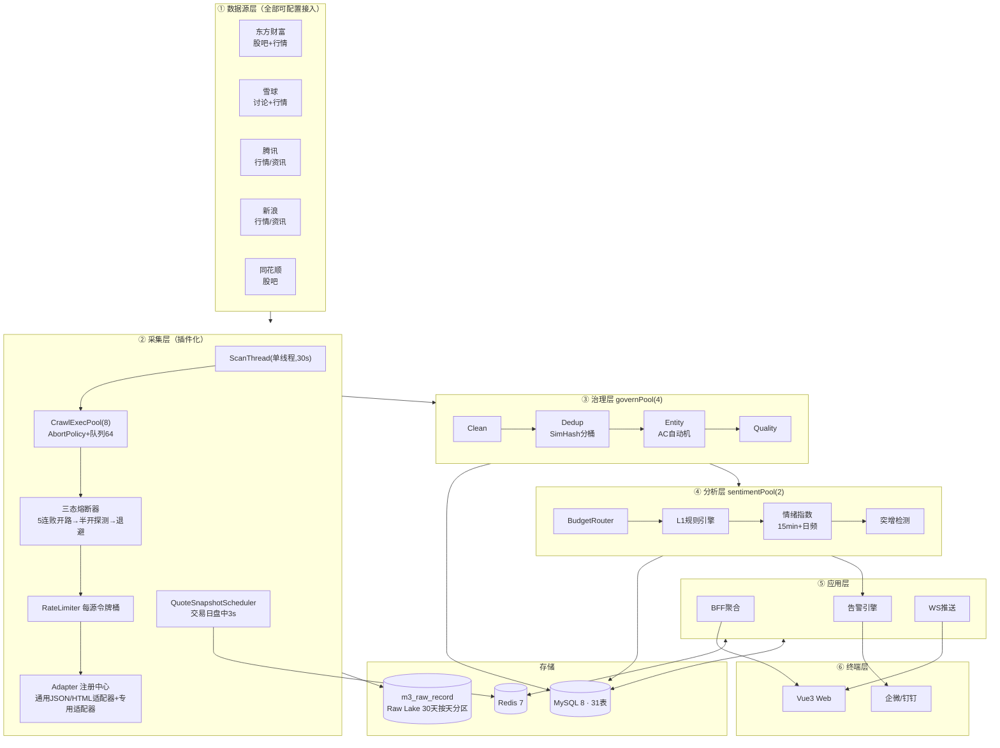
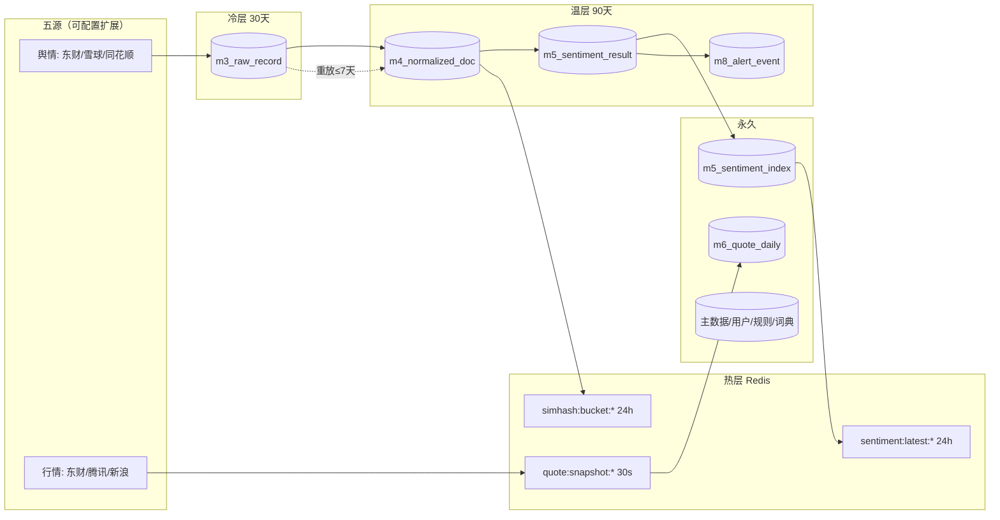
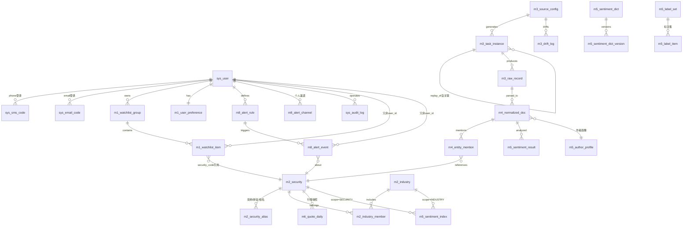

# 02 总体设计：架构与数据（V2.1 自包含版）

> **本文件内联全部 DDL，是表结构的唯一依据，可直接执行。**
> V2.1 修订：①全库**不使用外键**，表间仅逻辑关联（应用层保证一致性）；②数据源**可配置插件模式**，内置支持东财/雪球/腾讯/新浪/同花顺；③行情表启用。

## 一、系统架构图



## 二、数据源可配置接入模型（V2.1 核心设计）

### 2.1 设计目标

新增/调整数据源**不改代码、只改配置**（数据源页面结构匹配通用模式时）；结构特殊的源才写专用 Adapter。源与数据类型解耦：一个源可提供多种数据（如东财同时供舆情+行情）。

### 2.2 五源能力矩阵（V1 接入范围）

| 源 | source_code | 舆情帖 | 行情快照 | 接入方式 | V1 |
|---|---|:-:|:-:|---|:-:|
| 东方财富 | `EASTMONEY` | ✅ 股吧 | ✅ push2 快照 | 专用 Adapter | ✅ 主源 |
| 雪球 | `XUEQIU` | ✅ 讨论 | ✅ 快照 | 专用 Adapter（需 Cookie） | ✅ |
| 同花顺 | `THS` | ✅ 股吧 | ⚪ | 专用 Adapter（HTML） | ✅ |
| 腾讯 | `TENCENT` | ⚪ | ✅ qt.gtimg 快照 | **通用 JSON Adapter（纯配置）** | ✅ 行情备源 |
| 新浪 | `SINA` | ⚪ | ✅ hq.sinajs 快照 | **通用 Adapter（纯配置）** | ✅ 行情备源 |

### 2.3 可配置的三层结构

```
m3_source_config (源实例)
  ├─ adapter_key      → 用哪个适配器实现（GENERIC_JSON_LIST / GENERIC_HTML_LIST / EASTMONEY_GUBA / QUOTE_SNAPSHOT / ...）
  ├─ crawl_params     → JSON: {endpoint模板, method, headers, paging, fieldMapping, schema, auth}
  └─ rate_limit/cron/circuit/last_cursor → 运行策略

适配器层（代码）                配置层（DB, 运营可改）
┌─────────────────────┐      ┌──────────────────────────────┐
│ GenericJsonAdapter  │ ←──  │ endpoint:"https://qt.gtimg.cn/q={codes}" │
│ GenericHtmlAdapter  │      │ fieldMapping:{price:"$[3]",name:"$[1]"}  │
│ EastmoneyGubaAdapter│      │ schema:{price:{type:decimal,required}}   │
│ QuoteSnapshotAdapter│      └──────────────────────────────┘
└─────────────────────┘
```

**fieldMapping 取值语法**（通用适配器约定）：
- JSON 源：JSONPath 简化子集（`$.data.list[*].title`）
- HTML 源：CSS 选择器（`div.articleh span.l3 a`）
- 正则兜底：`regex:..."(\d+\.\d+)"...`

**行情多源路由**：`QUOTE_SNAPSHOT` 适配器按 `EASTMONEY → TENCENT → SINA` 优先级取首个健康源（复用熔断状态），任一可用即正常；全不可用 → stale 降级。

### 2.4 新增一个源的完整步骤（示例：新浪行情）

```sql
INSERT INTO m3_source_config
  (source_code, source_name, source_type, adapter_key, base_url, cron, rate_limit_qps, crawl_params)
VALUES
  ('SINA_QUOTE', '新浪行情快照', 5, 'QUOTE_SNAPSHOT', 'https://hq.sinajs.cn',
   '*/3 * 9-15 * * ?', 2, JSON_OBJECT(
     'endpoint', '/list={codes}',
     'headers', JSON_OBJECT('Referer','https://finance.sina.com.cn'),
     'fieldMapping', JSON_OBJECT('price','csv[3]','open','csv[1]','high','csv[4]','low','csv[5]','volume','csv[8]'),
     'encoding', 'GBK'));
```
零代码上线；Schema 校验、限流、熔断、记账、审计全部自动继承。

## 三、数据拓扑



**逻辑关联（无外键）说明**：所有 `xxx_id`/`xxx_code` 列仅为逻辑关联，应用层负责一致性（删除用软删或级联服务方法，DB 层无 FK、无级联约束）。好处：采集/治理高频写入无 FK 校验开销；重放/淘汰可独立执行；坏处（孤儿数据风险）由每日对账任务兜底（04 §6）。

## 四、全量 DDL（V2.1 · 无外键 · 可直接执行）

### 4.0 逻辑 ER 图（无 DB 外键，图中关系 = 逻辑关联，由应用层保证一致性）



> 注：以上连线仅表达业务关系与查询路径（如"我的告警"走 `m8_alert_event.user_id` 直查免 JOIN）；DB 层不建任何 FOREIGN KEY 约束，孤儿数据防护靠 04 §6 的对账与同步清理任务。

> **域编号说明**：m1 自选 / m2 主数据 / m3 采集 / m4 治理 / m5 情感 / m6 行情快照 / m8 告警；**m7 为行情分析域预留编号**（V2 技术/资金/公告类表启用），V1 不建任何 m7 表，31 表清单中无 m7 属刻意留位而非遗漏。

```sql
-- ============================================================
-- Aquila V2.1 全量 DDL (31 表)
-- MySQL 8.0+ / InnoDB / utf8mb4 / 时区+08:00 / STRICT_TRANS_TABLES
-- 约定: 全库无外键; 表间关联仅为逻辑关联, 一致性由应用层+对账任务保证
-- ============================================================
CREATE DATABASE IF NOT EXISTS aquila DEFAULT CHARSET utf8mb4 COLLATE utf8mb4_general_ci;
USE aquila;

-- ========== 用户域 ==========
CREATE TABLE `sys_user` (
  `id`            bigint      NOT NULL AUTO_INCREMENT,
  `phone`         varchar(16)  DEFAULT NULL COMMENT '手机号(与email至少其一)',
  `email`         varchar(64)  DEFAULT NULL COMMENT '邮箱(备选登录通道)',
  `username`      varchar(32) NOT NULL DEFAULT '',
  `password_hash` varchar(128) DEFAULT NULL COMMENT 'BCrypt(可选)',
  `role`          varchar(16) NOT NULL DEFAULT 'USER' COMMENT 'USER/ADMIN',
  `status`        tinyint     NOT NULL DEFAULT 1,
  `created_at`    datetime    NOT NULL DEFAULT CURRENT_TIMESTAMP,
  `updated_at`    datetime    NOT NULL DEFAULT CURRENT_TIMESTAMP ON UPDATE CURRENT_TIMESTAMP,
  PRIMARY KEY (`id`),
  UNIQUE KEY `uk_phone` (`phone`),
  UNIQUE KEY `uk_email` (`email`)
) ENGINE=InnoDB DEFAULT CHARSET=utf8mb4 COMMENT='用户';

CREATE TABLE `sys_sms_code` (
  `id` bigint NOT NULL AUTO_INCREMENT, `phone` varchar(16) NOT NULL,
  `code_hash` char(64) NOT NULL COMMENT 'SHA-256(code+salt)',
  `scene` varchar(16) NOT NULL DEFAULT 'login',
  `expires_at` datetime NOT NULL, `used` tinyint NOT NULL DEFAULT 0,
  `created_at` datetime NOT NULL DEFAULT CURRENT_TIMESTAMP,
  PRIMARY KEY (`id`), KEY `idx_phone_scene` (`phone`,`scene`,`created_at`)
) ENGINE=InnoDB DEFAULT CHARSET=utf8mb4 COMMENT='短信验证码(1天淘汰)';

CREATE TABLE `sys_email_code` (
  `id` bigint NOT NULL AUTO_INCREMENT, `email` varchar(64) NOT NULL,
  `code_hash` char(64) NOT NULL, `scene` varchar(16) NOT NULL DEFAULT 'login',
  `expires_at` datetime NOT NULL, `used` tinyint NOT NULL DEFAULT 0,
  `created_at` datetime NOT NULL DEFAULT CURRENT_TIMESTAMP,
  PRIMARY KEY (`id`), KEY `idx_email_scene` (`email`,`scene`,`created_at`)
) ENGINE=InnoDB DEFAULT CHARSET=utf8mb4 COMMENT='邮箱验证码(短信不可用时保底通道)';

CREATE TABLE `m1_watchlist_group` (
  `id` bigint NOT NULL AUTO_INCREMENT, `user_id` bigint NOT NULL COMMENT '逻辑关联sys_user.id',
  `group_name` varchar(32) NOT NULL, `sort_order` int NOT NULL DEFAULT 0,
  `created_at` datetime NOT NULL DEFAULT CURRENT_TIMESTAMP,
  `updated_at` datetime NOT NULL DEFAULT CURRENT_TIMESTAMP ON UPDATE CURRENT_TIMESTAMP,
  PRIMARY KEY (`id`), KEY `idx_user` (`user_id`,`sort_order`)
) ENGINE=InnoDB DEFAULT CHARSET=utf8mb4 COMMENT='自选股分组(≤20组/用户)';

CREATE TABLE `m1_watchlist_item` (
  `id` bigint NOT NULL AUTO_INCREMENT,
  `group_id` bigint NOT NULL COMMENT '逻辑关联m1_watchlist_group.id',
  `user_id`  bigint NOT NULL COMMENT '冗余,免JOIN(告警scope展开/订阅反查)',
  `security_code` varchar(16) NOT NULL,
  `note` varchar(256) DEFAULT NULL, `sort_order` int NOT NULL DEFAULT 0,
  `added_at` datetime NOT NULL DEFAULT CURRENT_TIMESTAMP,
  PRIMARY KEY (`id`),
  UNIQUE KEY `uk_group_code` (`group_id`,`security_code`),
  KEY `idx_user_code` (`user_id`,`security_code`),
  KEY `idx_code` (`security_code`)
) ENGINE=InnoDB DEFAULT CHARSET=utf8mb4 COMMENT='自选股明细(≤100只/组)';

CREATE TABLE `m1_user_preference` (
  `id` bigint NOT NULL AUTO_INCREMENT, `user_id` bigint NOT NULL,
  `preferences` json NOT NULL COMMENT '{colorScheme,pushQuietHours,listDensity,theme}',
  `updated_at` datetime NOT NULL DEFAULT CURRENT_TIMESTAMP ON UPDATE CURRENT_TIMESTAMP,
  PRIMARY KEY (`id`), UNIQUE KEY `uk_user` (`user_id`)
) ENGINE=InnoDB DEFAULT CHARSET=utf8mb4 COMMENT='用户偏好';

-- ========== 主数据域 ==========
CREATE TABLE `m2_security` (
  `id` bigint NOT NULL AUTO_INCREMENT,
  `security_code` varchar(16) NOT NULL, `security_name` varchar(32) NOT NULL,
  `exchange` varchar(8) NOT NULL COMMENT 'SH/SZ/BJ',
  `security_type` tinyint NOT NULL DEFAULT 1 COMMENT '1股票 2指数 3基金 4债券',
  `status` tinyint NOT NULL DEFAULT 1 COMMENT '1上市 2退市 3暂停',
  `is_st` tinyint NOT NULL DEFAULT 0 COMMENT '0否 1ST 2*ST',
  `list_date` date DEFAULT NULL, `delist_date` date DEFAULT NULL,
  `created_at` datetime NOT NULL DEFAULT CURRENT_TIMESTAMP,
  `updated_at` datetime NOT NULL DEFAULT CURRENT_TIMESTAMP ON UPDATE CURRENT_TIMESTAMP,
  PRIMARY KEY (`id`),
  UNIQUE KEY `uk_code` (`security_code`),
  KEY `idx_type_status` (`security_type`,`status`), KEY `idx_name` (`security_name`)
) ENGINE=InnoDB DEFAULT CHARSET=utf8mb4 COMMENT='证券主数据';

CREATE TABLE `m2_security_alias` (
  `id` bigint NOT NULL AUTO_INCREMENT, `security_code` varchar(16) NOT NULL,
  `alias` varchar(32) NOT NULL,
  `alias_type` tinyint NOT NULL COMMENT '1简称 2拼音全拼 3拼音首字母 4俗名',
  `created_at` datetime NOT NULL DEFAULT CURRENT_TIMESTAMP,
  PRIMARY KEY (`id`),
  UNIQUE KEY `uk_alias` (`alias`,`alias_type`,`security_code`),
  KEY `idx_code` (`security_code`)
) ENGINE=InnoDB DEFAULT CHARSET=utf8mb4 COMMENT='证券别名(AC词典+拼音搜索统一供数)';

CREATE TABLE `m2_industry` (
  `id` bigint NOT NULL AUTO_INCREMENT,
  `industry_code` varchar(32) NOT NULL, `industry_name` varchar(64) NOT NULL,
  `industry_type` tinyint NOT NULL COMMENT '1行业 2概念',
  `level` tinyint NOT NULL DEFAULT 1, `parent_code` varchar(32) DEFAULT NULL,
  PRIMARY KEY (`id`), UNIQUE KEY `uk_code_type` (`industry_code`,`industry_type`)
) ENGINE=InnoDB DEFAULT CHARSET=utf8mb4 COMMENT='行业/概念(东财口径)';

CREATE TABLE `m2_industry_member` (
  `id` bigint NOT NULL AUTO_INCREMENT,
  `security_code` varchar(16) NOT NULL, `industry_code` varchar(32) NOT NULL,
  PRIMARY KEY (`id`),
  UNIQUE KEY `uk_sec_ind` (`security_code`,`industry_code`), KEY `idx_ind` (`industry_code`)
) ENGINE=InnoDB DEFAULT CHARSET=utf8mb4 COMMENT='行业/概念成分';

CREATE TABLE `m2_trade_calendar` (
  `id` bigint NOT NULL AUTO_INCREMENT, `cal_date` date NOT NULL,
  `is_open` tinyint NOT NULL COMMENT '1交易日 0休市',
  `prev_open_date` date DEFAULT NULL COMMENT '冗余:上一交易日(免子查询)',
  `updated_at` datetime NOT NULL DEFAULT CURRENT_TIMESTAMP ON UPDATE CURRENT_TIMESTAMP,
  PRIMARY KEY (`id`), UNIQUE KEY `uk_date` (`cal_date`)
) ENGINE=InnoDB DEFAULT CHARSET=utf8mb4 COMMENT='交易日历(所有日级调度基准)';

-- ========== 采集域 ==========
CREATE TABLE `m3_source_config` (
  `id` bigint NOT NULL AUTO_INCREMENT,
  `source_code` varchar(32) NOT NULL COMMENT '如EASTMONEY_GUBA/TENCENT_QUOTE',
  `source_name` varchar(64) NOT NULL,
  `source_type` tinyint NOT NULL COMMENT '1舆情 2新闻 3公告 4研报 5行情 6资金 7财报',
  `adapter_key` varchar(48) NOT NULL COMMENT '适配器:GENERIC_JSON_LIST/GENERIC_HTML_LIST/EASTMONEY_GUBA/XUEQIU_STATUS/THS_GUBA/QUOTE_SNAPSHOT',
  `base_url` varchar(512) NOT NULL,
  `cron` varchar(32) NOT NULL DEFAULT '0 */5 * * * ?',
  `rate_limit_qps` int NOT NULL DEFAULT 5,
  `priority` int NOT NULL DEFAULT 100 COMMENT '同类型多源时优先级(小=优先)',
  `circuit_state` tinyint NOT NULL DEFAULT 0 COMMENT '0闭合 1开路 2半开',
  `circuit_fail_count` int NOT NULL DEFAULT 0,
  `circuit_open_until` datetime DEFAULT NULL,
  `crawl_params` json DEFAULT NULL COMMENT '{endpoint,method,headers,encoding,paging,fieldMapping,schema,auth};敏感值AES-256-GCM加密',
  `incremental_strategy` varchar(32) NOT NULL DEFAULT 'last_cursor',
  `last_cursor` varchar(128) DEFAULT NULL COMMENT '增量游标(唯一事实源)',
  `schema_version` int NOT NULL DEFAULT 1 COMMENT '字段Schema版本(变更可追溯)',
  `status` tinyint NOT NULL DEFAULT 1,
  `created_at` datetime NOT NULL DEFAULT CURRENT_TIMESTAMP,
  `updated_at` datetime NOT NULL DEFAULT CURRENT_TIMESTAMP ON UPDATE CURRENT_TIMESTAMP,
  PRIMARY KEY (`id`),
  UNIQUE KEY `uk_source_code` (`source_code`),
  KEY `idx_type_status` (`source_type`,`status`)
) ENGINE=InnoDB DEFAULT CHARSET=utf8mb4 COMMENT='采集源配置(可配置插件核心表)';

CREATE TABLE `m3_task_instance` (
  `id` bigint NOT NULL AUTO_INCREMENT,
  `source_code` varchar(32) NOT NULL,
  `task_params` json DEFAULT NULL,
  `status` tinyint NOT NULL DEFAULT 0 COMMENT '0运行中 1成功 2失败 3部分成功 4待重试 5已回放',
  `replay_of` bigint DEFAULT NULL COMMENT '逻辑关联:本任务是哪个任务的重放',
  `biz_id` varchar(36) DEFAULT NULL COMMENT '审计/追踪关联',
  `retry_count` int NOT NULL DEFAULT 0, `record_count` int NOT NULL DEFAULT 0,
  `error_msg` varchar(1024) DEFAULT NULL,
  `started_at` datetime NOT NULL, `finished_at` datetime DEFAULT NULL, `duration_ms` int DEFAULT NULL,
  PRIMARY KEY (`id`),
  KEY `idx_source_started` (`source_code`,`started_at`),
  KEY `idx_status` (`status`), KEY `idx_replay_of` (`replay_of`)
) ENGINE=InnoDB DEFAULT CHARSET=utf8mb4 COMMENT='采集任务实例(6态状态机)';

CREATE TABLE `m3_raw_record` (
  `id` bigint NOT NULL AUTO_INCREMENT,
  `task_id` bigint NOT NULL COMMENT '逻辑关联m3_task_instance.id',
  `source_code` varchar(32) NOT NULL, `outer_id` varchar(128) NOT NULL,
  `raw_content` longtext, `http_status` int NOT NULL,
  `parse_status` tinyint NOT NULL DEFAULT 0 COMMENT '0待解析 1已解析 2解析失败(重放/补偿依据)',
  `fetched_date` date NOT NULL COMMENT '采集日(应用层写入,幂等维度+分区键)',
  `fetched_at` datetime NOT NULL,
  `created_at` datetime NOT NULL DEFAULT CURRENT_TIMESTAMP,
  PRIMARY KEY (`id`,`fetched_date`),
  UNIQUE KEY `uk_source_outer_date` (`source_code`,`outer_id`,`fetched_date`),
  KEY `idx_parse_status` (`parse_status`,`fetched_date`),
  KEY `idx_task` (`task_id`)
) ENGINE=InnoDB DEFAULT CHARSET=utf8mb4 COMMENT='Raw Lake(30天,按天幂等)'
PARTITION BY RANGE COLUMNS(fetched_date) (
  PARTITION p_init VALUES LESS THAN ('2026-10-01'),
  PARTITION p_202610 VALUES LESS THAN ('2026-11-01'),
  PARTITION p_202611 VALUES LESS THAN ('2026-12-01'),
  PARTITION p_max VALUES LESS THAN (MAXVALUE)
);
-- 幂等说明: 同帖当天重采=更新(互动数刷新); 跨天重采=新快照行(允许,保留互动变化轨迹)

CREATE TABLE `m3_drift_log` (
  `id` bigint NOT NULL AUTO_INCREMENT, `source_code` varchar(32) NOT NULL,
  `task_id` bigint NOT NULL, `drift_level` varchar(4) NOT NULL COMMENT 'P1/P2/P3',
  `field_name` varchar(64) NOT NULL, `detail` varchar(512) DEFAULT NULL,
  `created_at` datetime NOT NULL DEFAULT CURRENT_TIMESTAMP,
  PRIMARY KEY (`id`), KEY `idx_source_level` (`source_code`,`drift_level`,`created_at`)
) ENGINE=InnoDB DEFAULT CHARSET=utf8mb4 COMMENT='字段漂移日志';

-- ========== 治理域 ==========
CREATE TABLE `m4_normalized_doc` (
  `id` bigint NOT NULL AUTO_INCREMENT,
  `raw_record_id` bigint NOT NULL COMMENT '逻辑关联m3_raw_record.id',
  `source_code` varchar(32) NOT NULL, `outer_id` varchar(128) NOT NULL,
  `security_code` varchar(16) DEFAULT NULL COMMENT '主标的(提及最多)',
  `title` varchar(512) DEFAULT NULL COMMENT '≤100字',
  `content` text NOT NULL COMMENT '≤5000字',
  `author_id` varchar(64) DEFAULT NULL COMMENT 'SHA-256脱敏',
  `author_name` varchar(64) DEFAULT NULL COMMENT '脱敏昵称(首字+***)',
  `interaction_count` int NOT NULL DEFAULT 0,
  `simhash` bigint unsigned DEFAULT NULL,
  `quality_score` int NOT NULL DEFAULT 3 COMMENT '1-5',
  `is_duplicate` tinyint NOT NULL DEFAULT 0,
  `topic_id` varchar(32) DEFAULT NULL COMMENT 'V2话题聚类',
  `published_at` datetime DEFAULT NULL, `replayed_at` datetime DEFAULT NULL,
  `created_at` datetime NOT NULL DEFAULT CURRENT_TIMESTAMP,
  PRIMARY KEY (`id`),
  UNIQUE KEY `uk_source_outer` (`source_code`,`outer_id`),
  KEY `idx_security_published` (`security_code`,`published_at`),
  KEY `idx_created` (`created_at`)
) ENGINE=InnoDB DEFAULT CHARSET=utf8mb4 COMMENT='治理后文档(90天)';

CREATE TABLE `m4_entity_mention` (
  `id` bigint NOT NULL AUTO_INCREMENT, `doc_id` bigint NOT NULL COMMENT '逻辑关联',
  `security_code` varchar(16) NOT NULL, `mention_count` int NOT NULL DEFAULT 1,
  `created_at` datetime NOT NULL DEFAULT CURRENT_TIMESTAMP COMMENT '级联清理依据',
  PRIMARY KEY (`id`),
  UNIQUE KEY `uk_doc_code` (`doc_id`,`security_code`), KEY `idx_code_created` (`security_code`,`created_at`)
) ENGINE=InnoDB DEFAULT CHARSET=utf8mb4 COMMENT='文档-实体关联(随doc 90天清理)';

CREATE TABLE `m4_dead_letter` (
  `id` bigint NOT NULL AUTO_INCREMENT,
  `stage` varchar(16) NOT NULL COMMENT 'clean/dedup/entity/quality/sentiment',
  `payload` json NOT NULL, `error_msg` varchar(1024) DEFAULT NULL,
  `retry_count` int NOT NULL DEFAULT 0, `status` tinyint NOT NULL DEFAULT 0 COMMENT '0待处理 1已恢复 2放弃',
  `created_at` datetime NOT NULL DEFAULT CURRENT_TIMESTAMP,
  PRIMARY KEY (`id`), KEY `idx_status_stage` (`status`,`stage`)
) ENGINE=InnoDB DEFAULT CHARSET=utf8mb4 COMMENT='死信队列(每小时重试)';

-- ========== 情感域 ==========
CREATE TABLE `m5_sentiment_dict` (
  `id` bigint NOT NULL AUTO_INCREMENT, `word` varchar(32) NOT NULL,
  `dict_type` tinyint NOT NULL COMMENT '1正面 2负面 3否定 4程度副词 5转折 6广告词',
  `weight` decimal(4,2) NOT NULL DEFAULT 1.00,
  `dict_version` int NOT NULL DEFAULT 1,
  `status` tinyint NOT NULL DEFAULT 1,
  `updated_at` datetime NOT NULL DEFAULT CURRENT_TIMESTAMP ON UPDATE CURRENT_TIMESTAMP,
  PRIMARY KEY (`id`), UNIQUE KEY `uk_word_type` (`word`,`dict_type`)
) ENGINE=InnoDB DEFAULT CHARSET=utf8mb4 COMMENT='情感/清洗词典(热加载)';

CREATE TABLE `m5_sentiment_dict_version` (
  `id` bigint NOT NULL AUTO_INCREMENT, `version` int NOT NULL,
  `word_count` int NOT NULL, `change_summary` varchar(512) DEFAULT NULL,
  `snapshot` mediumtext COMMENT '全量快照JSON(回滚依据)',
  `operator` varchar(32) NOT NULL, `created_at` datetime NOT NULL DEFAULT CURRENT_TIMESTAMP,
  PRIMARY KEY (`id`), UNIQUE KEY `uk_version` (`version`)
) ENGINE=InnoDB DEFAULT CHARSET=utf8mb4 COMMENT='词典版本(单调递增,可回滚)';

CREATE TABLE `m5_author_profile` (
  `id` bigint NOT NULL AUTO_INCREMENT,
  `source_code` varchar(32) NOT NULL, `author_id` varchar(64) NOT NULL COMMENT 'SHA-256脱敏',
  `is_kol` tinyint NOT NULL DEFAULT 0,
  `kol_score` decimal(5,2) NOT NULL DEFAULT 10.00 COMMENT '[0,100],V1默认10(加权中约去)',
  `post_count_30d` int NOT NULL DEFAULT 0, `avg_quality` decimal(3,2) DEFAULT NULL,
  `updated_at` datetime NOT NULL DEFAULT CURRENT_TIMESTAMP ON UPDATE CURRENT_TIMESTAMP,
  PRIMARY KEY (`id`), UNIQUE KEY `uk_source_author` (`source_code`,`author_id`)
) ENGINE=InnoDB DEFAULT CHARSET=utf8mb4 COMMENT='作者画像(w_account数据源,内存Map加载)';

CREATE TABLE `m5_sentiment_result` (
  `id` bigint NOT NULL AUTO_INCREMENT, `doc_id` bigint NOT NULL COMMENT '逻辑关联',
  `security_code` varchar(16) DEFAULT NULL,
  `engine_level` tinyint NOT NULL COMMENT '实际执行级别 1规则 2模型 3LLM',
  `requested_level` tinyint NOT NULL DEFAULT 1 COMMENT '路由请求级别(降级追溯)',
  `label` varchar(8) NOT NULL COMMENT 'positive/neutral/negative',
  `score` decimal(5,4) NOT NULL COMMENT '[-1,1]',
  `confidence` decimal(5,4) NOT NULL,
  `dict_version` int NOT NULL, `algo_version` varchar(16) NOT NULL DEFAULT 'l1-v1',
  `detail` json DEFAULT NULL COMMENT '逐词{word,baseScore,negation,degree,finalScore}',
  `created_at` datetime NOT NULL DEFAULT CURRENT_TIMESTAMP,
  PRIMARY KEY (`id`),
  UNIQUE KEY `uk_doc_engine` (`doc_id`,`engine_level`),
  KEY `idx_security_created` (`security_code`,`created_at`), KEY `idx_created` (`created_at`)
) ENGINE=InnoDB DEFAULT CHARSET=utf8mb4 COMMENT='情感分析结果(90天;90天内可重算)';

CREATE TABLE `m5_sentiment_index` (
  `id` bigint NOT NULL AUTO_INCREMENT,
  `scope_type` varchar(12) NOT NULL DEFAULT 'SECURITY' COMMENT 'SECURITY/INDUSTRY',
  `scope_code` varchar(32) NOT NULL,
  `trade_date` date NOT NULL,
  `sentiment_index` decimal(6,2) DEFAULT NULL COMMENT '[0,100];NULL=无有效数据',
  `post_count` int NOT NULL DEFAULT 0 COMMENT 'INDUSTRY时为去重后文档数',
  `sample_post_count` int NOT NULL DEFAULT 0 COMMENT 'confidence≥0.3的有效样本数',
  `signal_level` varchar(16) NOT NULL DEFAULT 'NO_DATA' COMMENT 'NO_DATA/LOW_SAMPLE/HIGH_VOLATILE/NORMAL',
  `confidence` decimal(4,3) DEFAULT NULL COMMENT '指数置信度(展示与告警门槛用)',
  `positive_count` int NOT NULL DEFAULT 0, `neutral_count` int NOT NULL DEFAULT 0, `negative_count` int NOT NULL DEFAULT 0,
  `positive_ratio` decimal(5,4) DEFAULT NULL, `negative_ratio` decimal(5,4) DEFAULT NULL,
  `dict_version` int NOT NULL, `algo_version` varchar(16) NOT NULL,
  `weight_detail` json DEFAULT NULL,
  `calculated_at` datetime NOT NULL DEFAULT CURRENT_TIMESTAMP,
  PRIMARY KEY (`id`),
  UNIQUE KEY `uk_scope_date` (`scope_type`,`scope_code`,`trade_date`),
  KEY `idx_date_index` (`trade_date`,`sentiment_index`)
) ENGINE=InnoDB DEFAULT CHARSET=utf8mb4 COMMENT='情绪指数-日频(永久)';

CREATE TABLE `m5_sentiment_index_15m` (
  `id` bigint NOT NULL AUTO_INCREMENT, `security_code` varchar(16) NOT NULL,
  `window_end` datetime NOT NULL,
  `sentiment_index` decimal(6,2) DEFAULT NULL, `post_count` int NOT NULL DEFAULT 0,
  `calculated_at` datetime NOT NULL DEFAULT CURRENT_TIMESTAMP,
  PRIMARY KEY (`id`),
  UNIQUE KEY `uk_code_window` (`security_code`,`window_end`), KEY `idx_window` (`window_end`)
) ENGINE=InnoDB DEFAULT CHARSET=utf8mb4 COMMENT='15min滚动指数(7天,V2突增基线)';

CREATE TABLE `m5_label_set` (
  `id` bigint NOT NULL AUTO_INCREMENT, `name` varchar(64) NOT NULL,
  `version` int NOT NULL DEFAULT 1, `item_count` int NOT NULL DEFAULT 0,
  `created_at` datetime NOT NULL DEFAULT CURRENT_TIMESTAMP,
  PRIMARY KEY (`id`), UNIQUE KEY `uk_name_version` (`name`,`version`)
) ENGINE=InnoDB DEFAULT CHARSET=utf8mb4 COMMENT='标注集(L1回归门禁)';

CREATE TABLE `m5_label_item` (
  `id` bigint NOT NULL AUTO_INCREMENT, `set_id` bigint NOT NULL COMMENT '逻辑关联',
  `content` text NOT NULL, `expect_label` varchar(8) NOT NULL,
  `source` varchar(32) DEFAULT NULL, `created_at` datetime NOT NULL DEFAULT CURRENT_TIMESTAMP,
  PRIMARY KEY (`id`), KEY `idx_set` (`set_id`)
) ENGINE=InnoDB DEFAULT CHARSET=utf8mb4 COMMENT='标注样本';

-- ========== 行情域 ==========
CREATE TABLE `m6_quote_daily` (
  `id` bigint NOT NULL AUTO_INCREMENT, `security_code` varchar(16) NOT NULL,
  `trade_date` date NOT NULL,
  `open_price` decimal(12,3) DEFAULT NULL, `close_price` decimal(12,3) DEFAULT NULL,
  `high_price` decimal(12,3) DEFAULT NULL, `low_price` decimal(12,3) DEFAULT NULL,
  `volume` bigint DEFAULT NULL, `amount` decimal(20,2) DEFAULT NULL,
  `turnover_rate` decimal(8,4) DEFAULT NULL,
  `data_source` varchar(32) DEFAULT NULL COMMENT '实际来源(EASTMONEY/TENCENT/SINA)',
  `created_at` datetime NOT NULL DEFAULT CURRENT_TIMESTAMP,
  PRIMARY KEY (`id`),
  UNIQUE KEY `uk_code_date` (`security_code`,`trade_date`)
) ENGINE=InnoDB DEFAULT CHARSET=utf8mb4 COMMENT='行情日快照(V1:收盘落库;V2扩日K历史)';

-- ========== 告警域 ==========
CREATE TABLE `m8_alert_rule` (
  `id` bigint NOT NULL AUTO_INCREMENT, `user_id` bigint NOT NULL COMMENT '逻辑关联',
  `rule_name` varchar(64) NOT NULL,
  `priority` varchar(4) NOT NULL DEFAULT 'P1' COMMENT 'P0/P1/P2 显式指定',
  `dsl` json NOT NULL COMMENT '{conditions:[{metric,op,value,windowMinutes}]}',
  `dsl_version` int NOT NULL DEFAULT 1 COMMENT 'DSL规范版本(升级可识别旧规则)',
  `scope` varchar(128) NOT NULL COMMENT 'WATCHLIST:{groupId}|SECURITY:{code}|INDUSTRY:{code}',
  `cooldown_seconds` int NOT NULL DEFAULT 900, `max_per_day` int NOT NULL DEFAULT 10,
  `dedup_window_seconds` int NOT NULL DEFAULT 900,
  `quiet_hours` json DEFAULT NULL COMMENT '{start,end,minPriority}',
  `channels` json NOT NULL COMMENT '["in_app","wecom","dingtalk"]',
  `status` tinyint NOT NULL DEFAULT 1,
  `created_at` datetime NOT NULL DEFAULT CURRENT_TIMESTAMP,
  `updated_at` datetime NOT NULL DEFAULT CURRENT_TIMESTAMP ON UPDATE CURRENT_TIMESTAMP,
  PRIMARY KEY (`id`), KEY `idx_user_status` (`user_id`,`status`)
) ENGINE=InnoDB DEFAULT CHARSET=utf8mb4 COMMENT='告警规则';

CREATE TABLE `m8_alert_event` (
  `id` bigint NOT NULL AUTO_INCREMENT,
  `rule_id` bigint NOT NULL COMMENT '逻辑关联',
  `user_id` bigint NOT NULL COMMENT '冗余(我的告警免JOIN+越权校验)',
  `security_code` varchar(16) DEFAULT NULL,
  `priority` varchar(4) NOT NULL,
  `event_type` varchar(32) NOT NULL COMMENT 'price/volume_surge/sentiment_reversal/z_score',
  `event_data` json NOT NULL COMMENT '{triggerValue,threshold,window}',
  `dedup_key` varchar(80) NOT NULL COMMENT 'rule+code+type+窗口起点(SHA1截断)',
  `merge_count` int NOT NULL DEFAULT 1,
  `push_status` tinyint NOT NULL DEFAULT 0 COMMENT '0待推送 1成功 2失败',
  `ack_status` tinyint NOT NULL DEFAULT 0 COMMENT '0未处理 1已处理 2已忽略',
  `ack_note` varchar(256) DEFAULT NULL,
  `triggered_at` datetime NOT NULL, `pushed_at` datetime DEFAULT NULL,
  PRIMARY KEY (`id`),
  UNIQUE KEY `uk_dedup` (`dedup_key`),
  KEY `idx_user_unread` (`user_id`,`ack_status`,`triggered_at`),
  KEY `idx_rule_triggered` (`rule_id`,`triggered_at`)
) ENGINE=InnoDB DEFAULT CHARSET=utf8mb4 COMMENT='告警事件(90天)';

CREATE TABLE `m8_alert_channel` (
  `id` bigint NOT NULL AUTO_INCREMENT,
  `user_id` bigint DEFAULT NULL COMMENT 'NULL=全局渠道(运营配置); 否则个人渠道',
  `channel` varchar(16) NOT NULL COMMENT 'wecom/dingtalk/email',
  `name` varchar(64) NOT NULL,
  `webhook_url` varchar(512) DEFAULT NULL COMMENT 'AES-256-GCM加密存储',
  `config` json DEFAULT NULL, `status` tinyint NOT NULL DEFAULT 1,
  `updated_at` datetime NOT NULL DEFAULT CURRENT_TIMESTAMP ON UPDATE CURRENT_TIMESTAMP,
  PRIMARY KEY (`id`), UNIQUE KEY `uk_owner_channel` (`user_id`,`channel`,`name`)
) ENGINE=InnoDB DEFAULT CHARSET=utf8mb4 COMMENT='推送渠道(全局+个人两级)';

-- ========== 审计域 ==========
CREATE TABLE `sys_audit_log` (
  `id` bigint NOT NULL AUTO_INCREMENT,
  `biz_id` varchar(36) NOT NULL COMMENT '一次操作一串事件共享',
  `operator_id` bigint DEFAULT NULL, `operator_name` varchar(32) DEFAULT NULL,
  `module` varchar(32) NOT NULL, `action` varchar(32) NOT NULL,
  `target` varchar(128) DEFAULT NULL,
  `before_json` json DEFAULT NULL, `after_json` json DEFAULT NULL,
  `ip` varchar(45) DEFAULT NULL,
  `created_at` datetime NOT NULL DEFAULT CURRENT_TIMESTAMP,
  PRIMARY KEY (`id`),
  KEY `idx_biz` (`biz_id`), KEY `idx_module_time` (`module`,`created_at`)
) ENGINE=InnoDB DEFAULT CHARSET=utf8mb4 COMMENT='审计日志(ADMIN写操作全留痕)';
```

### 分区维护存储过程

```sql
DELIMITER //
CREATE PROCEDURE `sp_add_raw_partition`(IN p_month CHAR(7))
BEGIN
  DECLARE p_name  VARCHAR(16) DEFAULT CONCAT('p_', REPLACE(p_month,'-',''));
  DECLARE p_bound VARCHAR(10) DEFAULT DATE_FORMAT(
      STR_TO_DATE(CONCAT(p_month,'-01'),'%Y-%m-%d') + INTERVAL 1 MONTH,'%Y-%m-%d');
  SET @sql = CONCAT('ALTER TABLE m3_raw_record REORGANIZE PARTITION p_max INTO (',
    'PARTITION ', p_name, ' VALUES LESS THAN (''', p_bound, '''),',
    'PARTITION p_max VALUES LESS THAN (MAXVALUE))');
  PREPARE stmt FROM @sql; EXECUTE stmt; DEALLOCATE PREPARE stmt;
END //
DELIMITER ;
```

### 保留与淘汰

| 表 | 保留 | 方式 | 执行 |
|---|---|---|---|
| m3_raw_record | 30 天 | DROP 分区（按 information_schema.PARTITIONS 枚举） | 每日 03:30 |
| m4_normalized_doc / m4_entity_mention | 90 天 | 批 DELETE 1000 行/批（mention 按 created_at 同步清） | 04:00 |
| m5_sentiment_result | 90 天（超期以 index 为准） | 批 DELETE | 04:10 |
| m5_sentiment_index_15m | 7 天 | 批 DELETE | 04:20 |
| m8_alert_event | 90 天 | 批 DELETE | 04:30 |
| sys_sms_code / sys_email_code | 1 天 | DELETE | 每小时 |
| m5_sentiment_index / m6_quote_daily / 主数据 | 永久 | — | — |
