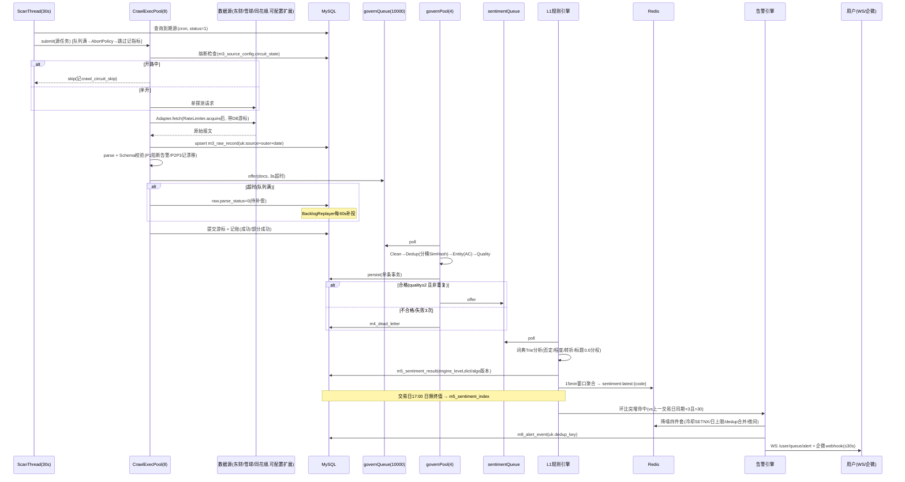

# 03 调用链与调用方式

> 版本：V2.1（2026-10-03）｜ §三为全量内联 API 契约（唯一契约）

## 一、核心调用链（时序）

### 链路 1：舆情采集→告警端到端（系统主链路）



### 链路 2：行情快照链（独立于治理）

```
QuoteSnapshotScheduler(交易日09:25-15:05 每3s)
  → 标的集 = 自选股 ∪ 告警scope展开 ∪ 三大指数（每30s重建一次，缓存）
  → 按优先级取健康源: 东财(push2) → 腾讯(qt.gtimg) → 新浪(hq.sinajs)
     （复用各源熔断状态; 单源失败自动切下一源; 腾讯/新浪为通用Adapter纯配置接入）
  → 批量拉取(50-100代码/次, QPS≤1)
  → Redis: quote:snapshot:{code}(TTL30s±10%抖动, 带dataSource标记) + market:summary:{date}(5min)
  → 15:05 收盘: 落 m6_quote_daily(upsert uk code+date, 记录实际data_source)
  → 全源失败降级: 返回最近收盘价 + stale=true; 响应头 X-Degraded: quote
```

### 链路 3：用户请求链（详情页 / 工作台）

```
浏览器 → HTTPS → Nginx(反代) → JWT Filter → 限流Filter(60/min) → traceId注入
  → Controller → Redis卡片缓存(5min±抖动, 空值缓存1min防穿透)
    └ miss → BFF聚合: CompletableFuture×7卡(每卡超时500ms, 总预算700ms)
              超时/异常卡 → {available:false}
  → Result{code,message,data,traceId}
WS: wss /ws + STOMP CONNECT(Bearer)
  → 频道: /user/queue/quote(3-5s) /alert(事件) /watchlist(变更)
  → msgId递增, 跳号>3重连; per-user发送队列100, 溢出通知
  → AT过期: 推auth_expired, 60s内SEND新AT续期
  → 重连3次失败 → 降级10s轮询 /api/workbench
```

### 链路 4：重放与失真治理链

```
POST /api/crawl/tasks/replay {source, 窗口≤7d, target=parse|govern}
  → 新建任务(replay_of=原任务id) → 加载raw(parse_status过滤)
  → 重新parse→治理→情感(同dict/algo版本可复现)
  → 产出受影响(code,tradeDate)清单 → 指数重算 → 刷Redis → sys_audit_log(biz_id)

词典回滚(运营): 选定dict_version → 版本回滚 → 同上重算链 → 标注集回归验证 → 复盘留痕
```

## 二、内部调用方式（模块间）

| 调用 | 方式 | 超时/背压 |
|---|---|---|
| 调度→采集 | 线程池 submit | AbortPolicy，跳过记指标下轮再来 |
| 采集→治理 | `governQueue.offer(3s)` | 超时→parse_status=0 待补偿 |
| 治理→情感 | `sentimentQueue.offer(3s)` | 同上 |
| 治理持久化 | 单条 `@Transactional` | 失败重试3次→死信 |
| 情感→告警 | 直接调用（同池） | 告警评估独立 30s 周期池 |
| 告警→渠道 | 推送池(2线程) | 失败重试3次，push_status=2 |
| 配置/词典热更 | Redis pub/sub | 版本号校验，双 buffer 原子切换 |

## 三、外部 API 契约（全量内联 · 唯一契约）

**通用约定**：统一包装 `{code, message, data, traceId}`；HTTP 恒 200（唯一例外：限流返回 HTTP 429 + code 1004）；除登录/刷新外全部需 `Authorization: Bearer <AT>`（AT 2h / RT 7d，RT 旋转：刷新即换发，旧 RT 复用 → 吊销全部会话）；POST 写接口支持 `Idempotency-Key`（24h 内重放返回首次结果）；列表 offset 分页，帖文流 cursor 分页（`ORDER BY published_at DESC, id DESC`，cursor=base64(JSON) 服务端签名防篡改）；时间一律 ISO8601 `+08:00`。

**错误码总表**：0 成功｜1001 参数缺失 / 1002 格式错误 / 1003 资源不存在 / 1004 限流｜2001 未登录 / 2002 Token 过期 / 2003 无权限｜3001 组超限(20) / 3002 DSL 非法 / 3003 验证码错误或过期 / 3004 验证码过频(1条/min,10条/天) / 3005 组内超限(100) / 3006 标的已存在 / 3007 维度未开放(V2) / 3008 评分卡未开放(V3) / 3009 规则超限(50) / 3010 scope 非法｜4001 源熔断 / 4002 字段漂移 / 4004 重放窗口>7天 / 4005 重放冲突｜5001 DB / 5002 缓存 / 5003 调度。

### 3.1 认证

**POST /api/auth/login** —— 双通道（手机或邮箱二选一）
```json
请求:  { "channel": "phone|email", "account": "13800001111", "code": "8888" }
响应:  { "code": 0, "message": "success", "traceId": "a1b2c3",
        "data": { "accessToken": "eyJ...", "accessTokenTtl": 7200,
                  "refreshToken": "d9f2...", "refreshTokenTtl": 604800,
                  "user": { "id": 10001, "username": "股民甲", "role": "USER", "isNew": false } } }
错误:  1002 格式错误 / 3003 验证码错误 / 3004 过频
```
**POST /api/auth/send-code** `{channel, account}` → `{data:{sent:true, ttlSeconds:300}}`（错误 3004）
**POST /api/auth/refresh** `{refreshToken}` → 同 login 的 token 结构（新 RT，旧 RT 作废）
**POST /api/auth/logout** → `{data:null}`（吊销 RT）

### 3.2 工作台与自选股

**GET /api/workbench?date=today** —— 缓存 5s；SLA P95≤1.5s；行情源故障时 `marketSnapshot=null` + 响应头 `X-Degraded: quote`
```json
{ "code":0, "data": {
  "watchlist": [ { "groupId":1, "groupName":"核心持仓",
    "items":[ { "code":"600519","name":"贵州茅台","price":1689.50,"changePercent":0.73,
                "quoteStale":false, "sentimentIndex":72.3, "sentimentChange":-15.0,
                "signalLevel":"NORMAL", "surgeFlag":true } ] } ],
  "sentimentSummary": { "topBullish":[{"code":"300750","name":"宁德时代","index":88.1}],
                        "topBearish":[{"code":"600519","name":"贵州茅台","index":41.2}] },
  "hotPosts": [ { "id":9001,"title":"...","sourceCode":"EASTMONEY","securityCode":"600519",
                  "interactionCount":1523,"publishedAt":"2026-10-03T09:41:00+08:00" } ],
  "alerts": [ { "id":555,"ruleName":"茅台声量突增","priority":"P0","securityCode":"600519",
                "message":"声量较上一交易日同期增长3.2倍","triggeredAt":"...",
                "actionUrl":"/stock/600519?tab=sentiment" } ],
  "marketSnapshot": { "shIndex":{"price":3088.12,"changePercent":0.5},
                      "upCount":2312,"downCount":1856,"updatedAt":"...","stale":false } } }
```
> 字段约束：`sentimentIndex` ∈ [0,100] 或 `null`（无数据显示"—"）；告警 message 只允许事实描述，禁止行动建议措辞。

**自选股**（全部需登录；写操作后刷 `watchlist:{userId}` 缓存 + WS 广播 `watchlist_change`）：
- `GET /api/watchlist/groups` → `{data:[{id,groupName,itemCount,sortOrder}]}`
- `POST /api/watchlist/groups` `{groupName(≤32),sortOrder?}` → `{data:{id,groupName,itemCount:0,sortOrder}}`（3001/1002）
- `DELETE /api/watchlist/groups/{id}` → `{data:null}`
- `POST /api/watchlist/items` `{groupId,securityCode,note?}` → `{data:{id,groupId,securityCode,note,sortOrder,addedAt}}`（3005/3006/1003）
- `PATCH /api/watchlist/items/{id}` `{note?,sortOrder?}` → `{data:{id,note,sortOrder}}`
- `DELETE /api/watchlist/items/{id}` → `{data:null}`
- `PUT /api/watchlist/groups/{id}/sort` `{itemIds:[...]}`（数组即新顺序）→ `{data:null}`
- `GET /api/preferences` → `{data:{colorScheme,pushQuietHours,listDensity,theme}}`
- `PUT /api/preferences` 全量 preferences JSON → `{data:{...回显}}`

### 3.3 主数据

**GET /api/securities?keyword=&type=1&industry=&page=1&size=20** —— 限流 20/min；命中优先级：代码精确 > 名称前缀 > 拼音前缀 > 名称包含；P95 ≤200ms
```json
{ "code":0, "data": { "items":[ {"code":"600519","name":"贵州茅台","exchange":"SH",
    "pinyin":"GZMT","isSt":0,"industry":"白酒"} ], "total":1,"page":1,"size":20,"totalPages":1 } }
```
**GET /api/securities/{code}** → `{data:{code,name,exchange,type,isSt,listDate,industries:[{code,name,type}]}}`（1003）
**GET /api/industries?type=1|2** → `{data:[{code,name,level,memberCount}]}`

### 3.4 采集运营（ADMIN，全部写操作进 sys_audit_log）

- `GET /api/crawl/sources` → `{data:[{sourceCode,sourceName,sourceType,adapterKey,status,circuitState,circuitFailCount,priority,todaySuccess,todayFail,todayAvgDurationMs,lastCursor,lastRunAt}]}`
- `POST /api/crawl/sources` / `PUT /api/crawl/sources/{sourceCode}` —— 源配置管理（可配置插件入口；body=源配置 JSON，敏感字段服务端加密）
- `POST /api/crawl/sources/{sourceCode}/circuit/reset` → 手动半开
- `POST /api/crawl/tasks/replay` `{sourceCode,startTime,endTime,target?:"parse"|"govern"}` → `{data:{taskId,replayOf,totalCount,status:"RUNNING"}}`（4004/4005）
- `GET /api/crawl/tasks/replay/{taskId}` → `{data:{total,done,failed,status}}`
- `GET /api/crawl/drift/{sourceCode}` → `{data:[{fieldName,driftLevel,missingRate,createdAt}]}`
- `GET /api/crawl/stats/24h` → 看板用：`{data:[{sourceCode,hourlyNew:[24],fieldMissingRate,circuitState}]}`

### 3.5 舆情与情绪

**GET /api/sentiment/posts** —— 参数：`securityCode`(必) / `startDate,endDate`(≤30天) / `label` / `minQuality`(默认2) / `cursor,size≤50`
```json
{ "code":0, "data": { "items":[ {
    "id":9001, "sourceCode":"EASTMONEY", "title":"...",
    "content":"...(摘录≤200字)", "originUrl":"https://guba.eastmoney.com/...",
    "authorName":"股海老***", "interactionCount":1523, "qualityScore":4,
    "sentiment": { "label":"positive","score":0.82,"confidence":0.91 },
    "publishedAt":"2026-10-03T09:41:00+08:00" } ],
  "nextCursor":"eyJpZCI6OTAwMH0=.sig", "hasMore":true } }
```
**GET /api/sentiment/index/{code}?startDate=&endDate=&granularity=day|15m**
```json
{ "code":0, "data":[ { "tradeDate":"2026-10-02","sentimentIndex":72.3,"postCount":127,
    "samplePostCount":98,"signalLevel":"NORMAL","confidence":0.78,
    "positiveRatio":0.62,"negativeRatio":0.21 } ] }
```
**GET /api/sentiment/surge?date=&securityCode=** → `{data:[{securityCode,surgeType:"ratio",metricValue:3.2,currentValue:186,baselineValue:45,triggeredAt:"..."}]}`
**GET /api/sentiment/wordcloud/{code}?date=** → `{data:{words:[{word,weight,sentiment}]}}`（Top100，缓存 30min）

### 3.6 个股详情

**GET /api/securities/{code}/detail?cards=overview,sentiment** —— 七卡并行，每卡超时 500ms 总预算 700ms；未接入卡恒 `{available:false}`；缓存 5min±10% 抖动
```json
{ "code":0, "data": {
  "overview":  { "code":"600519","name":"贵州茅台","price":1689.5,"changePercent":0.73,
                 "quoteStale":false,"sentimentIndex":72.3,"signalLevel":"NORMAL",
                 "heatPercentile":88,"compositeScore":null },
  "sentiment": { "index":72.3,"indexChange":-15.0,"postCount":127,"samplePostCount":98,
                 "signalLevel":"NORMAL","trend7d":[{"tradeDate":"...","sentimentIndex":70.1}],
                 "surgeFlag":true,"topPosts":["...3条,结构同3.5"] },
  "technical":   { "available": false },
  "capital":     { "available": false },
  "fundamental": { "available": false },
  "institutional": { "available": false },
  "risk": { "isSt":0,"delistRisk":false,
            "recentAlerts":[{"id":555,"eventType":"volume_surge","triggeredAt":"..."}] } } }
```

### 3.7 告警

**POST /api/alert-rules**
```json
请求: { "ruleName":"茅台情绪反转","priority":"P1","scope":"SECURITY:600519",
        "dsl":{ "conditions":[ {"metric":"sentiment_index","op":"<=","value":40,"windowMinutes":60} ] },
        "cooldownSeconds":900,"maxPerDay":10,"dedupWindowSeconds":900,
        "quietHours":{"start":"22:00","end":"08:00","minPriority":"P0"},
        "channels":["wecom","in_app"] }
响应: { "code":0, "data":{ "id":123,"ruleName":"茅台情绪反转","status":1,"createdAt":"..." } }
错误: 3002(指明非法字段) / 3009 / 3010
```
**指标白名单（V1）**：`price`(>=,<=) / `volume_ratio`(>=) / `sentiment_index`(>=,<=)；**op 白名单**：`> >= < <= = drop surge`。
- `GET /api/alert-rules` → `{data:[{id,ruleName,priority,scope,status,channels,createdAt}]}`
- `PATCH /api/alert-rules/{id}` `{status}` → `{data:{id,status}}`；`DELETE /api/alert-rules/{id}`
- `POST /api/alert-rules/test` `{dsl}` → `{data:{wouldTrigger,matchedStocks:[...],triggerTimes:[...]}}`（近 7 日回测）
- `GET /api/alert-events?startDate=&endDate=&status=&page=&size=` → `{data:{items:[{id,ruleId,ruleName,securityCode,priority,eventType,eventData,mergeCount,pushStatus,ackStatus,triggeredAt,pushedAt}],total,page,size}}`（服务端强制按当前 user_id 过滤）
- `PUT /api/alert-events/{id}/ack` `{ackStatus,note?}` / `PUT /api/alert-events/batch-ack` `{ids}`

### 3.8 后台（ADMIN）

- 词典：`GET/POST/PUT/DELETE /api/admin/dict/words`、`POST /api/admin/dict/import`(CSV，返回 `{added,skipped,preview}`)、`GET /api/admin/dict/versions`、`POST /api/admin/dict/versions/{v}/rollback`
- 审计：`GET /api/admin/audit?module=&operator=&startDate=&endDate=&page=`
- 渠道：`GET/POST/DELETE /api/alert-channels`（个人渠道，user_id 服务端注入）

### 3.9 V2/V3 契约冻结（V1 返回占位错误码）

`POST /api/screener/run` → 3007；`GET /api/scores/{code}` → 3008；`GET /api/quotes/{code}/daily`、`/api/capital/{code}`、`/api/fundamentals/{code}` → 3007。版本策略：破坏性变更走 `/api/v2/...`；响应只增不删；废弃字段标 `deprecated` 保留 2 版。

## 四、WebSocket 协议要点

| 频道 | 内容 | 频率 |
|---|---|---|
| /user/queue/quote | 自选股行情打包一帧 | 3-5s（盘中） |
| /user/queue/alert | 告警事件（含 actionUrl） | 事件触发 |
| /user/queue/watchlist | 自选股变更（多端同步） | 变更触发 |

心跳 10s；单用户 ≤3 连接；服务端 per-user 队列 100 条溢出推 `overflow` 通知。
